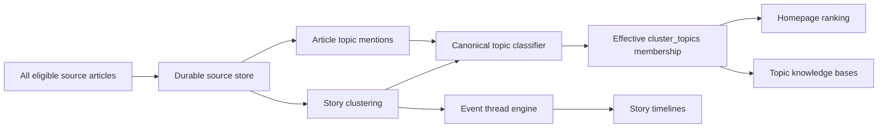

# Canonical Multi-Topic Knowledge Base — Phase-Wise Execution Plan

The multi-hashtag requirement is the central design principle: each story cluster may belong to several canonical topics, normally 3–6, while story threads remain separate narrative timelines. The vocabulary is open for discovery but canonical at publication: the seed taxonomy bootstraps the system and never limits which new source-grounded entities can be discovered later.

The implementation will proceed one phase at a time. After each phase, work must stop, all discovered debt must be resolved, the complete verification suite must pass, and the required Phase Summary must be provided before the next phase begins.

## Target architecture



Hashtags will be presentation labels generated from canonical topic records:

```text
Topic SSOT: united-states
Display:    #UnitedStates
Aliases:    USA, US, U.S., America
```

An article can then receive:

```text
#Iran             actor
#UnitedStates     target
#Jordan           location
#Airbases         asset class
#MuwaffaqSaltiAB  facility
#IranUSTensions   strategic theme
```

Three to six tags is the normal target, not an enforced maximum.

## Sources of truth and cross-run stability

The system has separate authoritative records for separate questions:

- `topics` and `topic_aliases` are the SSOT for topic identity, canonical display, and alias resolution.
- `article_topic_mentions` is the evidence ledger for what an individual source article explicitly or contextually mentions.
- `cluster_topics` is the SSOT for the current validated topic membership of a story cluster.
- `topic_assignment_runs` and `cluster_topic_decisions` are the immutable provenance ledger explaining proposed, accepted, suppressed, and removed assignments.
- Story threads remain the SSOT for narrative continuity; they never define topic identity or membership.

Model output, publisher hashtags, extracted entity strings, and compatibility fields such as `primaryTag` are inputs or projections, never sources of truth.

Equivalent source phrasing must converge before storage:

```text
USA / U.S. / US / United States
→ resolve registered alias
→ topic_id = united-states
→ render #UnitedStates
```

The same unchanged classification input must produce the same effective assignments across crawler runs. Every classification records a deterministic `content_fingerprint`, `registry_version`, `classifier_version`, and `assignment_policy_version`. If those values are unchanged, the prior validated result is reused rather than recomputed. Validated semantic adjudications are cached by an input hash; model sampling is never relied upon for determinism.

Each run computes a complete desired assignment set and reconciles it with `cluster_topics` atomically. Runs must not accumulate a permanent union of all historical hashtags. Curator-locked assignments are preserved. Low-confidence additions or removals remain shadow decisions until they satisfy the publication policy, preventing public hashtags from oscillating between runs.

A cluster retains a durable identity when its primary source changes. Cluster merges and splits are recorded through lineage and redirects so topic assignments, curator decisions, thread references, and public URLs remain traceable.

## Open-world discovery and canonical publication

The topic registry is a living database, not a hardcoded TypeScript allowlist. The crawler must discover new source-grounded concepts without requiring a code deployment while preventing unverified model strings from immediately fragmenting the public taxonomy.

Classification therefore has two output channels:

```json
{
  "existingTopics": [
    {
      "topicId": "iran",
      "role": "actor",
      "evidence": "Iran launched..."
    }
  ],
  "discoveredConcepts": [
    {
      "name": "Muwaffaq Salti Air Base",
      "type": "facility",
      "role": "target",
      "evidence": "the attack targeted Muwaffaq Salti Air Base"
    }
  ]
}
```

The discovery path is:

```text
Extract concept
→ validate exact source evidence
→ normalize its name
→ search canonical topics and aliases
→ resolve an existing equivalent where possible
→ create a provisional canonical topic when deterministic safety gates pass
→ otherwise queue it for review
→ assign the article to the resolved topic
```

The ontology is open-ended for concrete entities such as countries, people, offices, armed forces, units, organizations, companies, platforms, programmes, facilities, locations, exercises, operations, alliances, conflicts, technologies, and capabilities. Abstract thematic labels may also be proposed, but require stricter semantic deduplication or curator review because unconstrained themes are the main source of hashtag fragmentation.

Concrete named entities may be created automatically with `provisional` status when their name is present as an exact span in trusted source text, their type is reliably established, they do not collide with an existing alias, and all security and quality checks pass. A provisional topic becomes `active` after corroboration by multiple independent sources, one authoritative official source, or a curator. Ambiguous entities, broad themes, aliases, and proposed merges require review.

An exact text span proves only that the source used those words. It does not by itself prove entity type, factual truth, material relevance, or source independence. Those properties require separate deterministic checks or curator review. Provisional topics and shadow assignments are never returned by public endpoints until their publication state becomes `published`.

## Rules applying to every phase

Every phase must satisfy all of the following before closure:

- All new business behavior is covered by meaningful unit tests.
- Cross-layer behavior is covered by integration tests.
- No skipped, pending, or quarantined tests.
- MVVM boundaries remain intact.
- Components do not call crawler, database, or API logic directly.
- D1 access remains behind services and parameterized query builders.
- All UI strings use resource files.
- All colors use the established style variables.
- No source file exceeds 300 lines unless an SRP justification is documented in that file.
- No model-generated string is trusted as a topic ID, URL, HTML fragment, or database value.
- Public APIs use input validation, bounded pagination, rate limiting, and safe error responses.
- Curator mutations require the existing authentication controls.
- No public topic is created automatically from an unreviewed model suggestion.
- A concrete topic may be created provisionally only from validated source evidence and deterministic creation gates; a model suggestion by itself is insufficient.
- Runtime topic recognition is driven by the D1 registry and learned aliases rather than a compiled source-code allowlist.
- Canonical topic IDs, durable article IDs, and durable cluster IDs are stable and never derived from model output.
- Unchanged content, registry, classifier, and policy versions produce identical effective assignments across repeated runs.
- Assignment writes use desired-state reconciliation; cross-run hashtag union is forbidden.
- Shadow, provisional, suppressed, and rejected decisions cannot leak through public APIs or compatibility fields.
- Curator-locked decisions cannot be overwritten by ingestion, reclassification, or backfill.
- Full verification runs through `npm run check`.
- Relevant D1 migration tests and backfill tests pass separately.
- The build and bundle budget pass.

The Phase Summary will use this template:

```text
Phase N Summary

Delivered:
Verification:
Tech debt discovered:
Resolution:
Known limitations:
Build status:
Test status:
```

A phase cannot be marked complete with unresolved release-blocking debt. Any accepted non-blocking debt must have a documented owner, reason, and target phase; planned later functionality is future scope rather than completed behavior.

## Phase 0 — Baseline, invariants, and classification corpus

### Goal

Establish measurable current behavior and encode the product rules before modifying production logic.

### Deliverables

1. Document the architectural decision separating:

   - Source articles
   - Story clusters
   - Canonical topics
   - Article-topic mentions
   - Effective cluster-topic assignments
   - Narrative story threads
   - Knowledge-graph relationships

   The decision must also define ownership and migration boundaries for existing `canonical_entities`, `discovered_entities`, `graph_nodes`, programmes, suppliers, and story threads. `topics` represents public navigable concepts; it must not silently become a conflicting master record for every domain entity. `topic_relations` represents topic navigation and controlled assignment implications, while factual graph claims remain in the knowledge graph.

2. Create a reviewed classification fixture containing positive and negative examples.

3. Capture baseline statistics from the current repository dataset:

   - Percentage of clusters with tags
   - Number of generated tag variants
   - Orphan cluster count
   - Articles excluded by the top-30 cutoff
   - Existing thread and event counts
   - Existing canonical aliases

4. Define canonical topic types:

   - Country
   - Bilateral relationship
   - Person
   - Office
   - Military service
   - Military unit
   - Organization
   - Company
   - Platform
   - Programme
   - Location
   - Facility
   - Exercise
   - Operation
   - Alliance
   - Operational theatre
   - Conflict
   - Technology
   - Capability
   - Strategic theme

5. Define assignment roles:

   - `subject`
   - `actor`
   - `target`
   - `operator`
   - `location`
   - `facility`
   - `platform`
   - `programme`
   - `context`

6. Define stable identity and evolution rules:

   - Canonical URL normalization and durable source article IDs
   - Durable cluster IDs independent of whichever source is currently primary
   - Event fingerprints and matching windows
   - Article movement between clusters
   - Cluster merge, split, lineage, and redirect behavior
   - Preservation of curator decisions during cluster evolution

7. Define evidence and corroboration rules:

   - Evidence uses `source_article_id`, bounded offsets, and a content hash rather than an unaudited copied string alone.
   - “Independent source” accounts for syndication and common ownership, not just distinct domains.
   - Authoritative-source status is type-specific and comes from reviewed source metadata.
   - The full-text acquisition policy states when classification uses a headline, feed snippet, official release, or fetched article body.

8. Ratify measurable release thresholds:

   - 100% canonical consistency for aliases in the gold corpus
   - 100% assignment stability for unchanged versioned inputs
   - At least 95% precision for public direct-topic assignments
   - At least 90% recall for explicit material subjects
   - No more than 2% incidental-topic false positives
   - No more than 1% unresolved near-duplicate topic candidates
   - Zero provisional or shadow topics exposed publicly
   - Deterministic classification p95 at or below 50 ms per cluster in the local benchmark, excluding network I/O
   - At most one bounded registry read operation per crawl and zero assignment mutations for unchanged inputs
   - At most one model request per uncached classification input hash and zero model requests for unchanged cached inputs
   - Topic classification keeps a 100-cluster crawl within five minutes under the configured model concurrency and timeout policy
   - Paid model spend defaults to zero; enabling a paid provider requires an explicit configured per-run budget and fail-closed cap

### Required test cases

The gold corpus will include:

- India-China talks explicitly mentioning LAC
- India-China meeting at Kibithu
- NSA meeting a Chinese counterpart about border negotiations
- An unrelated article containing “black” that must not match LAC
- Tourism in Kibithu that must not receive LAC
- US airbase in Jordan attacked by Iran
- US aircraft operating from a Jordanian airbase
- An article mentioning Iran only as historical background
- `USA`, `U.S.`, `US`, and `United States`
- `Su57`, `Su-57`, and `Sukhoi Su-57`
- Ambiguous aliases and homonyms such as Jaguar as a platform, company, or ordinary word
- Syndicated copies that must count as one independent source
- Transliteration, punctuation, capitalization, and renamed-programme variants
- Corrections, retractions, cluster merges, cluster splits, and a changed primary source
- Repeated identical crawler runs and repeated semantic adjudication

### Exit criteria

- Architecture decision is complete.
- Taxonomy and relevance rules are unambiguous.
- Identity, lineage, evidence, source independence, and ownership rules are unambiguous.
- Numeric quality, stability, performance, and cost gates are approved and encoded in tests or fixtures.
- Baseline tests and current full suite pass.
- No production behavior changes.

### Phase status

Complete as of 2026-09-13. The deep completion audit, verification evidence, tech-debt sweep, resolutions, and fail-loud carried-forward limitations are recorded in `docs/Plans/canonical-topic-phase-0-summary.md`.

## Phase 1 — Durable identity, canonical topic registry, and D1 schema

### Goal

Create the durable article, cluster, and topic foundation without changing production behavior or the public UI. The storage tables are created in this phase so every assignment foreign key has a valid parent before classification begins.

### Schema

Add versioned, additive D1 migrations for:

```text
ingestion_runs
source_articles
story_clusters
cluster_sources
cluster_lineage
topics
topic_aliases
topic_relations
topic_implication_rules
topic_candidates
topic_assignment_runs
cluster_topic_decisions
cluster_topics
article_topic_mentions
topic_curation_audit
topic_reclassification_queue
```

Representative fields:

```text
ingestion_runs
  id
  input_fingerprint
  status
  started_at
  completed_at
  failure_stage
  retry_count

source_articles
  id
  canonical_url
  source_domain
  source_owner_key
  title
  snippet
  published_at
  content_hash
  payload_key
  first_seen_at
  last_seen_at

story_clusters
  id
  event_fingerprint
  status
  primary_source_article_id
  first_observed_at
  last_observed_at
  merged_into_cluster_id
  created_at
  updated_at

cluster_sources
  cluster_id
  source_article_id
  coverage_role
  source_authority
  attached_at

cluster_lineage
  predecessor_cluster_id
  successor_cluster_id
  change_type
  reason
  changed_at

topics
  id
  display_name
  display_hashtag
  topic_type
  description
  status
  verification_state
  display_priority
  registry_version
  replaced_by_topic_id
  first_seen_at
  last_seen_at
  created_at
  updated_at

topic_aliases
  normalized_alias
  topic_id
  alias_type
  requires_context
  context_rule_json
  verification_state
  created_at

topic_relations
  source_topic_id
  relation_type
  target_topic_id
  confidence
  evidence_source_article_id
  evidence_start
  evidence_end
  evidence_content_hash
  verification_state

topic_implication_rules
  source_topic_id
  implied_topic_id
  required_context_json
  maximum_depth
  verification_state

topic_assignment_runs
  id
  cluster_id
  content_fingerprint
  registry_version
  classifier_version
  assignment_policy_version
  model_cache_key
  status
  started_at
  completed_at

cluster_topic_decisions
  id
  assignment_run_id
  cluster_id
  topic_id
  role
  confidence
  assignment_source
  decision_state
  supersedes_decision_id
  decided_at

cluster_topics
  cluster_id
  topic_id
  role
  confidence
  assignment_source
  source_decision_id
  locked_by_curator
  assignment_run_id
  classifier_version
  assigned_at
  reviewed_at

article_topic_mentions
  topic_id
  cluster_id
  source_article_id
  mention_kind
  evidence_start
  evidence_end
  evidence_content_hash
  extraction_run_id
  observed_at

topic_curation_audit
  id
  topic_id
  cluster_id
  action
  before_json
  after_json
  curator_email
  expected_version
  created_at

topic_reclassification_queue
  id
  trigger_type
  trigger_id
  cluster_id
  status
  attempts
  available_at
```

Required constraints:

- Unique topic ID
- Unique canonical hashtag
- Unique canonical article URL after normalization
- Unique `(cluster_id, source_article_id)` membership
- Unique `(normalized_alias, topic_id)` alias mapping
- At most one unconditional mapping for a normalized alias; contextual aliases may map to multiple topics and must be disambiguated
- Unique `(cluster_id, topic_id)`
- Unique article mention for the same topic, evidence span, and extraction run
- Unique directed topic relation and implication rule
- Foreign keys for all topic references
- Controlled values for type, role, lifecycle status, verification state, and assignment source
- Redirect support for merged or deprecated topics
- Redirect and lineage support for merged or split clusters
- Lifecycle support for `provisional`, `active`, `deprecated`, and `merged` topics
- Cycle prevention for topic redirects and bounded implication traversal
- Database checks for confidence ranges, evidence offsets, publication states, and lifecycle transitions
- Mention and independent-source counts are derived from evidence rows. Any cached counters are explicitly non-authoritative and have a reconciliation job.

### Migration strategy

- Adopt numbered migration files and a migration ledger; `d1/schema.sql` may remain a generated bootstrap snapshot but is not the deployment mechanism.
- Test migrations from an empty database and from representative copies of every supported prior schema.
- Enable and verify foreign-key enforcement in migration and application tests.
- Do not use crawler startup as an implicit schema migration path.
- Seed taxonomy records in an idempotent reviewed seed migration separate from runtime discovery.

### Initial taxonomy

Seed a small reviewed bootstrap taxonomy containing:

- India
- China
- United States
- Iran
- Jordan
- India-China
- LAC
- LOC
- Indian Army
- Indian Navy
- Indian Air Force
- Existing known platforms, programmes, and organizations
- Approved operational theatres and facility classes

These records only give the first crawl a reliable starting vocabulary. They are not an allowlist and do not define the boundary of what can be tagged. The D1 tables are the living runtime SSOT. Migration files provide version history; they do not become a second runtime registry. New verified topics and aliases must become available to subsequent classification runs without a code deployment.

Existing `canonical_entities` and `discovered_entities` records are imported only as reviewable migration candidates. Existing graph nodes, programmes, and suppliers retain their current domain ownership and may reference a topic; they are not silently duplicated as competing master records.

### Application structure

Likely modules:

```text
src/types/topics.ts
src/services/topicRegistryService.ts
src/services/topicQueryBuilder.ts
crawler/topicRegistryLoader.ts
crawler/durableIngestService.ts
crawler/topicAssignmentReconciler.ts
```

Each file receives one responsibility and remains below 300 lines.

### Tests

- Local migration from an empty database
- Migration against a database containing existing thread and archive tables
- Foreign-key enforcement
- Duplicate unconditional alias rejection and contextual alias disambiguation
- Redirect resolution
- Redirect-cycle rejection
- Alias normalization
- Invalid topic type rejection
- Topic lifecycle transition validation
- Derived corroboration counts across genuinely independent sources
- Prevention of alias collisions during automatic discovery
- Stable article identity after URL normalization
- Stable cluster identity when the primary source changes
- Cluster merge and split lineage
- Effective `cluster_topics` membership separated from shadow, provisional, suppressed, rejected, and superseded decision history
- Repository contract and line-count tests

### Exit criteria

- Schema applies cleanly and repeatably.
- Article, cluster, and topic registries can be read but do not affect current ingestion or hashtags.
- Existing application behavior remains unchanged.
- Full build and test suite pass.

### Phase status

Complete as of 2026-09-13. The deep completion audit, verification evidence,
tech-debt sweep, resolutions, and fail-loud carried-forward production rollout
are recorded in `docs/Plans/canonical-topic-phase-1-summary.md`.

## Phase 2 — Complete durable article and cluster storage

### Goal

Ensure homepage ranking never determines which stories enter the knowledge base.

### Pipeline change

Current behavior truncates to the top 30 before downstream processing. It will become:

```text
Fetch all eligible sources
→ persist source articles
→ cluster all eligible stories
→ persist every cluster
→ classify every cluster
→ rank/select top 30 for homepage
```

### Durable write path

Use the Phase 1 `source_articles`, `story_clusters`, and `cluster_sources` records to preserve every publication while allowing the topic UI to group duplicate reporting under one event.

`cluster_sources` identifies:

- Primary source
- Related coverage
- Social discussion
- Publication timestamp
- Source authority

R2 continues storing full cluster payloads. D1 stores indexed metadata and relationships.

Every crawl advances an explicit ingestion state machine:

```text
started
→ articles_persisted
→ clusters_persisted
→ classified
→ publishable
→ published

Any stage → failed_retryable | failed_terminal
```

D1 metadata writes for a bounded batch are transactional. R2 blobs are written with deterministic keys before their corresponding D1 references become visible. A failed D1 commit leaves a detectable orphan candidate for cleanup; a missing R2 blob prevents the D1 record from becoming publishable. Retries use the ingestion run ID and content hashes rather than creating new records.

### Behavioral requirements

- Every accepted source article receives a durable ID.
- Article IDs use canonicalized URLs with a documented fallback for genuinely URL-less sources.
- Every eligible cluster is persisted before homepage truncation.
- Existing durable clusters are matched before creating new clusters; changing the primary source does not change cluster identity.
- Cluster merges and splits preserve lineage, redirects, topic decisions, and curator locks.
- A story outside the top 30 remains available to topic classification and archive queries.
- Repeated crawl runs are idempotent.
- Re-entering the homepage does not delete the durable article record.
- Failure policy is explicit: durable article or cluster persistence failure blocks that run from publishing a new homepage snapshot; optional downstream enrichment failures may degrade only according to their documented fallback.
- Recovery resumes from the last completed run stage and never treats a partial write as successful ingestion.

### Tests

- A 50-cluster crawl persists all 50 but displays only 30.
- A rank-31 story appears in topic results.
- Duplicate source URLs remain deduplicated.
- Tracking parameters, equivalent URL forms, redirects, and protocol variants resolve according to the canonical URL policy.
- Multiple publications remain attached to their cluster.
- The same event retains its cluster ID when a different source becomes primary.
- Cluster merges and splits preserve lineage and do not orphan assignments.
- R2 failure prevents an incomplete durable record.
- Partial D1 failure is reported as a failed ingestion result and blocks snapshot publication.
- An R2-success/D1-failure orphan is detected and cleaned or adopted safely on retry.
- An interrupted ingestion resumes from its recorded stage.
- Re-running the same crawl creates no duplicates.

### Exit criteria

- Zero eligible clusters are lost because of ranking.
- No incomplete ingestion run is published as current data.
- Homepage output remains compatible.
- Existing archive search continues working.
- Full build and test suite pass.

### Phase status

Complete as of 2026-09-13. The durable path, deep completion audit,
verification evidence, tech-debt sweep, resolutions, and fail-loud
cross-phase/production validations are recorded in
`docs/Plans/canonical-topic-phase-2-summary.md`.

## Phase 3 — Registry-driven deterministic multi-topic classification

### Goal

Assign known topics with no model dependency and extract safe candidates for previously unseen concrete entities.

### Classification stages

1. Load active and provisional topics, aliases, verified navigation relations, and verified implication rules from D1 once per bounded crawl operation.
2. Normalize article and cluster text.
3. Match runtime canonical aliases with word boundaries.
4. Verify context-sensitive acronyms.
5. Extract exact source spans that could represent new concrete entities.
6. Resolve extracted spans against existing topic IDs and aliases.
7. Persist article-level mentions with source IDs, offsets, and content hashes.
8. Aggregate material article evidence into cluster-level assignments and roles.
9. Apply only approved conditional implication rules.
10. Compute the complete desired assignment set.
11. Reuse the prior validated result when the content, registry, classifier, and policy versions are unchanged.
12. Record immutable decisions, then atomically reconcile validated non-curator membership in `cluster_topics` without overwriting curator locks.

Examples:

```text
"LAC" → #LAC
"Line of Actual Control" → #LAC
"U.S." → #UnitedStates
"Tejas Mk1A" → #TejasMk1A
```

Contextual inference:

```text
Kibithu
+ India and China as material actors
+ military/diplomatic border event
→ #LAC
```

Taxonomy implications:

```text
#LAC
→ #India
→ #China
→ #IndiaChina
```

These implications must be explicit, verified, conditional implication rules, not free-form assumptions or generic graph traversal. A descriptive topic relation does not automatically imply story membership. Rules define direction, required context, maximum depth, and whether the result is eligible for automatic publication. Cycles and unbounded transitive expansion are rejected.

### Tagging policy

- Direct material subjects receive high confidence.
- Incidental mentions are rejected.
- Publisher tags are candidate signals only.
- Generic topics such as `#Airbases` are assigned only when the facility materially affects the report.
- A specific facility and its broad class may both be assigned.
- No fixed tag maximum is enforced.
- Topic order is determined separately for display.
- New concrete candidates retain their exact source span and provenance.
- Recognition behavior updates when the registry changes; it does not require recompiling a regex catalog.
- Exact-span extraction alone may create a review candidate, but cannot establish type or materiality without an independent deterministic rule.
- Deterministic matching operates over a bounded indexed registry lookup. Correctness must not depend on loading only the most recently seen topics.
- Similar source articles in the same durable cluster share one effective cluster assignment set while retaining their distinct article-level evidence.
- Similar articles in separate clusters may differ in secondary topics, but every directly evidenced canonical subject must resolve to the same topic ID.
- Reconciliation removes stale non-curator assignments when justified; it never implements a permanent union of hashtags from prior runs.

### Tests

- All Phase 0 gold-corpus deterministic cases
- Multi-topic assignments
- Idempotent writes
- Duplicate alias prevention
- Role selection
- Topic implication rules
- Incidental-mention rejection
- Whole-word acronym protection
- Stable results regardless of publisher hashtag order
- Identical assignments on repeated runs with unchanged fingerprints and versions
- Reuse of a prior assignment without reclassification when inputs are unchanged
- Removal of a stale non-curator assignment through desired-state reconciliation
- Preservation of curator-locked assignments during reconciliation
- Runtime recognition of a newly inserted D1 topic without a code change
- Extraction of an unseen concrete named entity with exact evidence
- Rejection of ordinary words, verbs, adjectives, and non-distinctive phrases as topics

### Exit criteria

- Known-topic classification works without Gemini or Workers AI.
- The deterministic pipeline can surface previously unseen concrete candidates without publishing arbitrary hashtags.
- One cluster can belong to multiple topics.
- `cluster_topics` contains one stable effective assignment set rather than an accumulated history of classifier outputs.
- Assignments remain shadow data and do not yet change public hashtag clicks.
- Full build and test suite pass.

### Phase status

Repository implementation and its full verification suite completed on
2026-09-13. Rule 12 carried-forward gaps are explicitly recorded as the final
Phase 14; they are not represented as completed Phase 3 behavior.

## Phase 4 — Hybrid existing-topic linking and open-world concept discovery

### Goal

Use model judgment both to link semantic cases to existing topics and to discover previously unseen source-grounded concepts, while preventing uncontrolled hashtag creation.

### Model contract

The model receives:

- Sanitized headline and available article text
- Deterministic candidates
- A retrieved, bounded set of likely existing topic IDs
- Topic definitions
- The open-world discovery schema
- Required role, type, and evidence fields
- An explicit instruction that source content is untrusted data and cannot modify the output contract

It returns:

```json
{
  "existingTopics": [
    {
      "topicId": "lac",
      "role": "context",
      "confidence": 0.91,
      "evidence": "meeting at Kibithu concerning the India-China border"
    }
  ],
  "discoveredConcepts": [
    {
      "name": "Muwaffaq Salti Air Base",
      "type": "facility",
      "role": "target",
      "confidence": 0.96,
      "evidence": "the attack targeted Muwaffaq Salti Air Base"
    }
  ]
}
```

Every returned existing topic ID is checked against the loaded registry. Unknown IDs in `existingTopics` are rejected. Every discovered concept must cite an exact, validated source span; a model-proposed name without grounded evidence is rejected.

The validated response is cached by a deterministic hash of sanitized evidence, retrieved candidate topic IDs, registry version, classifier version, and assignment-policy version. An unchanged hash reuses the validated decision. Model temperature or provider repeatability is not treated as a stability guarantee.

### Automatic creation policy

A discovered concrete entity may be normalized and created as a provisional topic when all deterministic gates pass:

- The entity type is eligible for automatic creation.
- The proposed name occurs exactly in trusted article content.
- The name is distinctive and passes length and character constraints.
- It does not resolve to, collide with, or closely duplicate an existing topic or alias.
- Its slug is stable and collision-free.
- Its evidence and source provenance are stored.

Abstract themes, uncertain types, near-duplicates, aliases, merges, and indirect inferences go to `topic_candidates` for review. Provisional topics accumulate private evidence immediately but remain `shadow` or `suppressed`; public APIs and compatibility hashtag fields exclude them until promotion and publication criteria are met.

Suggested new concepts enter `topic_candidates` with:

- Suggested name
- Normalized form
- Evidence
- Source clusters
- Mention count
- Distinct source count
- Status
- Reviewer metadata

They never become active public topics from a model suggestion alone. Promotion requires deterministic corroboration or curator approval.

### Effective-assignment stability

- Model results first enter `cluster_topic_decisions` as shadow decisions and do not directly mutate validated `cluster_topics` membership.
- A high-confidence addition becomes effective only after deterministic validation and the approved publication threshold.
- Removing an effective topic requires deterministic contradictory evidence, repeated agreement across the configured number of runs, a successfully evaluated classifier-version migration, or curator approval.
- Curator-locked additions and removals always win over automated decisions.
- Registry or classifier changes create a new desired assignment set and an auditable diff; they do not silently rewrite history.
- Similar clusters with conflicting core subjects are measured as a consistency failure and queued for review. Differences in materially supported secondary topics are allowed and retained with evidence.

### Shadow evaluation

Run old and new classification simultaneously and report:

- New-system precision and recall against the gold corpus
- Old/new disagreement rate
- Unknown-topic candidate rate
- New concrete concept discovery rate
- Provisional-to-active promotion rate
- Near-duplicate and alias-collision rate
- Average topics per cluster
- Untagged eligible cluster rate
- Assignment source distribution
- Repeated-run assignment stability
- Core-topic consistency across near-duplicate clusters
- Public assignment addition and removal churn
- Model cache hit rate, latency, and cost per eligible cluster

### Tests

- Hallucinated topic IDs are rejected.
- Malformed responses fail safely.
- Prompt-injection text cannot alter the schema.
- Evidence is length-limited and sanitized.
- Model outage leaves deterministic assignments intact.
- Candidate topics remain private.
- Repeated candidates aggregate without duplication.
- A new concrete entity can be provisionally created from an exact evidence span.
- A new abstract theme cannot bypass review.
- A provisional topic is promoted after the configured independent-source or authoritative-source threshold.
- Near-duplicate discovered concepts resolve or enter review rather than fragmenting the taxonomy.
- An unchanged semantic input reuses the cached validated result.
- Different model responses for the same uncached input cannot directly oscillate public assignments.
- Provisional and shadow assignments are absent from every public read path.

### Exit criteria

- Model output cannot directly create active public hashtags.
- Previously unseen concrete entities can enter the living registry through validated provisional creation.
- Deterministic fallback remains fully functional.
- Phase 0 quality thresholds are met on the reviewed corpus and shadow production sample, including 100% canonical alias convergence and 100% unchanged-input assignment stability.
- Full build and test suite pass.

### Phase status

Repository implementation completed on 2026-09-13. The guarded semantic path
is opt-in, cached by versioned input hash, source-span validated, and writes
model links/discoveries as shadow decisions only. Automatic provisional creation
is limited to entity types with deterministic naming evidence; other proposals
remain private review candidates. The external/provider measurements and broader
reviewed type validators that cannot truthfully be claimed from local fixtures
are carried forward explicitly in final Phase 15.

## Phase 5 — Curator topic governance and review workflow

### Goal

Provide the authenticated human-control surface required to govern candidates, ambiguous aliases, topic lifecycle, assignment exceptions, and merges before backfill or public cutover.

### Curator capabilities

- List and filter provisional topics, topic candidates, alias collisions, near-duplicates, and assignment disagreements.
- Inspect every supporting source article, bounded evidence span, source-independence calculation, classifier version, and assignment diff.
- Approve, reject, rename, promote, deprecate, merge, or redirect a topic.
- Add contextual or unconditional aliases with collision checks.
- Approve or reject topic implication rules separately from descriptive topic relations.
- Add, remove, or lock a cluster-topic assignment.
- Preview the affected assignments, historical clusters, API URLs, and redirects before a merge or rule change.
- Use optimistic concurrency so one curator cannot silently overwrite another curator's newer decision.
- Write an immutable audit record for every mutation.
- Enqueue bounded targeted reclassification after an approved topic, alias, merge, or implication-rule change.
- Reverse a mistaken merge or bulk decision through a tested recovery operation where data has not been irreversibly discarded.

### MVVM and API boundaries

Components consume curator ViewModels only. ViewModels call authenticated topic-governance services; services own validation, audit writes, and parameterized D1 operations. Existing curator authentication and safe error conventions remain mandatory.

### Tests

- Every mutation requires curator authentication and authorization.
- Candidate approval and rejection are auditable.
- Rename preserves canonical redirects.
- Unconditional alias collisions are rejected; contextual ambiguity is represented safely.
- Merge preview reports affected records before mutation.
- Merge, redirect, and reversal preserve assignment provenance.
- Optimistic concurrency rejects stale writes.
- Curator-locked assignment survives ingestion and backfill.
- Approved registry changes enqueue only affected historical clusters.
- Model or source text cannot inject a curator action, SQL value, URL, or HTML fragment.

### Exit criteria

- Every review path referenced by earlier phases has an authenticated, auditable operation.
- No candidate, ambiguous alias, merge, abstract theme, or implication rule requires direct database editing.
- Full build, security checks, and test suite pass.

### Phase status

Repository governance foundations completed on 2026-09-13: authenticated,
no-store curator endpoints now provide preview and audited mutations for
candidate approval/rejection, topic rename, aliases, implication rules,
merge/reversal, and curator cluster assignments. Mutations use an optimistic
governance-version resource, bounded targeted queueing, and the existing
immutable decision/audit ledger. Phase 16 records the remaining human-facing
review workflow and remote-D1 proof work under Rule 12; neither is claimed as
complete merely because the underlying mutation endpoint exists.

## Phase 6 — Topic read API and knowledge-base query model

### Goal

Expose authoritative topic collections independently from story threads. Deploy the routes behind the same internal or staging feature gate as the topic UI until Phase 10 enables public access.

### Endpoints

```text
GET /api/topics
GET /api/topics/:id
GET /api/topics/:id/articles
GET /api/topics/:id/related
```

Article results include:

- Cluster
- Primary source
- Related sources
- Assignment role
- Confidence and provenance where appropriate
- Publication date
- Related story thread IDs
- Pagination cursor

### Query behavior

- Resolve canonical ID, display hashtag, or registered alias.
- Follow deprecated-topic redirects.
- Query validated rows through indexed `cluster_topics` and active topics only; shadow, provisional, suppressed, and rejected decisions remain in the decision ledger and are structurally excluded.
- Use keyset pagination ordered by `(published_at DESC, cluster_id DESC)` with bounded, opaque, versioned cursors.
- Apply strict limits.
- Never scan the full archive per request.
- Do not depend on the 100-thread or 500-event synchronization windows.
- Return enough indexed D1 metadata to render collection cards without one R2 request per result. Fetch a full R2 payload only for detail that is not represented in D1.
- Define cache keys and invalidation using canonical topic ID, registry version, assignment publication version, and cursor.

### Security

- Validate and length-limit topic identifiers.
- Use parameterized SQL.
- Rate-limit public endpoints.
- Return safe errors.
- Do not expose internal prompts or curator-only evidence.
- Apply public caching only to successful read responses.
- Reject cursors whose signature, version, length, or sort position is invalid.

### Tests

- Lookup by canonical ID and alias
- Pagination without duplicates
- Stable pagination when several clusters share a publication timestamp
- Invalid and obsolete cursor handling
- Deprecated-topic redirect
- Unknown-topic 404
- Injection attempts
- Rate limiting
- Archived and live cluster retrieval
- One article appearing under every assigned topic
- All corroborating sources included
- Provisional, shadow, suppressed, and rejected records never returned
- Collection rendering does not perform an N+1 R2 read pattern

### Exit criteria

- Topic APIs accurately return multi-topic membership.
- Existing thread APIs remain operational.
- Full build and test suite pass.

### Phase status

Repository implementation completed on 2026-09-13. The feature-gated public
read routes use only effective `cluster_topics` membership, D1-backed source
metadata, parameterized indexed reads, and signed versioned keyset cursors.
They deliberately fail closed until both the staging gate and cursor secret are
configured. Remote D1/staging deployment proof is carried forward explicitly
in final Phase 17 rather than claimed from local verification.

### Phase 6 Summary

Delivered: Feature-gated `GET /api/topics`, `GET /api/topics/:id`,
`GET /api/topics/:id/articles`, and `GET /api/topics/:id/related`, plus
published-membership indexes, canonical/alias/display-hashtag resolution,
deprecated redirects, D1-only card metadata, batched corroborating sources and
thread IDs, signed opaque keyset cursors, bounded limits, cache version tags,
and safe errors/rate limits.

Verification: Focused handler and Pages-route tests cover aliases, display
hashtags, redirects, signed/tampered cursors, tie-safe pagination, sources,
thread IDs, feature gating, and cache tags. Local D1 migration application,
topic migration/schema integration tests, and the complete `npm run check`
suite pass.

Tech debt discovered: The first implementation rebuilt a few immutable query
statements twice and did not index the assignment-publication version lookup.

Resolution: Query statements are now constructed once per use; migration 0011
adds the `assigned_at` index in addition to topic-membership and source-hydration
indexes. No repository-scope Phase 6 debt remains.

Known limitations: Remote secret provisioning, staging-only enablement, remote
D1 query plans, edge-isolate rate limits, and production-scale cache behavior
cannot be proven locally. They are fail-closed and assigned to Phase 17.

Build status: Passing.

Test status: 1,461/1,461 full-suite tests passing; focused topic migration and
schema tests pass with no skipped or pending tests.

## Phase 7 — Historical classification and backfill

### Goal

Make existing history part of the new topic knowledge base before public cutover.

### Backfill behavior

1. Read live clusters and archived R2 cluster payloads.
2. Process bounded, resumable batches.
3. Apply deterministic classification.
4. Apply model adjudication only where needed.
5. Store content fingerprint, registry version, classifier version, assignment-policy version, and run ID.
6. Record failures for retry.
7. Reprocess only missing or outdated assignments.
8. Preserve curator decisions.
9. Produce before-and-after counts.
10. When a topic, alias, merge, or verified implication rule is added, enqueue affected historical clusters for targeted retroactive classification.
11. Compute and atomically reconcile a desired assignment set for each cluster rather than unioning historical hashtags.
12. Materialize no backfilled decision into `cluster_topics` until its topic is active and the decision satisfies the assignment acceptance policy.

### Existing hashtag migration

- Resolve current `primaryTag` and `hashtags` values through the new registry.
- Treat them as migration evidence, not truth; convert only trusted matches into shadow assignments before validation.
- Send ambiguous variants to review.
- Map legacy aliases to canonical topics.
- Create redirects for replaced hashtag URLs.
- Do not blindly promote existing `canonical_entities` rows; that table may contain earlier classification mistakes.

### Tests

- Backfill is idempotent.
- Interrupted batches resume safely.
- One bad R2 payload does not corrupt the batch.
- Failed records remain retryable.
- Classifier-version changes trigger controlled reassignment.
- Registry-version and assignment-policy changes trigger only the required reassignment.
- Unchanged fingerprints and versions reuse prior validated assignments.
- Curator-reviewed assignments cannot be overwritten.
- Historical LAC examples converge correctly.
- Aggregate counts remain stable on a second run.
- Effective topic membership remains identical on a second unchanged run.
- Stale non-curator assignments are removed without deleting assignment history.
- Establishing a new topic or alias retroactively attaches matching historical clusters.
- Establishing a new verified implication rule retroactively evaluates clusters affected by that rule.

### Exit criteria

- Backfill backlog reaches zero.
- Failed records are zero or fully resolved before phase closure.
- Topic counts reconcile with assignment rows.
- Repeated unchanged backfills produce zero effective assignment churn.
- Full build and test suite pass.

### Phase status

Repository implementation completed on 2026-09-13. `npm run backfill:topics`
drains bounded batches until the D1 selection is empty and fails loudly on the
first retryable payload or classification failure. The worker reads and
identity-validates archived R2 payloads, uses durable D1 source metadata for
classification, reuses one registry snapshot per bounded batch, and sends all
writes through desired-state reconciliation. Legacy `primaryTag` and
`hashtags` resolve only through registered canonical aliases as `migration`
shadow decisions; unknown legacy variants become private review candidates.
The retry ledger preserves the cluster ID, attempt count, safe error message,
and next availability so no bad payload can be treated as a completed batch.

### Phase 7 Summary

Delivered: Resumable historical topic backfill, a fail-loud draining command,
R2 archived-payload validation, D1 source hydration, version-aware and
targeted-queue selection, retry persistence, before/after effective-assignment
counts, legacy-tag shadow migration, and private ambiguous-legacy review
candidates.

Verification: Focused tests cover archived R2 success, unavailable payload
retry recording, legacy canonical and unknown-tag handling, and a second
unchanged run with zero churn. Local D1 migration application and the complete
`npm run check` suite pass.

Tech debt discovered: The initial registry-snapshot refactor moved the empty
durable-plan fast path after a D1 read, which broke the mocked empty-plan
ingestion contract and was unnecessary work.

Resolution: Restored the fast path before registry loading; the full suite
passes with the original no-read behavior intact. No repository-scope Phase 7
tech debt remains.

Known limitations: No authenticated D1/R2 environment was authorized for
running the real historical backlog, resolving any retry records, or measuring
the before/after production counts. Those external completion checks are
carried forward explicitly in Phase 18.

Build status: Passing.

Test status: 1,463/1,463 full-suite tests passing; no skipped or pending tests.

## Phase 8 — Feature-flagged multi-hashtag UI and topic knowledge-base view

### Goal

Build hashtag-to-topic behavior behind an internal or staging feature flag. Do not change public hashtag routing until thread/topic decoupling and final cutover are complete.

### MVVM structure

```text
src/services/topicService.ts
src/viewmodels/TopicKnowledgeBaseViewModel.ts
src/components/topics/TopicBadgeList.ts
src/components/topics/TopicKnowledgeBaseView.ts
src/components/topics/TopicArticleCard.ts
```

Components consume ViewModels and resource strings only.

### Card behavior

- Display the three highest-value topic badges.
- Display `+N` when more topics are assigned.
- Clicking a badge opens its canonical topic knowledge base.
- Assignment order favors specific topics over broad structural topics.
- Assignment order uses stored and tested display priority plus deterministic tie-breakers; it is not based on D1 row order or model output order.
- All validated topics assigned to the cluster remain discoverable even when collapsed; decision-ledger states remain hidden.
- Keyboard and screen-reader behavior matches existing accessibility conventions.

### Topic page

Display:

- Canonical hashtag and definition
- Total article or event count
- First and latest observation
- Chronological cluster list
- Nested corroborating sources
- Related topics
- Associated story threads
- Paginated loading
- Empty, loading, unavailable, and error states

All labels come from resource files, and all styling uses existing variables.

### Tests

- Three badges plus `+N`
- Every badge resolves to the correct topic ID
- Badge order remains identical across repeated renders and crawler runs with unchanged inputs
- Alias URL redirects
- Desktop and mobile rendering
- Light and dark themes
- Keyboard navigation
- Loading, error, and empty states
- Pagination
- HTML and URL sanitization
- Clicking `#India` returns all assigned Indian stories

### Exit criteria

- Feature-flagged hashtag clicks use topic APIs; production public routing remains unchanged.
- Multi-topic cards work across screen sizes.
- No hardcoded UI strings or colors.
- Full build, CSS check, accessibility tests, and bundle budget pass.

### Phase status

Repository implementation completed on 2026-09-13. Before Phase 10, the
internal/staging topic flag enabled canonical-topic badges only when a feed
cluster carried published `canonicalTopics`; legacy routing remained unchanged.
Topic pages use the Phase 6 public API only, preserve API ordering
through stored display priority and canonical-ID tie-breakers, paginate
articles, and render the complete published topic read model.

### Phase 8 Summary

Delivered: Feature-flagged canonical-topic badges with the three highest
priority topics and `+N`, internal topic navigation, a lazy MVVM topic
knowledge-base view, safe public API client, chronological article cards with
corroborating sources, related topics, associated thread IDs, accurate total
counts and observation bounds, pagination, resource strings, theme-variable
styling, and responsive layout.

Verification: Dedicated UI tests cover badge collapse, canonical-ID routing,
deterministic repeated ordering, loading/article/pagination behavior. The
complete `npm run check` suite passed: 1,466/1,466 tests, contracts/LOC,
crawler validation, CSS, production build, bundle budget, and security scan.

Tech debt discovered: The first page implementation derived total count and
observation dates from its current page, which would become wrong after
pagination.

Resolution: Added deterministic full-collection aggregates to the bounded
topic-article query and returned them through the existing public contract.
No Phase 8 repository-scope tech debt remains.

Known limitations: The production feed serializer does not yet hydrate the new
`canonicalTopics` field from published `cluster_topics`. The feature is safely
off by default and therefore cannot show real-topic badges until that durable
feed bridge and an authenticated staging validation are completed. This is
explicitly carried forward in Phase 19 under Rule 12.

Build status: Passing.

Test status: 1,466/1,466 full-suite tests passing; no skipped or pending tests.

## Phase 9 — Separate narrative threads from topic membership

### Goal

Remove the remaining assumption that every hashtag is a story thread.

### Changes

- Stop creating thread identities directly from `primaryTag`.
- Create or advance threads only for coherent evolving events or programmes.
- Allow several threads to belong to one topic.
- Allow one thread to reference several topics.
- Add `thread_topics` as an explicit junction table.
- Remove whole-database thread loading from matching.
- Query likely thread candidates by indexed topics, time, and event fingerprints.
- Use durable cluster identity and cluster lineage so a primary-source change, cluster merge, or cluster split cannot silently duplicate a thread event.
- Eliminate the fixed 100-thread and 500-event correctness dependency.
- Keep the Story Threads tab and timeline modal as separate product surfaces.

### Tests

- `#India` contains several unrelated threads without merging them.
- One Iran-Jordan event appears under several topic pages.
- An article can be in a topic without belonging to a thread.
- Dormant thread reactivation works.
- Old threads remain queryable.
- Event counts remain accurate beyond 500 events.
- No duplicate thread is created when the database exceeds 100 threads.
- Coherence checks reject unrelated events.
- Changing a cluster's primary source does not create a new thread or event.
- Cluster merge and split lineage preserves valid thread references.

### Exit criteria

- Topic retrieval and thread continuity are fully independent.
- Existing valid thread history is preserved.
- Fixed-limit correctness bugs are eliminated.
- Full build and test suite pass.

### Phase status

Repository implementation completed on 2026-09-13. Narrative continuity now
starts only from a programme/system signal, or advances an already coherent
thread; it never derives a new thread identity from `primaryTag` or hashtags.
Migration `0013_phase9_thread_topic_separation.sql` adds `thread_topics`,
backfills it from existing event-to-cluster topic memberships, and indexes
topic-to-thread lookup. Synchronization uses indexed canonical-topic and
cluster-lineage candidates, retrieves all events for those candidates, and no
longer relies on the former 100-thread/500-event slices. It preserves the
evidence-bearing predecessor event through a merge or split instead of creating
a duplicate event. Story Threads and the timeline surfaces are unchanged.

### Phase 9 Summary

Delivered: Explicit many-to-many `thread_topics` membership; programme/event
seeded narrative continuity separate from presentation hashtags; indexed topic
and lineage candidate reads; unbounded per-candidate event retrieval; lineage
duplicate prevention; upgrade backfill for valid historical thread/topic
references; and removal of crawler-time schema mutation and hard-coded remote
purges.

Verification: Dedicated Phase 9 integration tests cover several unrelated
threads under one topic, one thread linked to several topics, a 501-event
thread without a fixed-window lookup, primary-source change preservation, and
the thread engine's hashtag, dormant-reactivation, coherence, and merge/split
behaviour. `npm run check` passed: 1,471/1,471 tests, type checks, contract/LOC
checks, crawler validation, CSS, production build, bundle budget, and security
scan. No skipped or pending tests.

Tech debt discovered: The prior synchronizer mutated remote schema during a
crawl, contained hard-coded production data deletions, and relied on newest-N
global reads.

Resolution: Replaced those paths with numbered migration `0013`, additive
indexed reads, and fail-loud synchronization. No Phase 9 repository-scope tech
debt remains.

Known limitations: Applying the new migration and exercising topic/lineage
candidate reads against authenticated staging or production D1 is external
state work and was not claimed by local tests. It is carried forward in the
final Phase 20 under Rule 12.

Build status: Passing.

Test status: 1,471/1,471 full-suite tests passing; no skipped or pending tests.

## Phase 10 — Controlled cutover and legacy cleanup

### Goal

Make canonical topics the sole public hashtag system.

### Cutover

- Enable new topic assignments as the public source.
- Expose only validated `cluster_topics` membership for active topics; decision-ledger and provisional records stay private.
- Stop reading `cluster.primaryTag` and `cluster.hashtags` for knowledge-base membership.
- Retain only a derived compatibility representation where an older consumer still requires it; generate that projection from published `cluster_topics` in deterministic display order.
- Route legacy hashtag links through topic aliases and redirects.
- Remove obsolete self-learning tag-generation paths.
- Remove unused cross-cluster tag-union behavior.
- Retain `canonical_entities` only if another entity-resolution feature still needs it; otherwise migrate and remove it safely.
- Update documentation to match live code.

### Operational monitoring

Track:

- Eligible clusters persisted
- Untagged cluster rate
- Average topics per cluster
- Deterministic, model, and curator assignment counts
- Unknown-topic candidates
- Provisional topics awaiting corroboration
- Provisional-to-active promotion latency
- Newly discovered concrete entity rate
- Near-duplicate topic score and alias collisions
- Abandoned provisional topics
- Classification failures
- Topic-page 404s
- Alias redirects
- Backfill backlog
- Duplicate assignment attempts
- Effective-assignment churn between otherwise unchanged runs
- Core-topic disagreement across near-duplicate clusters
- Classification cache hit rate, latency, and model cost
- Orphaned R2 blobs and incomplete ingestion runs
- Per-topic volume spikes

Alert on:

- Any eligible cluster skipped
- Registry load failure
- Assignment write failure
- Sudden untagged-rate increase
- Unexpected new-topic volume
- Provisional topics that never receive corroboration
- A rise in near-duplicate or alias-collision detections
- Topic count regression
- Any public provisional topic or decision-ledger assignment
- Any unchanged-input assignment drift
- Any compatibility hashtag that does not resolve back to its stored topic ID

### Final acceptance scenarios

1. All three LAC examples appear under:

   - `#LAC`
   - `#India`
   - `#China`
   - `#IndiaChina`

2. The Iran/Jordan example appears under every approved relevant topic.

3. `#USA`, `#US`, and `#UnitedStates` resolve to one canonical knowledge base.

4. A rank-31 story remains searchable and appears in its topic pages.

5. Multiple publications covering one event are visible beneath the same cluster.

6. Broad topic pages contain several independent threads without merging them.

7. No unregistered hashtag appears publicly.

8. Re-running ingestion or backfill creates no duplicate assignments.

9. A previously unknown, explicitly named platform or facility can be discovered, provisionally registered, corroborated, promoted, and backfilled without a code deployment.

10. Semantically equivalent discoveries converge on one canonical topic instead of producing multiple hashtags.

11. Re-running an unchanged crawl with the same registry, classifier, and policy versions produces an identical effective topic set and performs no new model adjudication.

12. Similar articles clustered into the same durable event share one effective topic set while retaining source-specific evidence.

13. Near-duplicate clusters agree on directly evidenced core topics; justified secondary-topic differences retain their evidence and do not create new canonical spellings.

14. Changing the primary source preserves cluster identity, topic membership, thread references, and public URLs.

15. A low-confidence or inconsistent model response cannot add or remove a public hashtag without satisfying the publication policy.

### Exit criteria

- Legacy and new counts reconcile.
- Canonical identity convergence is 100% for registered aliases, and unchanged-input effective assignment stability is 100%.
- Public assignment churn, near-duplicate consistency, precision, recall, latency, and cost meet the Phase 0 thresholds.
- No unresolved migration failures or temporary compatibility debt remains.
- Documentation matches the implementation.
- Full suite, build, security checks, and deployment smoke tests pass.
- Phase 10 Summary records zero cutover-blocking debt and lists any explicitly accepted non-blocking debt for final validation.

### Phase status

Repository implementation completed on 2026-09-13. The crawler now derives
the reader feed's `canonicalTopics`, compatibility `primaryTag`, and
compatibility `hashtags` in one bounded D1 read from active, published topics
and validated `cluster_topics`, ordered by stored display priority and topic
ID. The reader always renders only that canonical projection. Legacy tag
generation, self-learning canonical-entity writes, fuzzy alias learning, and
cross-cluster tag unions have been removed. Migration `0014` removes the
now-unused `canonical_entities` table after its prior reviewed-candidate import.

### Phase 10 Summary

Delivered: Canonical topic cutover in repository code; published-only feed
projection with deterministic compatibility fields; public topic UI enabled;
legacy thread-badge routing no longer derives narrative identity from public
hashtags; removal of obsolete self-learning/tag-union code and its tests; and
an additive removal migration with regenerated bootstrap schema.

Deep check: The projection joins only `cluster_topics` to active, published
`topics`; decision-ledger, provisional, suppressed, and rejected states have
no public read path. Alias and redirect routing remains registry-backed through
the topic endpoint. Compatibility output is generated from the same ordered
published topics, not legacy cluster fields. The retired `canonical_entities`
table has no remaining runtime entity-resolution caller; historical backfill
continues to preserve old payload tags as private review candidates only.

Tech debt discovered: Deprecated tag generators, fuzzy alias learning,
cross-cluster hashtag unioning, and tag-derived thread badges remained after
Phase 9.

Resolution: Removed all production paths and their obsolete tests, replaced
their public result with one tested D1 projection, and regenerated the schema.
No repository-scope Phase 10 tech debt remains.

Known limitations: An authenticated deployment is still required to apply
migration `0014`, provision `TOPIC_CURSOR_SECRET`, collect the required
monitoring/alert measurements, and perform the controlled D1/R2 cutover and
rollback drills. These are fail-loudly carried to Phase 21.

Build status: Passing.

Test status: 1,433/1,433 full-suite tests passing; no skipped or pending tests.

## Phase 11 — Production baseline closure and post-cutover validation

### Goal

Close the external-state measurements that Phase 0 could not truthfully obtain from the repository snapshot, and verify the completed system against real D1/R2 production state after controlled cutover.

### Carried-forward Phase 0 gaps

- The Phase 0 repository snapshot cannot recover the exact pre-truncation `allClusters` collection because the current output persists only retained clusters. Its baseline therefore reports the observable eligible river URLs absent from retained cluster sources.
- The committed local D1 state does not contain the deployed `canonical_entities` table or learned production aliases.
- Repository thread seed counts do not prove current remote D1 thread, event, archive, or orphan counts.
- No Cloudflare credentials were available during Phase 0, so inventing or claiming remote values would violate fail-loud requirements.

### Validation work

- Capture exact eligible-article, pre-ranking cluster, retained homepage, and excluded-article counts from the durable ingestion run ledger introduced in Phase 2.
- Capture authenticated read-only production counts for topics, aliases, cluster assignments, threads, events, archived clusters, reclassification backlog, and unresolved orphans.
- Reconcile production D1 references with deterministic R2 object keys and resolve orphaned metadata or blobs.
- Compare production canonical alias convergence, unchanged-input stability, near-duplicate consistency, precision, recall, latency, write volume, cache hit rate, and model cost with the Phase 0 thresholds.
- Produce a dated, source-fingerprinted production baseline without overwriting the Phase 0 repository baseline.
- Verify alerts, dashboards, rollback instructions, and recovery drills against observed production state.

### Tests and evidence

- Read-only measurement commands and their scopes are documented and reproducible.
- Exact ingestion-ledger counts reconcile with durable articles and clusters.
- D1/R2 reconciliation has zero unexplained records.
- Re-running the production measurement produces stable counts absent intervening ingestion.
- No secrets, credentials, source bodies, or curator-only evidence enter committed reports.

### Exit criteria

- Every Phase 0 measurement limitation is closed with production evidence or explicitly marked not applicable with a reviewed reason.
- All Phase 10 operational alerts and rollback controls have been exercised successfully.
- Documentation matches observed production behavior.
- Full suite, build, security checks, and deployment smoke tests pass.
- Final Phase Summary records zero unresolved release-blocking debt and lists any explicitly accepted non-blocking debt with owner and resolution date.

## Phase 12 — Production migration rollout and schema parity closure

### Goal

Close the external production-state action intentionally not performed during
Phase 1 repository implementation: apply the reviewed numbered migrations to
the authenticated production D1 database and prove production schema parity
without exposing credentials or disrupting ingestion.

### Carried-forward Phase 1 limitation

- Phase 1 validated fresh and representative-prior-schema migrations with both
  SQLite and Wrangler's local D1 emulator. It did not mutate the remote D1
  database because repository implementation and commit did not grant separate
  production deployment authority.

### Validation work

- Take or verify a current D1 backup before migration.
- List pending production migrations and record their exact names.
- Apply all pending migrations with the authenticated Wrangler production flow.
- Verify the migration ledger reports no pending migrations on a second run.
- Run read-only table, index, trigger, seed-count, foreign-key, and
  `PRAGMA foreign_key_check` parity checks against production.
- Confirm existing archive, thread, graph, supplier, curator, and pattern data
  counts remain unchanged by the additive migration.
- Confirm legacy `canonical_entities` and `discovered_entities` rows appear only
  as pending private `topic_candidates`, never as public topics.
- Exercise documented backup/rollback recovery in a non-production clone before
  declaring the production rollout complete.

### Exit criteria

- Production contains every numbered migration exactly once.
- Local, clean-bootstrap, representative-prior, and production schemas agree.
- Existing production rows are preserved and all foreign keys are valid.
- Seeded topic records are readable, while current ingestion and public hashtag
  behavior remain unchanged until their planned cutover phases.
- No credentials or source payloads are committed in verification evidence.
- Full suite, build, bundle, and security checks pass after rollout.

## Phase 13 — Production activation and cross-phase closure (Phases 2–10)

### Goal

Close every remaining external-state check deliberately excluded from the
Phase 1–10 repository implementation — production migration activation,
deterministic and model-assisted classification reconciliation, curator
workflow completion, staged read/UI deployment, historical backfill,
thread-continuity migration, and final authenticated cutover with monitoring —
as one coordinated production rollout track, since Phase 11 already closes
Phase 0's baseline gaps and Phase 12 already closes Phase 1's migration
rollout foundation.

Every stage below shares the same root blocker: no authenticated production
D1/R2 credentials or deployment authority were available during repository
implementation, so none of this work may be inferred from local or mocked
verification alone (Rule 12).

### Execution order

The stages must run in this order. Each stage must reach a clean, verified
state — its own build/tests green, its own drills passed, no unresolved
failures — before the next stage begins. Collapsing nine phase numbers into
one does not collapse this sequencing: later stages genuinely depend on
earlier ones (for example, Stage 9's cutover depends on Stage 5's staged read
API and Stage 7's feed bridge already being live in staging).

0. Stage 0 — Apply all pending production migrations (once, up front)
1. Stage 1 — Durable ingestion production activation (closes former Phase 2)
2. Stage 2 — Deterministic classification corpus and D1 reconciliation (closes former Phase 3)
3. Stage 3 — Model-assisted discovery shadow evaluation and promotion (closes former Phase 4)
4. Stage 4 — Curator governance UI and remote concurrency (closes former Phase 5)
5. Stage 5 — Topic read API staged deployment (closes former Phase 6)
6. Stage 6 — Historical backfill execution (closes former Phase 7)
7. Stage 7 — Durable feed bridge and staged topic UI (closes former Phase 8)
8. Stage 8 — Thread-continuity migration and reconciliation (closes former Phase 9)
9. Stage 9 — Authenticated cutover, monitoring, and rollback (closes former Phase 10)

Each stage below records its own Phase-Summary-style evidence; the phase as a
whole is not closed until every stage's exit criteria are met and a single
combined Phase 13 Summary documents all nine.

### Stage 0 — Apply all pending production migrations

Migrations `0007`, `0011`, `0012`, `0013`, and `0014` were each written during
repository implementation of the phase they belong to (Phases 2, 6, 7, 9, and
10 respectively) but never applied to production, since Phase 12 closed only
the migration rollout for Phase 1. Rather than re-running "back up, apply,
verify" once per stage below, this single step clears the entire backlog so
every later stage can assume a schema-parity baseline and focus only on its
own reconciliation and drill work.

#### Validation work

- Take or verify a current D1 backup.
- List pending production migrations and confirm the set is exactly
  `0007_durable_ingestion.sql`, `0011_phase6_topic_read_indexes.sql`,
  `0012_phase7_topic_backfill.sql`, `0013_phase9_thread_topic_separation.sql`,
  and `0014_phase10_remove_legacy_canonical_entities.sql` — investigate rather
  than skip if any other migration is also pending.
- Apply all of them in order with the authenticated Wrangler production flow.
- Verify the migration ledger reports no pending migrations on a second run.
- Run `PRAGMA foreign_key_check` and table/index/trigger parity checks against
  production once, covering all five migrations together.

#### Exit criteria

- Production D1 contains migrations `0007`, `0011`, `0012`, `0013`, and `0014`
  exactly once each, and the ledger is clean on a repeated run.
- Foreign keys are valid and existing rows are unchanged by the additive
  migrations.
- No later stage in this phase re-applies or re-backs-up for a migration
  already closed here; each references this stage instead.

### Stage 1 — Durable ingestion production activation

#### Carried-forward Phase 2 limitations

- Migration `0007_durable_ingestion.sql` and its generated schema snapshot are
  locally verified but are not applied to production without explicit
  production deployment authority.
- Real R2-success/D1-failure orphan adoption and interrupted-run recovery are
  covered with deterministic unit/integration tests, but have not been drilled
  against production credentials and production objects.
- A rank-31 cluster is durably persisted, fully enriched, and inserted into the
  existing searchable archive in Phase 2. Its appearance in a canonical public
  topic page cannot be exercised until Phases 3 and 8 create and expose
  validated `cluster_topics`; treating that later UI as already live here would
  conflict with the plan's shadow-data boundary.
- Arbitrary HTTP redirects cannot be learned without fetching the article URL.
  Phase 2 applies the reviewed deterministic URL rules (tracking removal,
  encoding, ports, fragments, query ordering, and explicit scheme handling),
  but production redirect aliases must be recorded during the later full-text
  acquisition path rather than guessed.

#### Validation work

- Migration `0007_durable_ingestion.sql` is applied and verified in Stage 0;
  do not re-apply or re-back-up here.
- Run one controlled 50-cluster ingestion and reconcile the run ledger's
  eligible article count, eligible cluster count, and homepage count to 50,
  50, and 30 respectively.
- Inject a controlled R2-success/D1-failure, confirm the orphan candidate is
  detectable, retry the same fingerprint, and prove the manifest adopts the
  same randomly minted cluster ID and payload key.
- Interrupt runs after `articles_persisted`, `clusters_persisted`, and
  `publishable`; verify each resumes from its checkpoint and no incomplete run
  becomes the current homepage snapshot.
- After canonical topic publication is enabled, prove the stored rank-31
  cluster appears on its public topic page and remains searchable in Archive.
- During full-text acquisition, capture safe final response URLs, persist
  reviewed redirect aliases, and prove redirected/equivalent URLs converge
  without merging content-significant URLs or blindly collapsing HTTP/HTTPS.
- Verify cluster merges and splits preserve production lineage, redirects,
  topic decisions, curator locks, thread references, and R2 payload access.

#### Exit criteria

- D1/R2 reconciliation reports no unexplained orphan (migration parity for
  `0007` is already established in Stage 0).
- Controlled failure and interruption drills recover without duplicate
  articles, clusters, archive rows, or payload objects.
- The rank-31 public topic-page scenario passes after topic publication is live.
- Learned redirect aliases pass SSRF, canonicalization, identity, and collision
  checks and are covered by production-safe tests.
- All Phase 2 production counters and identity invariants reconcile exactly.
- Full suite, build, bundle, security checks, and deployment smoke tests pass.

### Stage 2 — Deterministic classification corpus and D1 reconciliation

#### Goal

Close the Phase 3 gaps deliberately left outside the safe deterministic
repository implementation. This stage exists under Rule 12: it must not be
mistaken for completed behavior merely because the plumbing and unit coverage
are present.

#### Carried-forward Phase 3 limitations

- The reviewed corpus contains contextual cases (notably NSA/India-China border
  negotiations) whose canonical recognition needs an additional reviewed,
  acyclic implication rule and source-grounded aliases. It must not be filled
  with a hardcoded heuristic or an unreviewed model inference.
- The complete Phase 0 corpus has not yet been exercised against a production
  D1 registry snapshot containing every reviewed topic and alias; only the
  deterministic unit corpus slice and migration seed are verified locally.
- Atomic assignment reconciliation, prior-result reuse, removal of stale
  automated assignments, and curator-lock preservation require a D1 REST
  integration fixture and a controlled authenticated production drill. No
  production D1 mutation was authorized by this repository task.
- Exact-span candidate extraction queues private review candidates with no
  asserted type. Type validation, alias collision adjudication, corroboration,
  and provisional-topic promotion remain Phase 4 work and must not be implied
  by candidate creation.

#### Validation work

- Add reviewed, acyclic registry records/rules for every remaining corpus case
  and execute the full fixture as an integration test against the D1 schema.
- Test multi-article cluster aggregation, unchanged fingerprint reuse,
  desired-state removal, and curator locks through an atomic D1 REST batch
  fixture, including batch-size and failure behavior.
- Run the same checks against an authenticated non-production clone, then a
  controlled production crawl after backup and migration parity verification.
- Confirm provisional/shadow decisions and candidates never reach public APIs,
  compatibility fields, archive output, or hashtag click paths.

#### Exit criteria

- Every Phase 0 deterministic corpus case passes from D1 registry data alone.
- No implication cycle, unbounded traversal, compiled alias allowlist, or
  unreviewed semantic inference is introduced.
- D1 atomic-reconciliation and lock invariants are proven locally and in the
  approved production rollout environment.
- Candidate discovery remains private until Phase 4's validation gates are met.
- Full suite, build, bundle, and security checks pass.

### Stage 3 — Model-assisted discovery shadow evaluation and promotion

#### Goal

Close the Phase 4 evidence that cannot be established solely with local,
synthetic fixtures. This stage is required by Rule 12; it must not be inferred
from the repository implementation or a passing mocked provider test.

#### Carried-forward Phase 4 limitations

- No authenticated provider run or production shadow sample was available to
  measure model precision, recall, disagreement, latency, cache hit rate, or
  cost against the Phase 0 thresholds.
- The local suite proves cache, validation, shadow-only writes, candidate
  aggregation, and promotion SQL construction, but has not executed the
  complete D1 REST batch against a production-like remote database with a
  real provider response.
- Automatic creation is deliberately restricted to facilities, exercises, and
  operations whose type is established by deterministic naming rules. Additional
  concrete types require reviewed deterministic type validators or authenticated
  curator approval; they remain private candidates until then.
- No calibrated publication threshold has been approved for model-only links.
  They remain shadow decisions, never effective public membership, until such a
  policy is ratified and tested.

#### Validation work

- Run a bounded, explicitly budgeted provider shadow evaluation over the gold
  corpus and independent production sample; record precision, recall,
  disagreement, candidate rate, assignment churn, p95 latency, cache hit rate,
  and cost without committing source bodies or credentials.
- Exercise semantic-cache hit, malformed-response cache, source outage, and
  atomic D1 batch behavior against an authenticated non-production D1 clone.
- Prove provisional-topic promotion using two independent owners and one
  reviewed authoritative source; prove provisional, shadow, suppressed, and
  rejected rows remain absent from all available public and compatibility paths.
- Add reviewed type validators for any additional auto-creatable concrete types,
  with homonym, collision, transliteration, and source-independence tests.
- If product policy approves model-link publication, encode a bounded,
  deterministic acceptance/removal threshold and verify curator locks, desired
  state reconciliation, and repeated-run stability before enabling it.

#### Exit criteria

- Phase 0 semantic quality, stability, latency, and cost thresholds are met on
  the reviewed shadow sample, or deployment remains disabled with an explicit
  corrective plan.
- Every automatic promotion has source-grounded evidence and no unreviewed
  model string reaches a public topic or effective membership row.
- Remote D1 batch, cache, promotion, and outage drills pass without orphaned or
  oscillating assignments.
- Full suite, build, bundle, security checks, and the approved provider/D1
  smoke tests pass.

### Stage 4 — Curator governance UI and remote concurrency

#### Goal

Close the Phase 5 capabilities that cannot truthfully be represented by the
repository’s new endpoint-only governance foundation.

#### Carried-forward Phase 5 limitations

- The Curator Desk does not yet expose a dedicated Topic Governance ViewModel
  and UI for listing/filtering provisional topics, candidates, alias
  collisions, near duplicates, and assignment disagreements, or for invoking
  every governed action without an API client.
- Supporting-source inspection (bounded evidence span, source-independence
  calculation, classifier version, assignment diff) is not yet surfaced in a
  curator-safe read model.
- The endpoint's optimistic-version precheck and D1 batch are unit-tested, but
  stale-write rejection has not been exercised against concurrent requests on
  an authenticated remote D1 instance.
- Assignment preview does not yet show every historical cluster/API URL before
  a rule change; it currently bounds affected effective assignments to 500.

#### Validation work

- Build the authenticated Topic Governance curator panel using MVVM, resource
  strings, safe rendering, and explicit confirmation/preview for every
  mutation.
- Add indexed curator read models for all review queues and supporting evidence
  without exposing evidence or decisions through public APIs.
- Run concurrent stale-write, merge/reversal, lock preservation, and bounded
  reclassification drills against an authenticated non-production D1 clone.
- Verify every supported mutation and recovery operation produces exactly one
  immutable audit record and only the affected queue entries.

#### Exit criteria

- A curator can complete every Phase 5 review path through the authenticated UI
  without direct database editing.
- Source evidence, independence, version, and diff previews are available only
  to curators and are bounded.
- Remote D1 concurrency and recovery drills pass with no silent overwrite,
  unqueued affected cluster, or lost provenance.
- Full suite, build, bundle, and security checks pass.

### Stage 5 — Topic read API staged deployment

#### Goal

Close the Phase 6 checks that require an authenticated staging/production D1
environment and explicitly configured edge bindings. This stage is required by
Rule 12: repository tests cannot establish that a secret was provisioned, a
feature gate was enabled only in staging, or a remote D1 query uses the intended
indexes at real data volume.

#### Carried-forward Phase 6 limitations

- `TOPIC_CURSOR_SECRET` was intentionally not created or committed because it
  is a deployment secret; without it, the endpoint safely returns 503.
- `TOPIC_API_ENABLED` remains `false` in the production Pages configuration;
  no authenticated staging deployment was available to prove the internal gate
  and cache invalidation behavior.
- Local migration and mocked handler tests cannot prove remote D1 query plans,
  query latency, cache tags, rate-limit behavior across isolates, or published
  assignment visibility against production-sized data.

#### Validation work

- Provision a high-entropy `TOPIC_CURSOR_SECRET` through the approved secret
  manager and set `TOPIC_API_ENABLED=true` only in the internal/staging
  environment.
- Migration `0011_phase6_topic_read_indexes.sql` is applied in Stage 0; here,
  verify `EXPLAIN QUERY PLAN` for topic collections, corroborating-source
  hydration, and thread-ID hydration uses those indexes.
- Run authenticated staging smoke tests for canonical ID, display hashtag,
  alias, deprecated redirect, invalid/tampered/stale cursor, pagination ties,
  rate limiting, cache tags, and the absence of provisional/shadow/suppressed/
  rejected decisions.
- Test a topic collection beyond the old thread/event synchronization windows
  and verify it performs no R2 read per card and no archive-wide scan.
- Document cache invalidation after a published assignment and registry change,
  then keep the route gated until Phase 10 public cutover approval.

#### Exit criteria

- The secret is managed outside source control and the production feature gate
  remains disabled until approved cutover.
- Staging demonstrates every Phase 6 endpoint and security behavior against
  remote D1 with the intended indexes and bounded latency.
- No unpublished topic, decision-ledger row, curator evidence, or internal
  classifier detail is exposed through the public responses.
- Full suite, build, bundle, security checks, remote migration checks, and
  staging smoke tests pass.

### Stage 6 — Historical backfill execution

#### Goal

Close the Phase 7 checks that require authenticated D1 and R2 data rather than
mistaking a locally tested worker for a completed historical migration.

#### Carried-forward Phase 7 limitations

- No authenticated run has drained the real historical backlog, so its final
  zero-backlog and zero-failure state is not established by repository tests.
- Production before/after counts, assignment-row reconciliation, and unchanged
  rerun churn have not been measured against the real D1 registry and R2
  archive.
- Legacy tags can be read from archived R2 cluster payloads. Any legacy live
  snapshot that was never durably persisted cannot be responsibly inferred;
  its recovery requires an approved data-source inventory rather than guessed
  hashtags.

#### Validation work

- Migration `0012_phase7_topic_backfill.sql` is applied in Stage 0; here,
  verify the retry-ledger index in an authenticated non-production clone
  before production before running the backfill.
- Run `npm run backfill:topics` with the approved D1/R2 credentials; resolve
  every retry record through corrected payload access or curator review, then
  rerun until the command reports a zero backlog and zero failures.
- Record sanitized before/after `cluster_topics`, assignment-run, shadow
  migration-decision, private-candidate, and retry counts; reconcile effective
  topic totals to assignment rows without exposing source payloads or secrets.
- Repeat the unchanged run and prove zero effective-membership churn. Exercise
  one alias, topic, and verified implication-rule update to prove bounded
  historical queueing and curator-lock preservation on remote D1.
- Inventory any pre-durable live snapshot source approved for recovery; import
  it only through the same registry-resolved shadow-migration path, or record
  it as unrecoverable rather than inventing tags.

#### Exit criteria

- The authenticated backlog is zero and `topic_backfill_failures` is empty.
- Production counts reconcile and a repeated unchanged run has zero effective
  assignment churn.
- Every legacy variant is either a canonical shadow decision, a private review
  candidate, or an explicitly documented unrecoverable record.
- Remote D1/R2 failure, retry, queueing, lock-preservation, and reconciliation
  drills pass, with full suite, build, bundle, and security checks green.

### Stage 7 — Durable feed bridge and staged topic UI

#### Goal

Close the two Phase 8 requirements that cannot be claimed from a client-only,
feature-disabled repository implementation: hydrate published canonical
memberships into the reader feed and validate the internal/staging flag against
real D1 data.

#### Carried-forward Phase 8 limitations

- Resolved by Phase 10: the reader feed now has a bounded, published-only
  `canonicalTopics` projection from `cluster_topics` and derives compatibility
  hashtags from that projection.
- No authenticated staging Pages/D1 environment was available to set both the
  topic-read API and UI flag, exercise aliases against real records, or verify
  responsive/accessibility behavior in a browser with production-like data.

#### Validation work

- Add a bounded durable-feed projection joining only active, published topics
  with accepted effective cluster memberships. It must preserve stored display
  priority plus canonical-ID ordering, omit all decision-ledger states, and
  add no per-card D1 query.
- Cover feed serialization, public-state exclusion, deterministic ordering,
  and the `#India` assigned-story path with integration tests.
- In approved staging only, provision `TOPIC_CURSOR_SECRET`, enable the topic
  API, and verify desktop/mobile, light/dark,
  keyboard navigation, aliases and redirects, empty/loading/unavailable/error
  states, pagination, URL/HTML sanitization, cache behavior, and no public
  routing regression.

#### Exit criteria

- Staging cards show exactly the published canonical memberships from D1 and
  every displayed badge opens the matching topic collection.
- Production public hashtag routing remains unchanged until the approved final
  cutover phase.
- No provisional, shadow, suppressed, rejected, or curator-only topic state
  reaches the reader payload or UI.
- Full suite, build, bundle, CSS, security, migration, and staging smoke tests
  pass with no skipped checks.

### Stage 8 — Thread-continuity migration and reconciliation

#### Goal

Close the Phase 9 evidence that cannot truthfully be established by local
SQLite and mocked D1 tests: apply the `thread_topics` migration and reconcile
historical continuity against the authenticated D1/R2 estate.

#### Carried-forward Phase 9 limitations

- Migration `0013_phase9_thread_topic_separation.sql` has not been applied to
  authenticated staging or production D1 in this repository task.
- The historical `thread_topics` backfill is deterministic and locally tested,
  but its production row count, foreign-key integrity, and topic/lineage query
  plan have not been measured against real data.
- A controlled merge and split drill using production lineage rows, plus a
  dormant-thread reactivation beyond the former 100-thread/500-event windows,
  requires approved non-production credentials and operational authority.

#### Validation work

- Migration `0013_phase9_thread_topic_separation.sql` is applied in Stage 0;
  do not re-apply or re-back-up here.
- Reconcile `thread_topics` with the distinct published `cluster_topics` of
  existing thread events; investigate every missing or extra mapping rather
  than silently repairing data.
- Run `PRAGMA foreign_key_check` and indexed `EXPLAIN QUERY PLAN` checks for
  topic, event-fingerprint, and lineage candidate reads at production-like
  volume.
- In an approved non-production clone, exercise primary-source replacement,
  merge, split, dormant reactivation, an event count above 500, and a database
  containing more than 100 threads; prove no duplicate event/thread and no
  lost historical reference.

#### Exit criteria

- Historical thread/topic mappings reconcile with no unexplained rows or
  foreign-key failures.
- Candidate reads use the intended indexes without global newest-N correctness
  dependencies.
- Controlled lineage and reactivation drills preserve event continuity and
  public Story Threads/timeline behaviour.
- Full suite, build, bundle, security checks, remote migration checks, and
  staging smoke tests pass with no skipped checks.

### Stage 9 — Authenticated cutover, monitoring, and rollback

#### Goal

Close the external-state work deliberately excluded from the repository change:
apply the legacy-table removal safely, activate the secret-backed public route,
and establish measured cutover safety rather than inferring it from mocks.

#### Validation work

- Migration `0014_phase10_remove_legacy_canonical_entities.sql` is applied in
  Stage 0; here, verify historical candidate rows remain private.
- Provision `TOPIC_CURSOR_SECRET` through the approved secret manager and run
  the canonical feed/topic route in staging before production approval.
- Record and alert on every Phase 10 monitoring signal, including skipped or
  untagged clusters, assignment errors/churn, registry failures, candidate and
  provisional-topic health, alias/404 rates, cache/model cost, orphaned blobs,
  and per-topic spikes; retain sanitized evidence without source bodies.
- Run the fifteen Phase 10 acceptance scenarios plus rollback from a captured
  snapshot; investigate every count mismatch, public unpublished row, or
  compatibility hashtag that fails to resolve to its stored topic ID.

#### Exit criteria

- D1/R2 reconciliation, alert delivery, staging smoke tests, production
  cutover, and rollback drill all pass with no unexplained records.
- Measured quality, stability, latency, and cost satisfy the approved Phase 0
  thresholds, or the public cutover is disabled with a corrective plan.
- Full suite, build, bundle, and security checks remain green; no credentials,
  source bodies, or curator evidence are committed.

### Phase 13 exit criteria

Phase 13 as a whole is not closed until every stage above has met its own
exit criteria and:

- A single combined Phase 13 Summary documents all nine stages using the
  standard template, including tech debt discovered and resolved per stage.
- No stage was skipped, reordered, or partially verified to reach closure.
- The full suite, build, bundle, and security checks remain green after the
  final stage.
