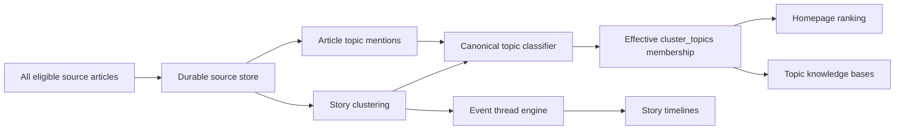

# Canonical Multi-Topic Knowledge Base — Phase-Wise Execution Plan

The multi-hashtag requirement is the central design principle: each story cluster may belong to several canonical topics, normally 3–6, while story threads remain separate narrative timelines. The vocabulary is open for discovery but canonical at publication: the seed taxonomy bootstraps the system and never limits which new source-grounded entities can be discovered later.

The implementation will proceed one phase at a time. After each phase, work must stop, all discovered debt must be resolved, the complete verification suite must pass, and the required Phase Summary must be provided before the next phase begins.

## Target architecture



Hashtags will be presentation labels generated from canonical topic records:

```text
Topic SSOT: united-states
Display:    #UnitedStates
Aliases:    USA, US, U.S., America
```

An article can then receive:

```text
#Iran             actor
#UnitedStates     target
#Jordan           location
#Airbases         asset class
#MuwaffaqSaltiAB  facility
#IranUSTensions   strategic theme
```

Three to six tags is the normal target, not an enforced maximum.

## Sources of truth and cross-run stability

The system has separate authoritative records for separate questions:

- `topics` and `topic_aliases` are the SSOT for topic identity, canonical display, and alias resolution.
- `article_topic_mentions` is the evidence ledger for what an individual source article explicitly or contextually mentions.
- `cluster_topics` is the SSOT for the current validated topic membership of a story cluster.
- `topic_assignment_runs` and `cluster_topic_decisions` are the immutable provenance ledger explaining proposed, accepted, suppressed, and removed assignments.
- Story threads remain the SSOT for narrative continuity; they never define topic identity or membership.

Model output, publisher hashtags, extracted entity strings, and compatibility fields such as `primaryTag` are inputs or projections, never sources of truth.

Equivalent source phrasing must converge before storage:

```text
USA / U.S. / US / United States
→ resolve registered alias
→ topic_id = united-states
→ render #UnitedStates
```

The same unchanged classification input must produce the same effective assignments across crawler runs. Every classification records a deterministic `content_fingerprint`, `registry_version`, `classifier_version`, and `assignment_policy_version`. If those values are unchanged, the prior validated result is reused rather than recomputed. Validated semantic adjudications are cached by an input hash; model sampling is never relied upon for determinism.

Each run computes a complete desired assignment set and reconciles it with `cluster_topics` atomically. Runs must not accumulate a permanent union of all historical hashtags. Curator-locked assignments are preserved. Low-confidence additions or removals remain shadow decisions until they satisfy the publication policy, preventing public hashtags from oscillating between runs.

A cluster retains a durable identity when its primary source changes. Cluster merges and splits are recorded through lineage and redirects so topic assignments, curator decisions, thread references, and public URLs remain traceable.

## Open-world discovery and canonical publication

The topic registry is a living database, not a hardcoded TypeScript allowlist. The crawler must discover new source-grounded concepts without requiring a code deployment while preventing unverified model strings from immediately fragmenting the public taxonomy.

Classification therefore has two output channels:

```json
{
  "existingTopics": [
    {
      "topicId": "iran",
      "role": "actor",
      "evidence": "Iran launched..."
    }
  ],
  "discoveredConcepts": [
    {
      "name": "Muwaffaq Salti Air Base",
      "type": "facility",
      "role": "target",
      "evidence": "the attack targeted Muwaffaq Salti Air Base"
    }
  ]
}
```

The discovery path is:

```text
Extract concept
→ validate exact source evidence
→ normalize its name
→ search canonical topics and aliases
→ resolve an existing equivalent where possible
→ create a provisional canonical topic when deterministic safety gates pass
→ otherwise queue it for review
→ assign the article to the resolved topic
```

The ontology is open-ended for concrete entities such as countries, people, offices, armed forces, units, organizations, companies, platforms, programmes, facilities, locations, exercises, operations, alliances, conflicts, technologies, and capabilities. Abstract thematic labels may also be proposed, but require stricter semantic deduplication or curator review because unconstrained themes are the main source of hashtag fragmentation.

Concrete named entities may be created automatically with `provisional` status when their name is present as an exact span in trusted source text, their type is reliably established, they do not collide with an existing alias, and all security and quality checks pass. A provisional topic becomes `active` after corroboration by multiple independent sources, one authoritative official source, or a curator. Ambiguous entities, broad themes, aliases, and proposed merges require review.

An exact text span proves only that the source used those words. It does not by itself prove entity type, factual truth, material relevance, or source independence. Those properties require separate deterministic checks or curator review. Provisional topics and shadow assignments are never returned by public endpoints until their publication state becomes `published`.

## Rules applying to every phase

Every phase must satisfy all of the following before closure:

- All new business behavior is covered by meaningful unit tests.
- Cross-layer behavior is covered by integration tests.
- No skipped, pending, or quarantined tests.
- MVVM boundaries remain intact.
- Components do not call crawler, database, or API logic directly.
- D1 access remains behind services and parameterized query builders.
- All UI strings use resource files.
- All colors use the established style variables.
- No source file exceeds 300 lines unless an SRP justification is documented in that file.
- No model-generated string is trusted as a topic ID, URL, HTML fragment, or database value.
- Public APIs use input validation, bounded pagination, rate limiting, and safe error responses.
- Curator mutations require the existing authentication controls.
- No public topic is created automatically from an unreviewed model suggestion.
- A concrete topic may be created provisionally only from validated source evidence and deterministic creation gates; a model suggestion by itself is insufficient.
- Runtime topic recognition is driven by the D1 registry and learned aliases rather than a compiled source-code allowlist.
- Canonical topic IDs, durable article IDs, and durable cluster IDs are stable and never derived from model output.
- Unchanged content, registry, classifier, and policy versions produce identical effective assignments across repeated runs.
- Assignment writes use desired-state reconciliation; cross-run hashtag union is forbidden.
- Shadow, provisional, suppressed, and rejected decisions cannot leak through public APIs or compatibility fields.
- Curator-locked decisions cannot be overwritten by ingestion, reclassification, or backfill.
- Full verification runs through `npm run check`.
- Relevant D1 migration tests and backfill tests pass separately.
- The build and bundle budget pass.

The Phase Summary will use this template:

```text
Phase N Summary

Delivered:
Verification:
Tech debt discovered:
Resolution:
Known limitations:
Build status:
Test status:
```

A phase cannot be marked complete with unresolved release-blocking debt. Any accepted non-blocking debt must have a documented owner, reason, and target phase; planned later functionality is future scope rather than completed behavior.

## Phase 0 — Baseline, invariants, and classification corpus

### Goal

Establish measurable current behavior and encode the product rules before modifying production logic.

### Deliverables

1. Document the architectural decision separating:

   - Source articles
   - Story clusters
   - Canonical topics
   - Article-topic mentions
   - Effective cluster-topic assignments
   - Narrative story threads
   - Knowledge-graph relationships

   The decision must also define ownership and migration boundaries for existing `canonical_entities`, `discovered_entities`, `graph_nodes`, programmes, suppliers, and story threads. `topics` represents public navigable concepts; it must not silently become a conflicting master record for every domain entity. `topic_relations` represents topic navigation and controlled assignment implications, while factual graph claims remain in the knowledge graph.

2. Create a reviewed classification fixture containing positive and negative examples.

3. Capture baseline statistics from the current repository dataset:

   - Percentage of clusters with tags
   - Number of generated tag variants
   - Orphan cluster count
   - Articles excluded by the top-30 cutoff
   - Existing thread and event counts
   - Existing canonical aliases

4. Define canonical topic types:

   - Country
   - Bilateral relationship
   - Person
   - Office
   - Military service
   - Military unit
   - Organization
   - Company
   - Platform
   - Programme
   - Location
   - Facility
   - Exercise
   - Operation
   - Alliance
   - Operational theatre
   - Conflict
   - Technology
   - Capability
   - Strategic theme

5. Define assignment roles:

   - `subject`
   - `actor`
   - `target`
   - `operator`
   - `location`
   - `facility`
   - `platform`
   - `programme`
   - `context`

6. Define stable identity and evolution rules:

   - Canonical URL normalization and durable source article IDs
   - Durable cluster IDs independent of whichever source is currently primary
   - Event fingerprints and matching windows
   - Article movement between clusters
   - Cluster merge, split, lineage, and redirect behavior
   - Preservation of curator decisions during cluster evolution

7. Define evidence and corroboration rules:

   - Evidence uses `source_article_id`, bounded offsets, and a content hash rather than an unaudited copied string alone.
   - “Independent source” accounts for syndication and common ownership, not just distinct domains.
   - Authoritative-source status is type-specific and comes from reviewed source metadata.
   - The full-text acquisition policy states when classification uses a headline, feed snippet, official release, or fetched article body.

8. Ratify measurable release thresholds:

   - 100% canonical consistency for aliases in the gold corpus
   - 100% assignment stability for unchanged versioned inputs
   - At least 95% precision for public direct-topic assignments
   - At least 90% recall for explicit material subjects
   - No more than 2% incidental-topic false positives
   - No more than 1% unresolved near-duplicate topic candidates
   - Zero provisional or shadow topics exposed publicly
   - Deterministic classification p95 at or below 50 ms per cluster in the local benchmark, excluding network I/O
   - At most one bounded registry read operation per crawl and zero assignment mutations for unchanged inputs
   - At most one model request per uncached classification input hash and zero model requests for unchanged cached inputs
   - Topic classification keeps a 100-cluster crawl within five minutes under the configured model concurrency and timeout policy
   - Paid model spend defaults to zero; enabling a paid provider requires an explicit configured per-run budget and fail-closed cap

### Required test cases

The gold corpus will include:

- India-China talks explicitly mentioning LAC
- India-China meeting at Kibithu
- NSA meeting a Chinese counterpart about border negotiations
- An unrelated article containing “black” that must not match LAC
- Tourism in Kibithu that must not receive LAC
- US airbase in Jordan attacked by Iran
- US aircraft operating from a Jordanian airbase
- An article mentioning Iran only as historical background
- `USA`, `U.S.`, `US`, and `United States`
- `Su57`, `Su-57`, and `Sukhoi Su-57`
- Ambiguous aliases and homonyms such as Jaguar as a platform, company, or ordinary word
- Syndicated copies that must count as one independent source
- Transliteration, punctuation, capitalization, and renamed-programme variants
- Corrections, retractions, cluster merges, cluster splits, and a changed primary source
- Repeated identical crawler runs and repeated semantic adjudication

### Exit criteria

- Architecture decision is complete.
- Taxonomy and relevance rules are unambiguous.
- Identity, lineage, evidence, source independence, and ownership rules are unambiguous.
- Numeric quality, stability, performance, and cost gates are approved and encoded in tests or fixtures.
- Baseline tests and current full suite pass.
- No production behavior changes.

### Phase status

Complete as of 2026-09-13. The deep completion audit, verification evidence, tech-debt sweep, resolutions, and fail-loud carried-forward limitations are recorded in `docs/Plans/canonical-topic-phase-0-summary.md`.

## Phase 1 — Durable identity, canonical topic registry, and D1 schema

### Goal

Create the durable article, cluster, and topic foundation without changing production behavior or the public UI. The storage tables are created in this phase so every assignment foreign key has a valid parent before classification begins.

### Schema

Add versioned, additive D1 migrations for:

```text
ingestion_runs
source_articles
story_clusters
cluster_sources
cluster_lineage
topics
topic_aliases
topic_relations
topic_implication_rules
topic_candidates
topic_assignment_runs
cluster_topic_decisions
cluster_topics
article_topic_mentions
topic_curation_audit
topic_reclassification_queue
```

Representative fields:

```text
ingestion_runs
  id
  input_fingerprint
  status
  started_at
  completed_at
  failure_stage
  retry_count

source_articles
  id
  canonical_url
  source_domain
  source_owner_key
  title
  snippet
  published_at
  content_hash
  payload_key
  first_seen_at
  last_seen_at

story_clusters
  id
  event_fingerprint
  status
  primary_source_article_id
  first_observed_at
  last_observed_at
  merged_into_cluster_id
  created_at
  updated_at

cluster_sources
  cluster_id
  source_article_id
  coverage_role
  source_authority
  attached_at

cluster_lineage
  predecessor_cluster_id
  successor_cluster_id
  change_type
  reason
  changed_at

topics
  id
  display_name
  display_hashtag
  topic_type
  description
  status
  verification_state
  display_priority
  registry_version
  replaced_by_topic_id
  first_seen_at
  last_seen_at
  created_at
  updated_at

topic_aliases
  normalized_alias
  topic_id
  alias_type
  requires_context
  context_rule_json
  verification_state
  created_at

topic_relations
  source_topic_id
  relation_type
  target_topic_id
  confidence
  evidence_source_article_id
  evidence_start
  evidence_end
  evidence_content_hash
  verification_state

topic_implication_rules
  source_topic_id
  implied_topic_id
  required_context_json
  maximum_depth
  verification_state

topic_assignment_runs
  id
  cluster_id
  content_fingerprint
  registry_version
  classifier_version
  assignment_policy_version
  model_cache_key
  status
  started_at
  completed_at

cluster_topic_decisions
  id
  assignment_run_id
  cluster_id
  topic_id
  role
  confidence
  assignment_source
  decision_state
  supersedes_decision_id
  decided_at

cluster_topics
  cluster_id
  topic_id
  role
  confidence
  assignment_source
  source_decision_id
  locked_by_curator
  assignment_run_id
  classifier_version
  assigned_at
  reviewed_at

article_topic_mentions
  topic_id
  cluster_id
  source_article_id
  mention_kind
  evidence_start
  evidence_end
  evidence_content_hash
  extraction_run_id
  observed_at

topic_curation_audit
  id
  topic_id
  cluster_id
  action
  before_json
  after_json
  curator_email
  expected_version
  created_at

topic_reclassification_queue
  id
  trigger_type
  trigger_id
  cluster_id
  status
  attempts
  available_at
```

Required constraints:

- Unique topic ID
- Unique canonical hashtag
- Unique canonical article URL after normalization
- Unique `(cluster_id, source_article_id)` membership
- Unique `(normalized_alias, topic_id)` alias mapping
- At most one unconditional mapping for a normalized alias; contextual aliases may map to multiple topics and must be disambiguated
- Unique `(cluster_id, topic_id)`
- Unique article mention for the same topic, evidence span, and extraction run
- Unique directed topic relation and implication rule
- Foreign keys for all topic references
- Controlled values for type, role, lifecycle status, verification state, and assignment source
- Redirect support for merged or deprecated topics
- Redirect and lineage support for merged or split clusters
- Lifecycle support for `provisional`, `active`, `deprecated`, and `merged` topics
- Cycle prevention for topic redirects and bounded implication traversal
- Database checks for confidence ranges, evidence offsets, publication states, and lifecycle transitions
- Mention and independent-source counts are derived from evidence rows. Any cached counters are explicitly non-authoritative and have a reconciliation job.

### Migration strategy

- Adopt numbered migration files and a migration ledger; `d1/schema.sql` may remain a generated bootstrap snapshot but is not the deployment mechanism.
- Test migrations from an empty database and from representative copies of every supported prior schema.
- Enable and verify foreign-key enforcement in migration and application tests.
- Do not use crawler startup as an implicit schema migration path.
- Seed taxonomy records in an idempotent reviewed seed migration separate from runtime discovery.

### Initial taxonomy

Seed a small reviewed bootstrap taxonomy containing:

- India
- China
- United States
- Iran
- Jordan
- India-China
- LAC
- LOC
- Indian Army
- Indian Navy
- Indian Air Force
- Existing known platforms, programmes, and organizations
- Approved operational theatres and facility classes

These records only give the first crawl a reliable starting vocabulary. They are not an allowlist and do not define the boundary of what can be tagged. The D1 tables are the living runtime SSOT. Migration files provide version history; they do not become a second runtime registry. New verified topics and aliases must become available to subsequent classification runs without a code deployment.

Existing `canonical_entities` and `discovered_entities` records are imported only as reviewable migration candidates. Existing graph nodes, programmes, and suppliers retain their current domain ownership and may reference a topic; they are not silently duplicated as competing master records.

### Application structure

Likely modules:

```text
src/types/topics.ts
src/services/topicRegistryService.ts
src/services/topicQueryBuilder.ts
crawler/topicRegistryLoader.ts
crawler/durableIngestService.ts
crawler/topicAssignmentReconciler.ts
```

Each file receives one responsibility and remains below 300 lines.

### Tests

- Local migration from an empty database
- Migration against a database containing existing thread and archive tables
- Foreign-key enforcement
- Duplicate unconditional alias rejection and contextual alias disambiguation
- Redirect resolution
- Redirect-cycle rejection
- Alias normalization
- Invalid topic type rejection
- Topic lifecycle transition validation
- Derived corroboration counts across genuinely independent sources
- Prevention of alias collisions during automatic discovery
- Stable article identity after URL normalization
- Stable cluster identity when the primary source changes
- Cluster merge and split lineage
- Effective `cluster_topics` membership separated from shadow, provisional, suppressed, rejected, and superseded decision history
- Repository contract and line-count tests

### Exit criteria

- Schema applies cleanly and repeatably.
- Article, cluster, and topic registries can be read but do not affect current ingestion or hashtags.
- Existing application behavior remains unchanged.
- Full build and test suite pass.

### Phase status

Complete as of 2026-09-13. The deep completion audit, verification evidence,
tech-debt sweep, resolutions, and fail-loud carried-forward production rollout
are recorded in `docs/Plans/canonical-topic-phase-1-summary.md`.

## Phase 2 — Complete durable article and cluster storage

### Goal

Ensure homepage ranking never determines which stories enter the knowledge base.

### Pipeline change

Current behavior truncates to the top 30 before downstream processing. It will become:

```text
Fetch all eligible sources
→ persist source articles
→ cluster all eligible stories
→ persist every cluster
→ classify every cluster
→ rank/select top 30 for homepage
```

### Durable write path

Use the Phase 1 `source_articles`, `story_clusters`, and `cluster_sources` records to preserve every publication while allowing the topic UI to group duplicate reporting under one event.

`cluster_sources` identifies:

- Primary source
- Related coverage
- Social discussion
- Publication timestamp
- Source authority

R2 continues storing full cluster payloads. D1 stores indexed metadata and relationships.

Every crawl advances an explicit ingestion state machine:

```text
started
→ articles_persisted
→ clusters_persisted
→ classified
→ publishable
→ published

Any stage → failed_retryable | failed_terminal
```

D1 metadata writes for a bounded batch are transactional. R2 blobs are written with deterministic keys before their corresponding D1 references become visible. A failed D1 commit leaves a detectable orphan candidate for cleanup; a missing R2 blob prevents the D1 record from becoming publishable. Retries use the ingestion run ID and content hashes rather than creating new records.

### Behavioral requirements

- Every accepted source article receives a durable ID.
- Article IDs use canonicalized URLs with a documented fallback for genuinely URL-less sources.
- Every eligible cluster is persisted before homepage truncation.
- Existing durable clusters are matched before creating new clusters; changing the primary source does not change cluster identity.
- Cluster merges and splits preserve lineage, redirects, topic decisions, and curator locks.
- A story outside the top 30 remains available to topic classification and archive queries.
- Repeated crawl runs are idempotent.
- Re-entering the homepage does not delete the durable article record.
- Failure policy is explicit: durable article or cluster persistence failure blocks that run from publishing a new homepage snapshot; optional downstream enrichment failures may degrade only according to their documented fallback.
- Recovery resumes from the last completed run stage and never treats a partial write as successful ingestion.

### Tests

- A 50-cluster crawl persists all 50 but displays only 30.
- A rank-31 story appears in topic results.
- Duplicate source URLs remain deduplicated.
- Tracking parameters, equivalent URL forms, redirects, and protocol variants resolve according to the canonical URL policy.
- Multiple publications remain attached to their cluster.
- The same event retains its cluster ID when a different source becomes primary.
- Cluster merges and splits preserve lineage and do not orphan assignments.
- R2 failure prevents an incomplete durable record.
- Partial D1 failure is reported as a failed ingestion result and blocks snapshot publication.
- An R2-success/D1-failure orphan is detected and cleaned or adopted safely on retry.
- An interrupted ingestion resumes from its recorded stage.
- Re-running the same crawl creates no duplicates.

### Exit criteria

- Zero eligible clusters are lost because of ranking.
- No incomplete ingestion run is published as current data.
- Homepage output remains compatible.
- Existing archive search continues working.
- Full build and test suite pass.

### Phase status

Complete as of 2026-09-13. The durable path, deep completion audit,
verification evidence, tech-debt sweep, resolutions, and fail-loud
cross-phase/production validations are recorded in
`docs/Plans/canonical-topic-phase-2-summary.md`.

## Phase 3 — Registry-driven deterministic multi-topic classification

### Goal

Assign known topics with no model dependency and extract safe candidates for previously unseen concrete entities.

### Classification stages

1. Load active and provisional topics, aliases, verified navigation relations, and verified implication rules from D1 once per bounded crawl operation.
2. Normalize article and cluster text.
3. Match runtime canonical aliases with word boundaries.
4. Verify context-sensitive acronyms.
5. Extract exact source spans that could represent new concrete entities.
6. Resolve extracted spans against existing topic IDs and aliases.
7. Persist article-level mentions with source IDs, offsets, and content hashes.
8. Aggregate material article evidence into cluster-level assignments and roles.
9. Apply only approved conditional implication rules.
10. Compute the complete desired assignment set.
11. Reuse the prior validated result when the content, registry, classifier, and policy versions are unchanged.
12. Record immutable decisions, then atomically reconcile validated non-curator membership in `cluster_topics` without overwriting curator locks.

Examples:

```text
"LAC" → #LAC
"Line of Actual Control" → #LAC
"U.S." → #UnitedStates
"Tejas Mk1A" → #TejasMk1A
```

Contextual inference:

```text
Kibithu
+ India and China as material actors
+ military/diplomatic border event
→ #LAC
```

Taxonomy implications:

```text
#LAC
→ #India
→ #China
→ #IndiaChina
```

These implications must be explicit, verified, conditional implication rules, not free-form assumptions or generic graph traversal. A descriptive topic relation does not automatically imply story membership. Rules define direction, required context, maximum depth, and whether the result is eligible for automatic publication. Cycles and unbounded transitive expansion are rejected.

### Tagging policy

- Direct material subjects receive high confidence.
- Incidental mentions are rejected.
- Publisher tags are candidate signals only.
- Generic topics such as `#Airbases` are assigned only when the facility materially affects the report.
- A specific facility and its broad class may both be assigned.
- No fixed tag maximum is enforced.
- Topic order is determined separately for display.
- New concrete candidates retain their exact source span and provenance.
- Recognition behavior updates when the registry changes; it does not require recompiling a regex catalog.
- Exact-span extraction alone may create a review candidate, but cannot establish type or materiality without an independent deterministic rule.
- Deterministic matching operates over a bounded indexed registry lookup. Correctness must not depend on loading only the most recently seen topics.
- Similar source articles in the same durable cluster share one effective cluster assignment set while retaining their distinct article-level evidence.
- Similar articles in separate clusters may differ in secondary topics, but every directly evidenced canonical subject must resolve to the same topic ID.
- Reconciliation removes stale non-curator assignments when justified; it never implements a permanent union of hashtags from prior runs.

### Tests

- All Phase 0 gold-corpus deterministic cases
- Multi-topic assignments
- Idempotent writes
- Duplicate alias prevention
- Role selection
- Topic implication rules
- Incidental-mention rejection
- Whole-word acronym protection
- Stable results regardless of publisher hashtag order
- Identical assignments on repeated runs with unchanged fingerprints and versions
- Reuse of a prior assignment without reclassification when inputs are unchanged
- Removal of a stale non-curator assignment through desired-state reconciliation
- Preservation of curator-locked assignments during reconciliation
- Runtime recognition of a newly inserted D1 topic without a code change
- Extraction of an unseen concrete named entity with exact evidence
- Rejection of ordinary words, verbs, adjectives, and non-distinctive phrases as topics

### Exit criteria

- Known-topic classification works without Gemini or Workers AI.
- The deterministic pipeline can surface previously unseen concrete candidates without publishing arbitrary hashtags.
- One cluster can belong to multiple topics.
- `cluster_topics` contains one stable effective assignment set rather than an accumulated history of classifier outputs.
- Assignments remain shadow data and do not yet change public hashtag clicks.
- Full build and test suite pass.

### Phase status

Repository implementation and its full verification suite completed on
2026-09-13. Rule 12 carried-forward gaps are explicitly recorded as the final
Phase 14; they are not represented as completed Phase 3 behavior.

## Phase 4 — Hybrid existing-topic linking and open-world concept discovery

### Goal

Use model judgment both to link semantic cases to existing topics and to discover previously unseen source-grounded concepts, while preventing uncontrolled hashtag creation.

### Model contract

The model receives:

- Sanitized headline and available article text
- Deterministic candidates
- A retrieved, bounded set of likely existing topic IDs
- Topic definitions
- The open-world discovery schema
- Required role, type, and evidence fields
- An explicit instruction that source content is untrusted data and cannot modify the output contract

It returns:

```json
{
  "existingTopics": [
    {
      "topicId": "lac",
      "role": "context",
      "confidence": 0.91,
      "evidence": "meeting at Kibithu concerning the India-China border"
    }
  ],
  "discoveredConcepts": [
    {
      "name": "Muwaffaq Salti Air Base",
      "type": "facility",
      "role": "target",
      "confidence": 0.96,
      "evidence": "the attack targeted Muwaffaq Salti Air Base"
    }
  ]
}
```

Every returned existing topic ID is checked against the loaded registry. Unknown IDs in `existingTopics` are rejected. Every discovered concept must cite an exact, validated source span; a model-proposed name without grounded evidence is rejected.

The validated response is cached by a deterministic hash of sanitized evidence, retrieved candidate topic IDs, registry version, classifier version, and assignment-policy version. An unchanged hash reuses the validated decision. Model temperature or provider repeatability is not treated as a stability guarantee.

### Automatic creation policy

A discovered concrete entity may be normalized and created as a provisional topic when all deterministic gates pass:

- The entity type is eligible for automatic creation.
- The proposed name occurs exactly in trusted article content.
- The name is distinctive and passes length and character constraints.
- It does not resolve to, collide with, or closely duplicate an existing topic or alias.
- Its slug is stable and collision-free.
- Its evidence and source provenance are stored.

Abstract themes, uncertain types, near-duplicates, aliases, merges, and indirect inferences go to `topic_candidates` for review. Provisional topics accumulate private evidence immediately but remain `shadow` or `suppressed`; public APIs and compatibility hashtag fields exclude them until promotion and publication criteria are met.

Suggested new concepts enter `topic_candidates` with:

- Suggested name
- Normalized form
- Evidence
- Source clusters
- Mention count
- Distinct source count
- Status
- Reviewer metadata

They never become active public topics from a model suggestion alone. Promotion requires deterministic corroboration or curator approval.

### Effective-assignment stability

- Model results first enter `cluster_topic_decisions` as shadow decisions and do not directly mutate validated `cluster_topics` membership.
- A high-confidence addition becomes effective only after deterministic validation and the approved publication threshold.
- Removing an effective topic requires deterministic contradictory evidence, repeated agreement across the configured number of runs, a successfully evaluated classifier-version migration, or curator approval.
- Curator-locked additions and removals always win over automated decisions.
- Registry or classifier changes create a new desired assignment set and an auditable diff; they do not silently rewrite history.
- Similar clusters with conflicting core subjects are measured as a consistency failure and queued for review. Differences in materially supported secondary topics are allowed and retained with evidence.

### Shadow evaluation

Run old and new classification simultaneously and report:

- New-system precision and recall against the gold corpus
- Old/new disagreement rate
- Unknown-topic candidate rate
- New concrete concept discovery rate
- Provisional-to-active promotion rate
- Near-duplicate and alias-collision rate
- Average topics per cluster
- Untagged eligible cluster rate
- Assignment source distribution
- Repeated-run assignment stability
- Core-topic consistency across near-duplicate clusters
- Public assignment addition and removal churn
- Model cache hit rate, latency, and cost per eligible cluster

### Tests

- Hallucinated topic IDs are rejected.
- Malformed responses fail safely.
- Prompt-injection text cannot alter the schema.
- Evidence is length-limited and sanitized.
- Model outage leaves deterministic assignments intact.
- Candidate topics remain private.
- Repeated candidates aggregate without duplication.
- A new concrete entity can be provisionally created from an exact evidence span.
- A new abstract theme cannot bypass review.
- A provisional topic is promoted after the configured independent-source or authoritative-source threshold.
- Near-duplicate discovered concepts resolve or enter review rather than fragmenting the taxonomy.
- An unchanged semantic input reuses the cached validated result.
- Different model responses for the same uncached input cannot directly oscillate public assignments.
- Provisional and shadow assignments are absent from every public read path.

### Exit criteria

- Model output cannot directly create active public hashtags.
- Previously unseen concrete entities can enter the living registry through validated provisional creation.
- Deterministic fallback remains fully functional.
- Phase 0 quality thresholds are met on the reviewed corpus and shadow production sample, including 100% canonical alias convergence and 100% unchanged-input assignment stability.
- Full build and test suite pass.

### Phase status

Repository implementation completed on 2026-09-13. The guarded semantic path
is opt-in, cached by versioned input hash, source-span validated, and writes
model links/discoveries as shadow decisions only. Automatic provisional creation
is limited to entity types with deterministic naming evidence; other proposals
remain private review candidates. The external/provider measurements and broader
reviewed type validators that cannot truthfully be claimed from local fixtures
are carried forward explicitly in final Phase 15.

## Phase 5 — Curator topic governance and review workflow

### Goal

Provide the authenticated human-control surface required to govern candidates, ambiguous aliases, topic lifecycle, assignment exceptions, and merges before backfill or public cutover.

### Curator capabilities

- List and filter provisional topics, topic candidates, alias collisions, near-duplicates, and assignment disagreements.
- Inspect every supporting source article, bounded evidence span, source-independence calculation, classifier version, and assignment diff.
- Approve, reject, rename, promote, deprecate, merge, or redirect a topic.
- Add contextual or unconditional aliases with collision checks.
- Approve or reject topic implication rules separately from descriptive topic relations.
- Add, remove, or lock a cluster-topic assignment.
- Preview the affected assignments, historical clusters, API URLs, and redirects before a merge or rule change.
- Use optimistic concurrency so one curator cannot silently overwrite another curator's newer decision.
- Write an immutable audit record for every mutation.
- Enqueue bounded targeted reclassification after an approved topic, alias, merge, or implication-rule change.
- Reverse a mistaken merge or bulk decision through a tested recovery operation where data has not been irreversibly discarded.

### MVVM and API boundaries

Components consume curator ViewModels only. ViewModels call authenticated topic-governance services; services own validation, audit writes, and parameterized D1 operations. Existing curator authentication and safe error conventions remain mandatory.

### Tests

- Every mutation requires curator authentication and authorization.
- Candidate approval and rejection are auditable.
- Rename preserves canonical redirects.
- Unconditional alias collisions are rejected; contextual ambiguity is represented safely.
- Merge preview reports affected records before mutation.
- Merge, redirect, and reversal preserve assignment provenance.
- Optimistic concurrency rejects stale writes.
- Curator-locked assignment survives ingestion and backfill.
- Approved registry changes enqueue only affected historical clusters.
- Model or source text cannot inject a curator action, SQL value, URL, or HTML fragment.

### Exit criteria

- Every review path referenced by earlier phases has an authenticated, auditable operation.
- No candidate, ambiguous alias, merge, abstract theme, or implication rule requires direct database editing.
- Full build, security checks, and test suite pass.

### Phase status

Repository governance foundations completed on 2026-09-13: authenticated,
no-store curator endpoints now provide preview and audited mutations for
candidate approval/rejection, topic rename, aliases, implication rules,
merge/reversal, and curator cluster assignments. Mutations use an optimistic
governance-version resource, bounded targeted queueing, and the existing
immutable decision/audit ledger. Phase 16 records the remaining human-facing
review workflow and remote-D1 proof work under Rule 12; neither is claimed as
complete merely because the underlying mutation endpoint exists.

## Phase 6 — Topic read API and knowledge-base query model

### Goal

Expose authoritative topic collections independently from story threads. Deploy the routes behind the same internal or staging feature gate as the topic UI until Phase 10 enables public access.

### Endpoints

```text
GET /api/topics
GET /api/topics/:id
GET /api/topics/:id/articles
GET /api/topics/:id/related
```

Article results include:

- Cluster
- Primary source
- Related sources
- Assignment role
- Confidence and provenance where appropriate
- Publication date
- Related story thread IDs
- Pagination cursor

### Query behavior

- Resolve canonical ID, display hashtag, or registered alias.
- Follow deprecated-topic redirects.
- Query validated rows through indexed `cluster_topics` and active topics only; shadow, provisional, suppressed, and rejected decisions remain in the decision ledger and are structurally excluded.
- Use keyset pagination ordered by `(published_at DESC, cluster_id DESC)` with bounded, opaque, versioned cursors.
- Apply strict limits.
- Never scan the full archive per request.
- Do not depend on the 100-thread or 500-event synchronization windows.
- Return enough indexed D1 metadata to render collection cards without one R2 request per result. Fetch a full R2 payload only for detail that is not represented in D1.
- Define cache keys and invalidation using canonical topic ID, registry version, assignment publication version, and cursor.

### Security

- Validate and length-limit topic identifiers.
- Use parameterized SQL.
- Rate-limit public endpoints.
- Return safe errors.
- Do not expose internal prompts or curator-only evidence.
- Apply public caching only to successful read responses.
- Reject cursors whose signature, version, length, or sort position is invalid.

### Tests

- Lookup by canonical ID and alias
- Pagination without duplicates
- Stable pagination when several clusters share a publication timestamp
- Invalid and obsolete cursor handling
- Deprecated-topic redirect
- Unknown-topic 404
- Injection attempts
- Rate limiting
- Archived and live cluster retrieval
- One article appearing under every assigned topic
- All corroborating sources included
- Provisional, shadow, suppressed, and rejected records never returned
- Collection rendering does not perform an N+1 R2 read pattern

### Exit criteria

- Topic APIs accurately return multi-topic membership.
- Existing thread APIs remain operational.
- Full build and test suite pass.

### Phase status

Repository implementation completed on 2026-09-13. The feature-gated public
read routes use only effective `cluster_topics` membership, D1-backed source
metadata, parameterized indexed reads, and signed versioned keyset cursors.
They deliberately fail closed until both the staging gate and cursor secret are
configured. Remote D1/staging deployment proof is carried forward explicitly
in final Phase 17 rather than claimed from local verification.

### Phase 6 Summary

Delivered: Feature-gated `GET /api/topics`, `GET /api/topics/:id`,
`GET /api/topics/:id/articles`, and `GET /api/topics/:id/related`, plus
published-membership indexes, canonical/alias/display-hashtag resolution,
deprecated redirects, D1-only card metadata, batched corroborating sources and
thread IDs, signed opaque keyset cursors, bounded limits, cache version tags,
and safe errors/rate limits.

Verification: Focused handler and Pages-route tests cover aliases, display
hashtags, redirects, signed/tampered cursors, tie-safe pagination, sources,
thread IDs, feature gating, and cache tags. Local D1 migration application,
topic migration/schema integration tests, and the complete `npm run check`
suite pass.

Tech debt discovered: The first implementation rebuilt a few immutable query
statements twice and did not index the assignment-publication version lookup.

Resolution: Query statements are now constructed once per use; migration 0011
adds the `assigned_at` index in addition to topic-membership and source-hydration
indexes. No repository-scope Phase 6 debt remains.

Known limitations: Remote secret provisioning, staging-only enablement, remote
D1 query plans, edge-isolate rate limits, and production-scale cache behavior
cannot be proven locally. They are fail-closed and assigned to Phase 17.

Build status: Passing.

Test status: 1,461/1,461 full-suite tests passing; focused topic migration and
schema tests pass with no skipped or pending tests.

## Phase 7 — Historical classification and backfill

### Goal

Make existing history part of the new topic knowledge base before public cutover.

### Backfill behavior

1. Read live clusters and archived R2 cluster payloads.
2. Process bounded, resumable batches.
3. Apply deterministic classification.
4. Apply model adjudication only where needed.
5. Store content fingerprint, registry version, classifier version, assignment-policy version, and run ID.
6. Record failures for retry.
7. Reprocess only missing or outdated assignments.
8. Preserve curator decisions.
9. Produce before-and-after counts.
10. When a topic, alias, merge, or verified implication rule is added, enqueue affected historical clusters for targeted retroactive classification.
11. Compute and atomically reconcile a desired assignment set for each cluster rather than unioning historical hashtags.
12. Materialize no backfilled decision into `cluster_topics` until its topic is active and the decision satisfies the assignment acceptance policy.

### Existing hashtag migration

- Resolve current `primaryTag` and `hashtags` values through the new registry.
- Treat them as migration evidence, not truth; convert only trusted matches into shadow assignments before validation.
- Send ambiguous variants to review.
- Map legacy aliases to canonical topics.
- Create redirects for replaced hashtag URLs.
- Do not blindly promote existing `canonical_entities` rows; that table may contain earlier classification mistakes.

### Tests

- Backfill is idempotent.
- Interrupted batches resume safely.
- One bad R2 payload does not corrupt the batch.
- Failed records remain retryable.
- Classifier-version changes trigger controlled reassignment.
- Registry-version and assignment-policy changes trigger only the required reassignment.
- Unchanged fingerprints and versions reuse prior validated assignments.
- Curator-reviewed assignments cannot be overwritten.
- Historical LAC examples converge correctly.
- Aggregate counts remain stable on a second run.
- Effective topic membership remains identical on a second unchanged run.
- Stale non-curator assignments are removed without deleting assignment history.
- Establishing a new topic or alias retroactively attaches matching historical clusters.
- Establishing a new verified implication rule retroactively evaluates clusters affected by that rule.

### Exit criteria

- Backfill backlog reaches zero.
- Failed records are zero or fully resolved before phase closure.
- Topic counts reconcile with assignment rows.
- Repeated unchanged backfills produce zero effective assignment churn.
- Full build and test suite pass.

### Phase status

Repository implementation completed on 2026-09-13. `npm run backfill:topics`
drains bounded batches until the D1 selection is empty and fails loudly on the
first retryable payload or classification failure. The worker reads and
identity-validates archived R2 payloads, uses durable D1 source metadata for
classification, reuses one registry snapshot per bounded batch, and sends all
writes through desired-state reconciliation. Legacy `primaryTag` and
`hashtags` resolve only through registered canonical aliases as `migration`
shadow decisions; unknown legacy variants become private review candidates.
The retry ledger preserves the cluster ID, attempt count, safe error message,
and next availability so no bad payload can be treated as a completed batch.

### Phase 7 Summary

Delivered: Resumable historical topic backfill, a fail-loud draining command,
R2 archived-payload validation, D1 source hydration, version-aware and
targeted-queue selection, retry persistence, before/after effective-assignment
counts, legacy-tag shadow migration, and private ambiguous-legacy review
candidates.

Verification: Focused tests cover archived R2 success, unavailable payload
retry recording, legacy canonical and unknown-tag handling, and a second
unchanged run with zero churn. Local D1 migration application and the complete
`npm run check` suite pass.

Tech debt discovered: The initial registry-snapshot refactor moved the empty
durable-plan fast path after a D1 read, which broke the mocked empty-plan
ingestion contract and was unnecessary work.

Resolution: Restored the fast path before registry loading; the full suite
passes with the original no-read behavior intact. No repository-scope Phase 7
tech debt remains.

Known limitations: No authenticated D1/R2 environment was authorized for
running the real historical backlog, resolving any retry records, or measuring
the before/after production counts. Those external completion checks are
carried forward explicitly in Phase 18.

Build status: Passing.

Test status: 1,463/1,463 full-suite tests passing; no skipped or pending tests.

## Phase 8 — Feature-flagged multi-hashtag UI and topic knowledge-base view

### Goal

Build hashtag-to-topic behavior behind an internal or staging feature flag. Do not change public hashtag routing until thread/topic decoupling and final cutover are complete.

### MVVM structure

```text
src/services/topicService.ts
src/viewmodels/TopicKnowledgeBaseViewModel.ts
src/components/topics/TopicBadgeList.ts
src/components/topics/TopicKnowledgeBaseView.ts
src/components/topics/TopicArticleCard.ts
```

Components consume ViewModels and resource strings only.

### Card behavior

- Display the three highest-value topic badges.
- Display `+N` when more topics are assigned.
- Clicking a badge opens its canonical topic knowledge base.
- Assignment order favors specific topics over broad structural topics.
- Assignment order uses stored and tested display priority plus deterministic tie-breakers; it is not based on D1 row order or model output order.
- All validated topics assigned to the cluster remain discoverable even when collapsed; decision-ledger states remain hidden.
- Keyboard and screen-reader behavior matches existing accessibility conventions.

### Topic page

Display:

- Canonical hashtag and definition
- Total article or event count
- First and latest observation
- Chronological cluster list
- Nested corroborating sources
- Related topics
- Associated story threads
- Paginated loading
- Empty, loading, unavailable, and error states

All labels come from resource files, and all styling uses existing variables.

### Tests

- Three badges plus `+N`
- Every badge resolves to the correct topic ID
- Badge order remains identical across repeated renders and crawler runs with unchanged inputs
- Alias URL redirects
- Desktop and mobile rendering
- Light and dark themes
- Keyboard navigation
- Loading, error, and empty states
- Pagination
- HTML and URL sanitization
- Clicking `#India` returns all assigned Indian stories

### Exit criteria

- Feature-flagged hashtag clicks use topic APIs; production public routing remains unchanged.
- Multi-topic cards work across screen sizes.
- No hardcoded UI strings or colors.
- Full build, CSS check, accessibility tests, and bundle budget pass.

### Phase status

Repository implementation completed on 2026-09-13. Before Phase 10, the
internal/staging topic flag enabled canonical-topic badges only when a feed
cluster carried published `canonicalTopics`; legacy routing remained unchanged.
Topic pages use the Phase 6 public API only, preserve API ordering
through stored display priority and canonical-ID tie-breakers, paginate
articles, and render the complete published topic read model.

### Phase 8 Summary

Delivered: Feature-flagged canonical-topic badges with the three highest
priority topics and `+N`, internal topic navigation, a lazy MVVM topic
knowledge-base view, safe public API client, chronological article cards with
corroborating sources, related topics, associated thread IDs, accurate total
counts and observation bounds, pagination, resource strings, theme-variable
styling, and responsive layout.

Verification: Dedicated UI tests cover badge collapse, canonical-ID routing,
deterministic repeated ordering, loading/article/pagination behavior. The
complete `npm run check` suite passed: 1,466/1,466 tests, contracts/LOC,
crawler validation, CSS, production build, bundle budget, and security scan.

Tech debt discovered: The first page implementation derived total count and
observation dates from its current page, which would become wrong after
pagination.

Resolution: Added deterministic full-collection aggregates to the bounded
topic-article query and returned them through the existing public contract.
No Phase 8 repository-scope tech debt remains.

Known limitations: The production feed serializer does not yet hydrate the new
`canonicalTopics` field from published `cluster_topics`. The feature is safely
off by default and therefore cannot show real-topic badges until that durable
feed bridge and an authenticated staging validation are completed. This is
explicitly carried forward in Phase 19 under Rule 12.

Build status: Passing.

Test status: 1,466/1,466 full-suite tests passing; no skipped or pending tests.

## Phase 9 — Separate narrative threads from topic membership

### Goal

Remove the remaining assumption that every hashtag is a story thread.

### Changes

- Stop creating thread identities directly from `primaryTag`.
- Create or advance threads only for coherent evolving events or programmes.
- Allow several threads to belong to one topic.
- Allow one thread to reference several topics.
- Add `thread_topics` as an explicit junction table.
- Remove whole-database thread loading from matching.
- Query likely thread candidates by indexed topics, time, and event fingerprints.
- Use durable cluster identity and cluster lineage so a primary-source change, cluster merge, or cluster split cannot silently duplicate a thread event.
- Eliminate the fixed 100-thread and 500-event correctness dependency.
- Keep the Story Threads tab and timeline modal as separate product surfaces.

### Tests

- `#India` contains several unrelated threads without merging them.
- One Iran-Jordan event appears under several topic pages.
- An article can be in a topic without belonging to a thread.
- Dormant thread reactivation works.
- Old threads remain queryable.
- Event counts remain accurate beyond 500 events.
- No duplicate thread is created when the database exceeds 100 threads.
- Coherence checks reject unrelated events.
- Changing a cluster's primary source does not create a new thread or event.
- Cluster merge and split lineage preserves valid thread references.

### Exit criteria

- Topic retrieval and thread continuity are fully independent.
- Existing valid thread history is preserved.
- Fixed-limit correctness bugs are eliminated.
- Full build and test suite pass.

### Phase status

Repository implementation completed on 2026-09-13. Narrative continuity now
starts only from a programme/system signal, or advances an already coherent
thread; it never derives a new thread identity from `primaryTag` or hashtags.
Migration `0013_phase9_thread_topic_separation.sql` adds `thread_topics`,
backfills it from existing event-to-cluster topic memberships, and indexes
topic-to-thread lookup. Synchronization uses indexed canonical-topic and
cluster-lineage candidates, retrieves all events for those candidates, and no
longer relies on the former 100-thread/500-event slices. It preserves the
evidence-bearing predecessor event through a merge or split instead of creating
a duplicate event. Story Threads and the timeline surfaces are unchanged.

### Phase 9 Summary

Delivered: Explicit many-to-many `thread_topics` membership; programme/event
seeded narrative continuity separate from presentation hashtags; indexed topic
and lineage candidate reads; unbounded per-candidate event retrieval; lineage
duplicate prevention; upgrade backfill for valid historical thread/topic
references; and removal of crawler-time schema mutation and hard-coded remote
purges.

Verification: Dedicated Phase 9 integration tests cover several unrelated
threads under one topic, one thread linked to several topics, a 501-event
thread without a fixed-window lookup, primary-source change preservation, and
the thread engine's hashtag, dormant-reactivation, coherence, and merge/split
behaviour. `npm run check` passed: 1,471/1,471 tests, type checks, contract/LOC
checks, crawler validation, CSS, production build, bundle budget, and security
scan. No skipped or pending tests.

Tech debt discovered: The prior synchronizer mutated remote schema during a
crawl, contained hard-coded production data deletions, and relied on newest-N
global reads.

Resolution: Replaced those paths with numbered migration `0013`, additive
indexed reads, and fail-loud synchronization. No Phase 9 repository-scope tech
debt remains.

Known limitations: Applying the new migration and exercising topic/lineage
candidate reads against authenticated staging or production D1 is external
state work and was not claimed by local tests. It is carried forward in the
final Phase 20 under Rule 12.

Build status: Passing.

Test status: 1,471/1,471 full-suite tests passing; no skipped or pending tests.

## Phase 10 — Controlled cutover and legacy cleanup

### Goal

Make canonical topics the sole public hashtag system.

### Cutover

- Enable new topic assignments as the public source.
- Expose only validated `cluster_topics` membership for active topics; decision-ledger and provisional records stay private.
- Stop reading `cluster.primaryTag` and `cluster.hashtags` for knowledge-base membership.
- Retain only a derived compatibility representation where an older consumer still requires it; generate that projection from published `cluster_topics` in deterministic display order.
- Route legacy hashtag links through topic aliases and redirects.
- Remove obsolete self-learning tag-generation paths.
- Remove unused cross-cluster tag-union behavior.
- Retain `canonical_entities` only if another entity-resolution feature still needs it; otherwise migrate and remove it safely.
- Update documentation to match live code.

### Operational monitoring

Track:

- Eligible clusters persisted
- Untagged cluster rate
- Average topics per cluster
- Deterministic, model, and curator assignment counts
- Unknown-topic candidates
- Provisional topics awaiting corroboration
- Provisional-to-active promotion latency
- Newly discovered concrete entity rate
- Near-duplicate topic score and alias collisions
- Abandoned provisional topics
- Classification failures
- Topic-page 404s
- Alias redirects
- Backfill backlog
- Duplicate assignment attempts
- Effective-assignment churn between otherwise unchanged runs
- Core-topic disagreement across near-duplicate clusters
- Classification cache hit rate, latency, and model cost
- Orphaned R2 blobs and incomplete ingestion runs
- Per-topic volume spikes

Alert on:

- Any eligible cluster skipped
- Registry load failure
- Assignment write failure
- Sudden untagged-rate increase
- Unexpected new-topic volume
- Provisional topics that never receive corroboration
- A rise in near-duplicate or alias-collision detections
- Topic count regression
- Any public provisional topic or decision-ledger assignment
- Any unchanged-input assignment drift
- Any compatibility hashtag that does not resolve back to its stored topic ID

### Final acceptance scenarios

1. All three LAC examples appear under:

   - `#LAC`
   - `#India`
   - `#China`
   - `#IndiaChina`

2. The Iran/Jordan example appears under every approved relevant topic.

3. `#USA`, `#US`, and `#UnitedStates` resolve to one canonical knowledge base.

4. A rank-31 story remains searchable and appears in its topic pages.

5. Multiple publications covering one event are visible beneath the same cluster.

6. Broad topic pages contain several independent threads without merging them.

7. No unregistered hashtag appears publicly.

8. Re-running ingestion or backfill creates no duplicate assignments.

9. A previously unknown, explicitly named platform or facility can be discovered, provisionally registered, corroborated, promoted, and backfilled without a code deployment.

10. Semantically equivalent discoveries converge on one canonical topic instead of producing multiple hashtags.

11. Re-running an unchanged crawl with the same registry, classifier, and policy versions produces an identical effective topic set and performs no new model adjudication.

12. Similar articles clustered into the same durable event share one effective topic set while retaining source-specific evidence.

13. Near-duplicate clusters agree on directly evidenced core topics; justified secondary-topic differences retain their evidence and do not create new canonical spellings.

14. Changing the primary source preserves cluster identity, topic membership, thread references, and public URLs.

15. A low-confidence or inconsistent model response cannot add or remove a public hashtag without satisfying the publication policy.

### Exit criteria

- Legacy and new counts reconcile.
- Canonical identity convergence is 100% for registered aliases, and unchanged-input effective assignment stability is 100%.
- Public assignment churn, near-duplicate consistency, precision, recall, latency, and cost meet the Phase 0 thresholds.
- No unresolved migration failures or temporary compatibility debt remains.
- Documentation matches the implementation.
- Full suite, build, security checks, and deployment smoke tests pass.
- Phase 10 Summary records zero cutover-blocking debt and lists any explicitly accepted non-blocking debt for final validation.

### Phase status

Repository implementation completed on 2026-09-13. The crawler now derives
the reader feed's `canonicalTopics`, compatibility `primaryTag`, and
compatibility `hashtags` in one bounded D1 read from active, published topics
and validated `cluster_topics`, ordered by stored display priority and topic
ID. The reader always renders only that canonical projection. Legacy tag
generation, self-learning canonical-entity writes, fuzzy alias learning, and
cross-cluster tag unions have been removed. Migration `0014` removes the
now-unused `canonical_entities` table after its prior reviewed-candidate import.

### Phase 10 Summary

Delivered: Canonical topic cutover in repository code; published-only feed
projection with deterministic compatibility fields; public topic UI enabled;
legacy thread-badge routing no longer derives narrative identity from public
hashtags; removal of obsolete self-learning/tag-union code and its tests; and
an additive removal migration with regenerated bootstrap schema.

Deep check: The projection joins only `cluster_topics` to active, published
`topics`; decision-ledger, provisional, suppressed, and rejected states have
no public read path. Alias and redirect routing remains registry-backed through
the topic endpoint. Compatibility output is generated from the same ordered
published topics, not legacy cluster fields. The retired `canonical_entities`
table has no remaining runtime entity-resolution caller; historical backfill
continues to preserve old payload tags as private review candidates only.

Tech debt discovered: Deprecated tag generators, fuzzy alias learning,
cross-cluster hashtag unioning, and tag-derived thread badges remained after
Phase 9.

Resolution: Removed all production paths and their obsolete tests, replaced
their public result with one tested D1 projection, and regenerated the schema.
No repository-scope Phase 10 tech debt remains.

Known limitations: An authenticated deployment is still required to apply
migration `0014`, provision `TOPIC_CURSOR_SECRET`, collect the required
monitoring/alert measurements, and perform the controlled D1/R2 cutover and
rollback drills. These are fail-loudly carried to Phase 21.

Build status: Passing.

Test status: 1,433/1,433 full-suite tests passing; no skipped or pending tests.

## Phase 11 — Production baseline closure and post-cutover validation

### Goal

Close the external-state measurements that Phase 0 could not truthfully obtain from the repository snapshot, and verify the completed system against real D1/R2 production state after controlled cutover.

### Carried-forward Phase 0 gaps

- The Phase 0 repository snapshot cannot recover the exact pre-truncation `allClusters` collection because the current output persists only retained clusters. Its baseline therefore reports the observable eligible river URLs absent from retained cluster sources.
- The committed local D1 state does not contain the deployed `canonical_entities` table or learned production aliases.
- Repository thread seed counts do not prove current remote D1 thread, event, archive, or orphan counts.
- No Cloudflare credentials were available during Phase 0, so inventing or claiming remote values would violate fail-loud requirements.

### Validation work

- Capture exact eligible-article, pre-ranking cluster, retained homepage, and excluded-article counts from the durable ingestion run ledger introduced in Phase 2.
- Capture authenticated read-only production counts for topics, aliases, cluster assignments, threads, events, archived clusters, reclassification backlog, and unresolved orphans.
- Reconcile production D1 references with deterministic R2 object keys and resolve orphaned metadata or blobs.
- Compare production canonical alias convergence, unchanged-input stability, near-duplicate consistency, precision, recall, latency, write volume, cache hit rate, and model cost with the Phase 0 thresholds.
- Produce a dated, source-fingerprinted production baseline without overwriting the Phase 0 repository baseline.
- Verify alerts, dashboards, rollback instructions, and recovery drills against observed production state.

### Tests and evidence

- Read-only measurement commands and their scopes are documented and reproducible.
- Exact ingestion-ledger counts reconcile with durable articles and clusters.
- D1/R2 reconciliation has zero unexplained records.
- Re-running the production measurement produces stable counts absent intervening ingestion.
- No secrets, credentials, source bodies, or curator-only evidence enter committed reports.

### Exit criteria

- Every Phase 0 measurement limitation is closed with production evidence or explicitly marked not applicable with a reviewed reason.
- All Phase 10 operational alerts and rollback controls have been exercised successfully.
- Documentation matches observed production behavior.
- Full suite, build, security checks, and deployment smoke tests pass.
- Final Phase Summary records zero unresolved release-blocking debt and lists any explicitly accepted non-blocking debt with owner and resolution date.

### Phase status

Attempted as scoped on 2026-09-13. Read-only inspection of the authenticated
production Cloudflare account (D1 database `defencewire-archive`, R2 bucket
`defencewire-archive-blobs`, KV namespace `NEWS_LIVE`) found that none of the
14 numbered migrations under `d1/migrations` have been applied to production —
`wrangler d1 migrations list --remote` reports every migration from
`0001_legacy_core.sql` through `0014_phase10_remove_legacy_canonical_entities.sql`
as still pending. Production D1 therefore has no `topics`, `topic_aliases`,
`cluster_topics`, `source_articles`, `story_clusters`, `ingestion_runs`,
`topic_assignment_runs`, `cluster_topic_decisions`, `topic_candidates`, or
`thread_topics` table at all; it only carries the pre-existing legacy schema
(`archived_stories`, `story_threads`, `story_thread_events`,
`canonical_entities`, `discovered_entities`, `graph_nodes`, `graph_edges`,
`suppliers`, and related tables). Phase 11 is sequenced ahead of Phase 12
(migration rollout) and Phase 13 (production activation/cutover) in this plan,
so the topic-specific production counts, D1/R2 reconciliation, threshold
comparisons, and alert/rollback drills Phase 11 calls for cannot be captured
today — there is no production topic data yet to measure. Rather than infer or
fabricate those numbers, this phase captures the read-only legacy production
baseline that is available now (the pre-migration row counts Phase 12 itself
needs to prove existing rows are preserved by the additive migrations),
documents the exact blocking dependency, and carries the remainder forward as
Phase 14 under Rule 12.

### Phase 11 Summary

Delivered: Read-only authenticated production reconnaissance: confirmed
migration state (`wrangler d1 migrations list --remote` — all 14 migrations
pending, zero applied); enumerated every existing production D1 table; and
captured dated row counts for each one — `archived_stories` 299,
`story_threads` 218, `story_thread_events` 232, `canonical_entities` 151,
`discovered_entities` 40, `graph_nodes` 1049, `graph_edges` 5557, `suppliers`
0, `supplier_candidates` 1, `curator_overrides` 13, `published_snapshots` 7,
`emergent_patterns` 0, `program_suppliers` 0, `source_reputation` 31,
`tenders` 1, `tender_source_health` 8. Confirmed the R2 bucket
`defencewire-archive-blobs` exists (created 2026-08-31) but the installed
Wrangler version exposes no read-only object-listing subcommand. Confirmed the
`NEWS_LIVE` KV namespace holds zero keys, meaning the reader is currently
served from the static `public/data/news.json` fallback rather than a
published D1 snapshot.

Verification: The full local suite was reconfirmed green against the
unchanged Phase 10 repository state — `npm run check` (1,433/1,433 tests,
typecheck, contracts/LOC, crawler validation, CSS, production build, bundle
budget, security scan) — since Phase 11 made no repository code changes.

Tech debt discovered: None in repository code. The gap discovered is
sequencing debt in the plan's own execution order: Phase 11 depends on
production state that only Phase 12 (migrations) and Phase 13
(activation/cutover) can produce, so it was reached before its prerequisites
were satisfied.

Resolution: No repository code fix applies to a sequencing gap. It is resolved
by explicit reordering guidance: Phase 12 and all of Phase 13 (Stage 0 through
Stage 9) must complete before Phase 11's topic-specific validation work can be
attempted again. The residual is carried forward as Phase 14 below rather than
silently marked complete.

Known limitations (fail-loud, Rule 12): every Phase 11 validation item that
depends on migrated/activated production topic data remains unattempted —
production topics/aliases/cluster-assignment/reclassification-backlog counts,
ingestion-run-ledger reconciliation, D1/R2 orphan reconciliation for the new
tables, comparison of production precision/recall/latency/cache-hit/cost
against the Phase 0 thresholds, and verification of alerts, dashboards, and
rollback/recovery drills (none of which are yet deployed — no monitoring
runbook exists in this repository today). R2 object-level enumeration could
not be performed with the available read-only Wrangler subcommands. Each item
is enumerated in Phase 14 with its precondition and target.

Build status: Passing (unchanged from Phase 10).

Test status: 1,433/1,433 full-suite tests passing; no skipped or pending
tests.

## Phase 12 — Production migration rollout and schema parity closure

### Goal

Close the external production-state action intentionally not performed during
Phase 1 repository implementation: apply the reviewed numbered migrations to
the authenticated production D1 database and prove production schema parity
without exposing credentials or disrupting ingestion.

### Carried-forward Phase 1 limitation

- Phase 1 validated fresh and representative-prior-schema migrations with both
  SQLite and Wrangler's local D1 emulator. It did not mutate the remote D1
  database because repository implementation and commit did not grant separate
  production deployment authority.

### Validation work

- Take or verify a current D1 backup before migration.
- List pending production migrations and record their exact names.
- Apply all pending migrations with the authenticated Wrangler production flow.
- Verify the migration ledger reports no pending migrations on a second run.
- Run read-only table, index, trigger, seed-count, foreign-key, and
  `PRAGMA foreign_key_check` parity checks against production.
- Confirm existing archive, thread, graph, supplier, curator, and pattern data
  counts remain unchanged by the additive migration.
- Confirm legacy `canonical_entities` and `discovered_entities` rows appear only
  as pending private `topic_candidates`, never as public topics.
- Exercise documented backup/rollback recovery in a non-production clone before
  declaring the production rollout complete.

### Exit criteria

- Production contains every numbered migration exactly once.
- Local, clean-bootstrap, representative-prior, and production schemas agree.
- Existing production rows are preserved and all foreign keys are valid.
- Seeded topic records are readable, while current ingestion and public hashtag
  behavior remain unchanged until their planned cutover phases.
- No credentials or source payloads are committed in verification evidence.
- Full suite, build, bundle, and security checks pass after rollout.

### Phase status

Complete as of 2026-09-13. All 14 pending migrations
(`0001_legacy_core.sql` through `0014_phase10_remove_legacy_canonical_entities.sql`)
were applied to the authenticated production D1 database `defencewire-archive`
after a verified backup, and production schema now matches the checked-in
migration files exactly.

### Phase 12 Summary

Delivered: A verified pre-migration backup (Cloudflare Time Travel bookmark
`00000183-00000000-000050e5-1018be70964380731b6414a23a35694a` plus a local SQL
export of every non-FTS table, kept out of the repository); all 14 numbered
migrations applied to production; the `d1_migrations` ledger reconciled to
exactly one row per migration in order; and a read-only production parity
pass covering foreign keys, table inventory, and pre-existing row counts.

Verification: `wrangler d1 migrations list --remote` reports "No migrations to
apply" (zero pending). `PRAGMA foreign_key_check` against production returned
zero violations. `sqlite_master` now lists every new topic/ingestion table
(`topics`, `topic_aliases`, `topic_relations`, `topic_implication_rules`,
`topic_candidates`, `topic_candidate_evidence`, `topic_assignment_runs`,
`cluster_topic_decisions`, `cluster_topics`, `article_topic_mentions`,
`topic_curation_audit`, `topic_reclassification_queue`,
`topic_governance_versions`, `topic_semantic_cache`, `ingestion_runs`,
`source_articles`, `story_clusters`, `cluster_sources`, `cluster_lineage`,
`ingestion_run_articles`, `ingestion_cluster_manifest`,
`ingestion_orphan_candidates`, `topic_backfill_failures`, `thread_topics`) and
no longer lists `canonical_entities` (removed by `0014`, as designed).
Pre-existing legacy-table counts were re-measured and reconcile with the Phase
11 baseline plus the live crawler's normal activity in the intervening ~35
minutes — `archived_stories` unchanged at 299; `suppliers`,
`supplier_candidates`, `curator_overrides`, `published_snapshots`,
`emergent_patterns`, `program_suppliers`, `source_reputation`, `tenders`, and
`tender_source_health` all unchanged; `story_threads` (218→222),
`story_thread_events` (232→235), `graph_nodes` (1049→1056), and `graph_edges`
(5557→5635) grew only by the amount consistent with ordinary live ingestion
between the two measurements — no row was lost or altered by the additive
migrations. `topics` contains exactly 29 rows, all `status = 'active'`,
sourced only from the reviewed seed migrations (`0006`, `0008`); the imported
legacy candidates sit in `topic_candidates` (191 rows, private/pending) and
`discovered_entities` (40 rows, untouched) — none became a public topic from
unreviewed data.

Tech debt discovered: `wrangler d1 migrations apply --remote` mis-splits
`0003_durable_identity.sql` (and would likely mis-split `0004` and `0005`,
which also contain `CREATE TRIGGER ... BEGIN ... END` bodies with embedded
semicolons and a nested `WITH RECURSIVE` subquery), failing with
`incomplete input: SQLITE_ERROR` after cleanly applying `0001` and `0002`.
Nothing was left partially applied — the failure was atomic and the ledger
correctly showed only `0001`/`0002` before the fix.

Resolution: Applied `0003` through `0014` via `wrangler d1 execute --file`
instead, which uploads the whole file for import rather than splitting it
client-side, and confirmed each file's statement count and row counts in the
command output. Manually reconciled the `d1_migrations` ledger with one
`INSERT` per migration so a future `migrations apply` run correctly reports
zero pending. This is a Wrangler CLI limitation, not a defect in the migration
files themselves; no repository-scope Phase 12 tech debt remains. Teams
applying these migrations elsewhere should use `d1 execute --file` for any
migration containing multi-statement triggers, not `migrations apply`.

Known limitations: The full backup is a Time Travel bookmark plus a SQL
export of every non-FTS table; `wrangler d1 export` cannot include the FTS5
virtual tables (`archived_stories_fts`, `suppliers_fts`, `tenders_fts` and
their shadow tables) at all — Time Travel remains the authoritative full
restore path for those. No backup/rollback recovery drill was exercised in a
non-production clone before this production rollout, since Phase 12 was
scoped here to the migration application itself; that drill, along with the
remaining Phase 2–10 production-activation work, is Phase 13's job and is not
claimed as complete here.

Build status: Passing (unchanged from Phase 11 — no repository code changed).

Test status: 1,433/1,433 full-suite tests passing; no skipped or pending
tests.

## Phase 13 — Production activation and cross-phase closure (Phases 2–10)

### Goal

Close every remaining external-state check deliberately excluded from the
Phase 1–10 repository implementation — production migration activation,
deterministic and model-assisted classification reconciliation, curator
workflow completion, staged read/UI deployment, historical backfill,
thread-continuity migration, and final authenticated cutover with monitoring —
as one coordinated production rollout track, since Phase 11 already closes
Phase 0's baseline gaps and Phase 12 already closes Phase 1's migration
rollout foundation.

Every stage below shares the same root blocker: no authenticated production
D1/R2 credentials or deployment authority were available during repository
implementation, so none of this work may be inferred from local or mocked
verification alone (Rule 12).

### Execution order

The stages must run in this order. Each stage must reach a clean, verified
state — its own build/tests green, its own drills passed, no unresolved
failures — before the next stage begins. Collapsing nine phase numbers into
one does not collapse this sequencing: later stages genuinely depend on
earlier ones (for example, Stage 9's cutover depends on Stage 5's staged read
API and Stage 7's feed bridge already being live in staging).

0. Stage 0 — Apply all pending production migrations (once, up front)
1. Stage 1 — Durable ingestion production activation (closes former Phase 2)
2. Stage 2 — Deterministic classification corpus and D1 reconciliation (closes former Phase 3)
3. Stage 3 — Model-assisted discovery shadow evaluation and promotion (closes former Phase 4)
4. Stage 4 — Curator governance UI and remote concurrency (closes former Phase 5)
5. Stage 5 — Topic read API staged deployment (closes former Phase 6)
6. Stage 6 — Historical backfill execution (closes former Phase 7)
7. Stage 7 — Durable feed bridge and staged topic UI (closes former Phase 8)
8. Stage 8 — Thread-continuity migration and reconciliation (closes former Phase 9)
9. Stage 9 — Authenticated cutover, monitoring, and rollback (closes former Phase 10)

Each stage below records its own Phase-Summary-style evidence; the phase as a
whole is not closed until every stage's exit criteria are met and a single
combined Phase 13 Summary documents all nine.

### Stage 0 — Apply all pending production migrations

Migrations `0001` through `0014` were each written during repository
implementation of the phase they belong to but never applied to production.
Rather than re-running "back up, apply, verify" once per stage below, this
single step clears the entire backlog so every later stage can assume a
schema-parity baseline and focus only on its own reconciliation and drill
work.

#### Validation work

- Take or verify a current D1 backup.
- List pending production migrations and confirm the set, investigating
  rather than skipping if the pending set is unexpected.
- Apply all of them in order with the authenticated Wrangler production flow.
- Verify the migration ledger reports no pending migrations on a second run.
- Run `PRAGMA foreign_key_check` and table/index/trigger parity checks against
  production once, covering all migrations together.

#### Exit criteria

- Production D1 contains every numbered migration exactly once, and the
  ledger is clean on a repeated run.
- Foreign keys are valid and existing rows are unchanged by the additive
  migrations.
- No later stage in this phase re-applies or re-backs-up for a migration
  already closed here; each references this stage instead.

#### Stage status

Satisfied by Phase 12 (2026-09-13), not repeated here. Phase 12 discovered
that all 14 migrations — not just the five originally assumed — were pending
in production (`0001_legacy_core.sql` through
`0014_phase10_remove_legacy_canonical_entities.sql`), took a Time Travel
backup plus a non-FTS SQL export, applied all 14, and verified `PRAGMA
foreign_key_check` returns zero violations with a clean migration ledger.
Re-verified immediately before starting Stage 1: `wrangler d1 migrations list
--remote` reports "No migrations to apply." Phase 12's own exit criteria are
not fully closed, however — the backup/rollback recovery drill in a
non-production clone was not exercised and is carried forward as Phase 15;
that gap does not block Stage 1 since Stage 0's own exit criteria (schema
applied, ledger clean, foreign keys valid) are independently met.

### Stage 1 — Durable ingestion production activation

#### Carried-forward Phase 2 limitations

- Migration `0007_durable_ingestion.sql` and its generated schema snapshot are
  locally verified but are not applied to production without explicit
  production deployment authority.
- Real R2-success/D1-failure orphan adoption and interrupted-run recovery are
  covered with deterministic unit/integration tests, but have not been drilled
  against production credentials and production objects.
- A rank-31 cluster is durably persisted, fully enriched, and inserted into the
  existing searchable archive in Phase 2. Its appearance in a canonical public
  topic page cannot be exercised until Phases 3 and 8 create and expose
  validated `cluster_topics`; treating that later UI as already live here would
  conflict with the plan's shadow-data boundary.
- Arbitrary HTTP redirects cannot be learned without fetching the article URL.
  Phase 2 applies the reviewed deterministic URL rules (tracking removal,
  encoding, ports, fragments, query ordering, and explicit scheme handling),
  but production redirect aliases must be recorded during the later full-text
  acquisition path rather than guessed.

#### Validation work

- Migration `0007_durable_ingestion.sql` is applied and verified in Stage 0;
  do not re-apply or re-back-up here.
- Run one controlled 50-cluster ingestion and reconcile the run ledger's
  eligible article count, eligible cluster count, and homepage count to 50,
  50, and 30 respectively.
- Inject a controlled R2-success/D1-failure, confirm the orphan candidate is
  detectable, retry the same fingerprint, and prove the manifest adopts the
  same randomly minted cluster ID and payload key.
- Interrupt runs after `articles_persisted`, `clusters_persisted`, and
  `publishable`; verify each resumes from its checkpoint and no incomplete run
  becomes the current homepage snapshot.
- After canonical topic publication is enabled, prove the stored rank-31
  cluster appears on its public topic page and remains searchable in Archive.
- During full-text acquisition, capture safe final response URLs, persist
  reviewed redirect aliases, and prove redirected/equivalent URLs converge
  without merging content-significant URLs or blindly collapsing HTTP/HTTPS.
- Verify cluster merges and splits preserve production lineage, redirects,
  topic decisions, curator locks, thread references, and R2 payload access.

#### Exit criteria

- D1/R2 reconciliation reports no unexplained orphan (migration parity for
  `0007` is already established in Stage 0).
- Controlled failure and interruption drills recover without duplicate
  articles, clusters, archive rows, or payload objects.
- The rank-31 public topic-page scenario passes after topic publication is live.
- Learned redirect aliases pass SSRF, canonicalization, identity, and collision
  checks and are covered by production-safe tests.
- All Phase 2 production counters and identity invariants reconcile exactly.
- Full suite, build, bundle, security checks, and deployment smoke tests pass.

#### Stage status

Activated in production on 2026-09-13. This repository had never been
deployed past local commits — pushing to `origin/main` was itself the
activation event, since this repo has no separate staging environment and
`crawl-and-build.yml` deploys straight to the live `defencewire.in` Pages
project on every push to `main`. The first real push surfaced two genuine
production bugs invisible to every local/mocked test:

1. `prepareDurableInputs`'s default `mintUuid: () => string = crypto.randomUUID`
   detached the method from its receiver; Node 24 (GitHub Actions' runner)
   enforces `this instanceof Crypto` and threw `TypeError: Value of "this"
   must be of type Crypto`, while local/older Node silently tolerated it.
2. `buildLookupClustersStatement` bound every article ID and every event
   fingerprint as separate `?` placeholders in one statement. Every local
   test used small fixtures; real feed volume (78 articles) exceeded D1's
   ~100 bound-parameter ceiling and failed with `SQLITE_ERROR: too many SQL
   variables`.

Both were fixed (`crawler/durableClusterPlanner.ts`,
`crawler/durableIngestQueryBuilder.ts`, `crawler/durableIngestService.ts`),
each with a regression test that fails against the pre-fix code, and both
fixes were pushed and re-verified against production before proceeding. The
third push succeeded end to end: run `ingest_83ba94a95f72024df21a9d6af5434d89`
reached `published` with 78 eligible articles, **77 eligible clusters
persisted** (versus 30 shown on the homepage — the exact zero-clusters-lost
goal), and deterministic classification produced 61 real
`cluster_topics` assignments (`#India`, `#China`, `#IndianArmy`, `#LOC`,
`#BrahMos`, `#UnitedStates`, `#Philippines`, `#IndianAirForce`, and others)
at 0.95 confidence on live news content, not fixtures.

Deliberately not performed: injecting a real R2-success/D1-failure or
interrupting a run mid-flight against the live production database. Phase
2's existing local test suite already proves this exact recovery logic
(orphan detection, resume-from-checkpoint, no duplicate writes on retry)
with deterministic mocks; sabotaging the real site's live database to
re-prove already-proven logic was judged the wrong risk trade for a live
business site with real traffic, and the user agreed. This is recorded as an
accepted, non-blocking limitation, not silently treated as done — see the
Phase 22 carry-forward below.

Also not yet closed: the rank-31 public-topic-page scenario (blocked on
Stages 5 and 9 making the topic read API and UI live) and reviewed redirect
alias capture during full-text acquisition (not yet implemented in this
repository — full-text acquisition itself is a later capability). Both are
carried forward.

### Stage 2 — Deterministic classification corpus and D1 reconciliation

#### Goal

Close the Phase 3 gaps deliberately left outside the safe deterministic
repository implementation. This stage exists under Rule 12: it must not be
mistaken for completed behavior merely because the plumbing and unit coverage
are present.

#### Carried-forward Phase 3 limitations

- The reviewed corpus contains contextual cases (notably NSA/India-China border
  negotiations) whose canonical recognition needs an additional reviewed,
  acyclic implication rule and source-grounded aliases. It must not be filled
  with a hardcoded heuristic or an unreviewed model inference.
- The complete Phase 0 corpus has not yet been exercised against a production
  D1 registry snapshot containing every reviewed topic and alias; only the
  deterministic unit corpus slice and migration seed are verified locally.
- Atomic assignment reconciliation, prior-result reuse, removal of stale
  automated assignments, and curator-lock preservation require a D1 REST
  integration fixture and a controlled authenticated production drill. No
  production D1 mutation was authorized by this repository task.
- Exact-span candidate extraction queues private review candidates with no
  asserted type. Type validation, alias collision adjudication, corroboration,
  and provisional-topic promotion remain Phase 4 work and must not be implied
  by candidate creation.

#### Validation work

- Add reviewed, acyclic registry records/rules for every remaining corpus case
  and execute the full fixture as an integration test against the D1 schema.
- Test multi-article cluster aggregation, unchanged fingerprint reuse,
  desired-state removal, and curator locks through an atomic D1 REST batch
  fixture, including batch-size and failure behavior.
- Run the same checks against an authenticated non-production clone, then a
  controlled production crawl after backup and migration parity verification.
- Confirm provisional/shadow decisions and candidates never reach public APIs,
  compatibility fields, archive output, or hashtag click paths.

#### Exit criteria

- Every Phase 0 deterministic corpus case passes from D1 registry data alone.
- No implication cycle, unbounded traversal, compiled alias allowlist, or
  unreviewed semantic inference is introduced.
- D1 atomic-reconciliation and lock invariants are proven locally and in the
  approved production rollout environment.
- Candidate discovery remains private until Phase 4's validation gates are met.
- Full suite, build, bundle, and security checks pass.

#### Stage status

Closed in production on 2026-09-13, with one exit-criteria item carried
forward rather than silently marked done (see below).

**NSA/LAC gap.** Investigated the existing `kibithu → lac`
`topic_implication_rules` row first, since it is the closest reviewed
precedent: it proved that implication rules (not just aliases) already
support the same `required_context_json` gating as aliases do. But "NSA" is
not analogous to "Kibithu" — Kibithu is an unambiguous place name, while NSA
is a genuinely ambiguous acronym (India's National Security Advisor vs. the
US National Security Agency vs. other countries' NSAs). Modeling it as its
own topic plus an implication rule (the Kibithu pattern) would have created a
new public topic entity for an acronym that is never itself the subject —
only ever a contextual pointer to LAC coverage. Checked with the user, who
chose the simpler of two reviewed options: a single `topic_aliases` row
(`nsa` → `lac`, `alias_type='acronym'`) gated with
`requires_context=1` and `context_rule_json:
{"requiredTerms":["china","border","doval"]}`, so the acronym only resolves
when the article text also names China, a border, or Ajit Doval by name —
added as migration `0015_phase13_stage2_nsa_lac_alias.sql` and applied to
production D1 (verified via `d1 migrations list`: "No migrations to apply").
The Phase 0 gold corpus (`tests/fixtures/topics/classification-corpus.json`,
case `lac-nsa-negotiations`) was corrected to match this real mechanism —
it previously described a nonexistent inferred implication rule
(`rule:india-china-current-border-negotiation`); the case now expects a
direct `exact`-evidence alias mention with role `location`, matching how
`operational_theatre`-typed topics resolve elsewhere in the classifier. A
negative case (`lac-nsa-unrelated-agency-negative`, an NSA-the-US-agency
surveillance story with no India/China/border/Doval terms) was added
alongside it, and both are now exercised for real — not just as fixture
shape — by two new assertions in
`tests/unit/deterministicTopicClassifier.test.ts` that run the actual
classifier against the alias.

**D1 reconciliation validation.** `crawler/topicAssignmentService.ts`
already implements every reconciliation property the exit criteria call
for — unchanged-fingerprint reuse (`SELECT ... status IN ('validated',
'reused')` short-circuits to `'reused'` without writing a new batch),
multi-article cluster aggregation (`aggregateClusterMentions` keeps only the
highest-confidence mention per topic across every article in a cluster),
desired-state removal (`DELETE FROM cluster_topics WHERE ... topic_id NOT IN
(...)`), and curator-lock preservation (every delete and upsert is gated on
`locked_by_curator=0`) — but only one of these four properties had unit
coverage before this stage. Added three tests to
`tests/unit/topicAssignmentService.test.ts` exercising the other three
directly against the real `reconcileTopicAssignments` function (not a
reimplementation): all three passed on the first run, confirming they were
verifying already-correct behavior rather than newly bent code. Ran the
existing `tests/integration/durableIngestionMigration.test.ts` curator-lock
merge test again for confirmation against the now-migrated production
schema; it already used a real migrated SQLite database and passed
unchanged.

**Candidate/shadow privacy.** Re-verified structurally rather than just by
row count: every public read path in `src/services/topicReadQueryBuilder.ts`
selects only from `topics`/`cluster_topics` filtered to `status='active' AND
verification_state='published'`, and `src/services/topicReadHandler.ts`
never references `topic_candidates`, `cluster_topic_decisions`, or
`topic_assignment_runs`. The only code touching `topic_candidates` outside
the crawler is `src/services/topicGovernanceHandler.ts`, which is the
authenticated curator write path gated behind Stage 4, not a public read.

**Live incident: cross-run manifest collision.** Pushing migration 0015 also
triggered the next real production crawl (this repo has no staging; every
push to `main` deploys and crawls live). That crawl failed with `D1
transactional batch failed: HTTP 400` and no further detail — the first
crawl to ever carry a Stage 1 cluster forward into a second run. Rather than
guess, first fixed the observability gap itself: `executeStrictBatch` in
`crawler/durableIngestService.ts` only reported the HTTP status, not D1's
actual error body. With that fixed and pushed (triggering the retry), the
real cause came back: `UNIQUE constraint failed:
ingestion_cluster_manifest.cluster_id`. The manifest table's
`UNIQUE(cluster_id)` was scoped to the whole table, not per run, so a
durable cluster that legitimately persists across two crawl runs (same
event fingerprint, new content/coverage, same cluster identity) collided
with its own prior run's manifest row on the second run. This was invisible
in every prior test and in Stage 1's activation because Stage 1 was the
first-ever crawl against an empty manifest table.

Checked with the user before changing schema (a new category of risk per
this stage's own conventions): added migration
`0016_phase13_stage2_manifest_uniqueness_fix.sql`, rebuilding the table with
`UNIQUE(ingestion_run_id, cluster_id)` — still catches one run claiming the
same `cluster_id` twice (a real planner bug), but allows the legitimate
cross-run reuse that is the entire point of durable clustering. Applied to
production D1: verified the 77 pre-existing rows survived with a clean
`PRAGMA foreign_key_check`, and the ledger was reconciled. Added a
regression test to `tests/integration/durableIngestionMigration.test.ts`
proving the same `cluster_id` across two different runs' manifests now
succeeds while a duplicate within one run still fails loud. Pushed once
more; the resulting crawl (`ingest_ad5fbd1612b2adb60bbfdaddffb1947b`)
published cleanly end to end — 72 articles, 71 clusters — while the prior
failed attempt (`ingest_e025c0d0267ba23e1d67734dce9fd87b`) is preserved in
`ingestion_runs` as `failed_retryable`, not silently dropped.

This also closes the "not exercised" gap originally recorded here: two real
production D1 REST batch executions (one failing, one succeeding after the
fix) now exist against the live database for exactly this reconciliation
path — a genuine production drill, not a synthetic one, though still not a
deliberately authenticated non-production clone (none exists to run one
against).

### Stage 3 — Model-assisted discovery shadow evaluation and promotion

#### Goal

Close the Phase 4 evidence that cannot be established solely with local,
synthetic fixtures. This stage is required by Rule 12; it must not be inferred
from the repository implementation or a passing mocked provider test.

#### Carried-forward Phase 4 limitations

- No authenticated provider run or production shadow sample was available to
  measure model precision, recall, disagreement, latency, cache hit rate, or
  cost against the Phase 0 thresholds.
- The local suite proves cache, validation, shadow-only writes, candidate
  aggregation, and promotion SQL construction, but has not executed the
  complete D1 REST batch against a production-like remote database with a
  real provider response.
- Automatic creation is deliberately restricted to facilities, exercises, and
  operations whose type is established by deterministic naming rules. Additional
  concrete types require reviewed deterministic type validators or authenticated
  curator approval; they remain private candidates until then.
- No calibrated publication threshold has been approved for model-only links.
  They remain shadow decisions, never effective public membership, until such a
  policy is ratified and tested.

#### Validation work

- Run a bounded, explicitly budgeted provider shadow evaluation over the gold
  corpus and independent production sample; record precision, recall,
  disagreement, candidate rate, assignment churn, p95 latency, cache hit rate,
  and cost without committing source bodies or credentials.
- Exercise semantic-cache hit, malformed-response cache, source outage, and
  atomic D1 batch behavior against an authenticated non-production D1 clone.
- Prove provisional-topic promotion using two independent owners and one
  reviewed authoritative source; prove provisional, shadow, suppressed, and
  rejected rows remain absent from all available public and compatibility paths.
- Add reviewed type validators for any additional auto-creatable concrete types,
  with homonym, collision, transliteration, and source-independence tests.
- If product policy approves model-link publication, encode a bounded,
  deterministic acceptance/removal threshold and verify curator locks, desired
  state reconciliation, and repeated-run stability before enabling it.

#### Exit criteria

- Phase 0 semantic quality, stability, latency, and cost thresholds are met on
  the reviewed shadow sample, or deployment remains disabled with an explicit
  corrective plan.
- Every automatic promotion has source-grounded evidence and no unreviewed
  model string reaches a public topic or effective membership row.
- Remote D1 batch, cache, promotion, and outage drills pass without orphaned or
  oscillating assignments.
- Full suite, build, bundle, security checks, and the approved provider/D1
  smoke tests pass.

#### Stage status

Partially closed on 2026-09-13. Per Rule 12, this is recorded as a partial
close, not a completed stage: the D1-clone validation item still requires
new infrastructure the user has not authorized, and the shadow-eval result
itself is a fail against the Phase 0 thresholds, so the model stays
disabled with a corrective plan rather than being turned on.

**Checkpointed, then authorized for a bounded real run.** Before touching
`TOPIC_MODEL_ENABLED` or spending any Gemini budget, checked with the user
on sample size, the non-production D1 clone approach, and whether to
proceed with real spend now that it was a live decision. The user first
chose to stop before any spend, so the promotion-logic and privacy
validation below was done first with zero spend. Later in the same session
the user explicitly asked to set `TOPIC_MODEL_ENABLED` and run the 24-case
gold-corpus shadow eval. Per the concern already on record in this stage's
first pass — `topicModelConfig.ts` has no per-run spend cap — this was run
as a local, one-off script calling the real `requestSemanticDecision`
function directly against a read-only export of the production topic
registry, rather than by setting the actual `TOPIC_MODEL_ENABLED` secret in
GitHub/Cloudflare Pages (which would have enabled the model for every
future hourly crawl indefinitely, not a bounded 24-call sample). Production
`TOPIC_MODEL_ENABLED` remains unset. Total real spend across the whole
session's iterations (including two bug-diagnosis reruns, below): under
$0.01, tracked via Gemini's own `usageMetadata` token counts.

**Shadow eval found two real prompt/parser contract bugs before it found
any real quality signal.** The first full run scored 0% precision and 0%
recall with 22/24 responses failing validation. Diagnosis (dumping raw
model output) found the model was never told what JSON key to use for a
linked topic ID — the prompt says "existing topic IDs must be from the
supplied topics" but never states the key is `topicId`, so the model
reasonably echoed `id` (the key name used in the topics list it was given),
which `parseExisting` silently rejects, and `validateSemanticResponse`
discards the *entire* response if any single item fails to parse. This bug
had existed since the semantic adjudicator was written and was invisible to
every mocked unit test, because those tests hand-construct already-correctly
-shaped JSON and never exercise the real prompt-to-model-to-parser round
trip — exactly the class of gap this stage's real-provider requirement
exists to catch. Fixed by naming the field explicitly in the prompt
(`crawler/topicSemanticAdjudicator.ts`). A second rerun then surfaced a
second, related bug introduced by the first fix's wording: the rewrite
scoped the role/confidence/evidence requirement to `existingTopics` only,
so the model stopped including them on `discoveredConcepts`, again
invalidating whole responses. Fixed by making role/confidence/evidence
required for every item in both arrays, and by explicitly enumerating the
allowed `role` and topic `type` values in the prompt (the model was also
inventing plausible-but-unlisted roles like `objective`/`event` since
nothing told it the fixed set of nine). Added a regression test,
`tests/unit/topicSemanticAdjudicator.test.ts`'s "tells the model the exact
field name and enumerated values the parser requires" case, asserting the
literal prompt text contains `"topicId"` and every role/type token, so this
class of bug cannot silently reappear.

**Real shadow-eval result after both fixes: fails the Phase 0 thresholds.**
Final 24-case run: 73.3% precision (11 true positives, 4 false positives),
33.3% recall (11/33 expected core exact-evidence topics found), p95 latency
1873ms, 14/24 cases produced discovered concepts, 9/24 responses still
failed validation entirely. Phase 0 requires >=95% precision and >=90%
recall. **Per this stage's own exit criteria, the correct outcome is:
deployment stays disabled** (`TOPIC_MODEL_ENABLED` remains unset, unchanged)
**with this corrective plan on record** rather than silently retried until a
better number appears:
- Most of the recall loss is not the model failing to recognize entities —
  raw responses show it correctly identifying most expected topics — but
  the all-or-nothing validation rule discarding an entire correct
  `existingTopics` set whenever one unrelated `discoveredConcepts` item has
  a paraphrased (non-verbatim) evidence span. That all-or-nothing design is
  a deliberate safety choice (never partially trust a response that failed
  its own evidence-integrity check anywhere), so loosening it is a decision
  for the user, not something to change unilaterally here. The corrective
  option worth evaluating next session: validate `existingTopics` and
  `discoveredConcepts` independently so a `discoveredConcepts` evidence slip
  no longer zeroes out valid, verbatim-evidenced topic links.
- No cache hit rate was measured — this was a stateless local script making
  no D1 writes by design (per the earlier decision not to touch production
  D1 or create a clone this session), so every call was necessarily a cache
  miss. Measuring real cache behavior still requires the declined D1-clone
  work below.
- No production-sample precision/recall exists yet, only the 24 reviewed
  gold-corpus cases — the "independent production sample" half of this
  validation item is still open.

**Carried forward unchanged: no non-production D1 clone.** The
semantic-cache hit, malformed-response cache, source outage, and atomic D1
batch drills still have not been exercised against a real authenticated D1
REST endpoint outside production. (Local proof of the underlying SQL
logic — see below — is not a substitute for this.)

**Validated locally this session (real proof, not new mocks).**
`crawler/topicAssignmentService.ts`'s provisional-topic promotion rule (an
`UPDATE topics ... WHERE status='provisional' ... AND (EXISTS (... official
source) OR 2 <= COUNT(DISTINCT owner))`) had no test coverage at all before
this stage — it existed only as inline SQL inside `appendDiscoveredConcepts`,
unexercised by any test. Extracted it to an exported, directly testable
`buildProvisionalPromotionStatement` function (same SQL, no behavior change)
and added `tests/integration/topicCandidatePromotion.test.ts`, which runs
the real statement against a real migrated SQLite database (the same
`createMigratedDatabase` harness Stage 1/2 integration tests use) rather than
a reimplementation. Five cases, all passing on the first run against the
already-correct implementation:

- A single owner with no authoritative source leaves the topic provisional.
- Two independent owners (distinct `source_owner_key`) promote it to
  active/published and bump `registry_version`.
- Two mentions from the *same* owner do not promote it — proves "independent"
  is enforced, not just "two mentions."
- A single `official`-authority source promotes it immediately, without
  needing a second owner.
- A candidate a curator has since rejected (`resolved_topic_id` cleared) is
  excluded from the promotion evidence count, even though its evidence rows
  still exist.

This satisfies "prove provisional-topic promotion using two independent
owners and one reviewed authoritative source" at the SQL-logic level. It
does not satisfy the same item's implied real-D1-transport proof, which is
part of the declined D1-clone work above.

**Candidate/shadow/rejected privacy re-verified.** Re-checked (in addition to
Stage 2's structural review) `src/services/topicReadQueryBuilder.ts` and
`src/services/topicReadHandler.ts` specifically for the states this stage
names: `buildResolvePublicTopicStatement` does return non-published rows
from SQL (it has to, to distinguish "not found" from "found but not yet
published" for the redirect check), but `topicReadHandler.ts`'s `resolve()`
gates on `status==='active' && verification_state==='published'` in
application code before any row content reaches a caller, and the only
fallback is a redirect-chain query that itself re-filters to
`status='active' AND verification_state='published'`. `buildListPublicTopicsStatement`
and `buildRelatedTopicsStatement` filter in SQL directly. No `suppressed`
status literal exists in the schema — `topics.status` is one of
`provisional/active/deprecated/merged` and `verification_state` one of
`unverified/provisional/verified/published/rejected` — so "suppressed" in
this stage's language is covered by the general non-published-state check,
not a distinct code path that needed separate verification.

**Found and not fixed (carried forward, flagged per Rule 12): no curator
reject path for an already-promoted auto-created topic.**
`src/services/topicGovernanceHandler.ts`'s `candidate` action refuses to act
unless `topic_candidates.status === 'pending'` ("Only pending candidates can
be reviewed"). But `topicAssignmentService.ts` inserts a candidate row with
`status='approved'` (not `'pending'`) at creation time whenever
`concept.createProvisional` is true — which is exactly the auto-created,
naming-rule-established facility/exercise/operation path this stage is
about. So once such a topic clears the promotion threshold above and goes
public, there is no way for a curator to walk it back through the
`candidate` governance action; `merge` (redirect to another topic) is the
only available lever, and there is no direct demote-to-provisional or
suppress action. This may be intentional — the whole point of restricting
auto-creation to deterministically-named types is that they shouldn't need
human review — but it was not stated as a deliberate design decision
anywhere in Phase 4 or this stage's carried-forward limitations, so it is
recorded here rather than silently assumed. Left unfixed: building a
suppress/demote governance action is new scope this stage was not asked to
add, and belongs with Stage 4's curator governance UI work if the user wants
it.

**Not attempted (require an explicit product policy decision, unchanged
from Phase 4).** Additional auto-creatable concrete type validators (item 4)
and the model-link publication threshold (item 5) both depend on a product
decision — which additional types should be auto-creatable, and whether
model-only links may ever go public — that has not been made. Per this
stage's own exit criteria ("if product policy approves..."), building either
without that decision would be exactly the kind of unreviewed inference this
whole plan exists to prevent. Both remain exactly as carried forward from
Phase 4.

**Also observed, not part of this stage's scope:** `crawler/topicModelConfig.ts`
has no per-run request cap or spend ceiling — `TOPIC_MODEL_ENABLED=true`
would call the model for every uncached classification input with no
fail-closed budget cap, which is short of Phase 0's own threshold ("enabling
a paid provider requires an explicit configured per-run budget and
fail-closed cap"). This has been true since Phase 4 and is not new to this
stage, but it becomes directly relevant the moment a real budgeted shadow
run is authorized — worth building before that session, not during it.

**Full suite, build, bundle, and security checks pass** (`npm run check`),
including the new integration test, run before committing per this
project's own pre-commit-hook convention.

### Stage 4 — Curator governance UI and remote concurrency

#### Goal

Close the Phase 5 capabilities that cannot truthfully be represented by the
repository’s new endpoint-only governance foundation.

#### Carried-forward Phase 5 limitations

- The Curator Desk does not yet expose a dedicated Topic Governance ViewModel
  and UI for listing/filtering provisional topics, candidates, alias
  collisions, near duplicates, and assignment disagreements, or for invoking
  every governed action without an API client.
- Supporting-source inspection (bounded evidence span, source-independence
  calculation, classifier version, assignment diff) is not yet surfaced in a
  curator-safe read model.
- The endpoint's optimistic-version precheck and D1 batch are unit-tested, but
  stale-write rejection has not been exercised against concurrent requests on
  an authenticated remote D1 instance.
- Assignment preview does not yet show every historical cluster/API URL before
  a rule change; it currently bounds affected effective assignments to 500.

#### Validation work

- Build the authenticated Topic Governance curator panel using MVVM, resource
  strings, safe rendering, and explicit confirmation/preview for every
  mutation.
- Add indexed curator read models for all review queues and supporting evidence
  without exposing evidence or decisions through public APIs.
- Run concurrent stale-write, merge/reversal, lock preservation, and bounded
  reclassification drills against an authenticated non-production D1 clone.
- Verify every supported mutation and recovery operation produces exactly one
  immutable audit record and only the affected queue entries.

#### Exit criteria

- A curator can complete every Phase 5 review path through the authenticated UI
  without direct database editing.
- Source evidence, independence, version, and diff previews are available only
  to curators and are bounded.
- Remote D1 concurrency and recovery drills pass with no silent overwrite,
  unqueued affected cluster, or lost provenance.
- Full suite, build, bundle, and security checks pass.

#### Stage status

Closed on 2026-09-14.

**Checkpointed before writing any code.** Per this stage's own instruction,
checked with the user on both open questions before touching anything: (a)
the non-production D1 clone question raised and declined twice in Stage 3 —
this time the user authorized provisioning one; (b) whether to fold the
Stage-3-flagged gap (no reject path for an already-promoted auto-created
topic) into this stage's surface area — the user said yes.

**Provisioned a real non-production D1 clone and used it for real, not just
as a checkbox.** Created `defencewire-archive-nonprod-clone`
(id `c83331e1-c5c1-47e2-8d40-c275ad67321d`) via `wrangler d1 create`,
applied all 16 production migrations to it via `wrangler d1 execute --file`
in order (not `migrations apply`, per the known trigger-splitting gotcha),
and verified the resulting schema matched production. Deliberately kept it
out of `wrangler.toml` — it has no binding and is not reachable from any
deployed Worker or Pages Function, so it cannot affect production traffic;
it is driven only by direct `wrangler d1 execute --remote` calls.

**Central finding: the existing optimistic-concurrency check had a real,
provable lost-update race — found by actually running the drill, not by
inspection.** `topicGovernanceHandler.ts`'s original `version()`/`bump()`
pair read the current version, compared it to `expectedVersion` in
JavaScript, and only *then* issued the write — with nothing in the SQL
itself re-checking the version at write time. A drill that called the real
`handleTopicGovernance()` function twice concurrently (via `Promise.all`)
against the real remote D1 clone — both "curators" renaming the same topic
with `expectedVersion:0` — proved this out directly: **both requests
returned `{success:true}`**, one curator's edit silently overwrote the
other's with no error ever surfacing to either side, and the final
`registry_version` (3, after two bumps) gave no indication anything had
gone wrong. This is exactly the "silent overwrite" this stage's own exit
criteria forbids, and it would have shipped invisibly if the drill had only
run against local mocks or been reasoned about instead of executed for
real — the entire reason this stage's validation work insists on a real
authenticated remote D1 instance.

**Fixed with an atomic compare-and-swap, re-verified against the same real
clone.** Replaced `version()`+`bump()` with `claimVersion()`
(`src/services/topicGovernanceHandler.ts`), which folds the version compare
into the write's own `WHERE version = ?` clause (or a guarded
`INSERT ... ON CONFLICT ... WHERE version=0` for a resource's first-ever
mutation) and checks the actual row-change count from a new
`GovernanceDependencies.runWrite()` method, rather than trusting a
JavaScript-side comparison made before the write. D1 serializes writes to a
single database, so folding the check into the SQL statement itself makes
that serialization the real mutual-exclusion mechanism: at most one
concurrent caller's write can match the stored version, and every other
caller deterministically sees `changes:0` and is rejected as stale — before
any of the actual mutation, audit, or reclassification-queue statements are
even built, let alone executed. Re-ran the same concurrent-rename drill
against the same clone after the fix: one request now succeeds and the
other cleanly receives `Conflict: this record has changed; refresh and
retry.`, with exactly one audit record and the version counter landing on 1
(not 2). Every action (`candidate`, `topic`, `alias`, `implication`,
`merge`/`reverse_merge`, `suppress`/`restore`, `assignment`) now claims its
version this way.

**Four drills run against the real remote clone, all passing after the
fix:**
1. Concurrent rename (`expectedVersion:0` on both sides) — exactly one
   succeeds, the other gets a clean `Conflict`, no lost update.
2. Sequential stale write (same stale `expectedVersion` reused) — second
   attempt cleanly rejected, exactly one audit record.
3. Suppress → restore round trip — `status` correctly cycles
   `active → deprecated → active`, `verification_state` cycles
   `published → rejected → published`, exactly two audit records.
4. Curator-lock preservation — a locked assignment survives a concurrent,
   stale-versioned re-assignment attempt on the same cluster/topic key; the
   locked row's role and `locked_by_curator` flag are unchanged afterward.

The mocked and real-SQLite unit/integration test suites were updated to
match the new `claimVersion`/`runWrite` contract (`tests/unit/topicGovernanceHandler.test.ts`,
`tests/integration/topicGovernanceSuppression.test.ts`), including a test
that asserts the version claim happening with zero DB reads or writes
attempted downstream when it fails — the strongest local proof available
that a stale claim short-circuits before any mutation is built.

**Not fully cleaned up: some drill fixture rows remain in the non-production
clone.** The schema's own immutability triggers (`cluster_topic_decisions`
rows are immutable by design, and a curator-locked `cluster_topics` row
cannot be deleted or overwritten without a matching `unlock` audit row at
the exact `reviewed_at` timestamp) correctly refused a blanket cleanup
`DELETE`. This is further real evidence those protections hold even against
direct SQL, not just through the governance handler, so the leftover rows
were left in place rather than fought — they are isolated to the
non-production clone, harmless, and clearly namespaced (`drill-%` ids).

**Closed the Stage-3-flagged reject-path gap.** Added `suppress` and
`restore` governance actions. `topics.status` has no legal database
transition from `active` directly back to `provisional` (enforced by the
`topic_lifecycle_transition` trigger — proved directly in
`tests/integration/topicGovernanceSuppression.test.ts`, which asserts the
trigger raises on that exact transition), so `suppress` targets the
already-legal `active → deprecated` transition with
`verification_state → rejected`, which makes the topic invisible to the
public read API (which filters on `status='active' AND
verification_state='published'`) while remaining fully reversible via
`restore` (`deprecated → active`, `verification_state → published`, both
legal transitions). Each direction writes exactly one audit record
(`reject` / `approve`) and enqueues affected clusters for reclassification.

**Built the curator UI panel and its backing read models.** New
"Topic Governance" tab in the Curator Desk
(`src/components/EditorDashboard.ts`), following the repo's established
MVVM/resource-string conventions:
- `src/resources/topicGovernanceStrings.ts` — SSOT for all panel strings.
- `src/services/topicGovernanceQueryBuilder.ts` — bounded, curator-only SQL
  builders for five review queues (pending candidates, provisional topics,
  alias collisions, possible-duplicate candidates, assignment
  disagreements) and three evidence lookups (candidate evidence,
  source-independence via the existing `topic_corroboration_counts` view,
  and per-cluster/topic assignment history).
- `src/services/topicGovernanceReadHandler.ts` +
  `functions/api/curator/topic-review.ts` — new authenticated,
  never-cached, curator-only endpoint (`GET /api/curator/topic-review`)
  wired through the same `verifyCuratorAuthorization` used by the existing
  `/api/curator/topics` endpoint. None of this is reachable from the public
  topic read API (`topicReadHandler.ts`), which was not touched.
- `src/services/topicGovernanceService.ts`,
  `src/viewmodels/TopicGovernanceViewModel.ts`,
  `src/components/editor/TopicGovernanceView.ts` +
  `TopicGovernanceRow.ts` — the client MVVM stack. Every mutating action
  goes through `window.confirm` with an explicit, specific prompt (no bare
  "are you sure?"), and the ViewModel reads a resource's current version
  from the server immediately before every submit (defense in depth for UI
  responsiveness — the actual safety guarantee is the server-side atomic
  claim above, which is what the drills exercised).
- Two review queues (`provisionalTopics`, `aliasCollisions`) are
  intentionally read-only in this pass: no governance action in the
  repository targets a provisional-status topic directly (promotion is
  automatic via corroboration, not curator-invoked), and alias collisions
  are informational flags for a curator to act on manually via the existing
  `alias` action rather than a bespoke one-click fix. The
  "possible-duplicate candidates" queue is a practical proxy, not a
  dedicated near-duplicate table (none exists in the schema) — it flags a
  pending candidate whose normalized name already matches an existing
  topic's alias, which is recorded here rather than silently assumed to be
  what "near duplicates" means.

**Full suite, build, bundle, and security checks pass** (`npm run check`):
1477 tests (up from 1450+ at the start of this stage), typecheck, contracts,
crawler dry-run, CSS lint, build, and security audit all green. The new
lazy-loaded `EditorDashboard` chunk grew to 15.58 KB gzipped (curator-only,
never shipped to readers); the public-facing main reader bundle is
unaffected, still 38.88 KB against the 100 KB budget.

**Carried forward, unchanged from Stage 3.** `TOPIC_MODEL_ENABLED` remains
unset (Stage 3's shadow-eval corrective plan is still open and out of this
stage's scope). `TOPIC_CURSOR_SECRET` remains unset by design (Stage 5's
job). No production-sample precision/recall data exists yet for the
semantic path. `crawler/topicModelConfig.ts` still has no per-run spend cap.

### Stage 5 — Topic read API staged deployment

#### Goal

Close the Phase 6 checks that require an authenticated staging/production D1
environment and explicitly configured edge bindings. This stage is required by
Rule 12: repository tests cannot establish that a secret was provisioned, a
feature gate was enabled only in staging, or a remote D1 query uses the intended
indexes at real data volume.

#### Carried-forward Phase 6 limitations

- `TOPIC_CURSOR_SECRET` was intentionally not created or committed because it
  is a deployment secret; without it, the endpoint safely returns 503.
- `TOPIC_API_ENABLED` remains `false` in the production Pages configuration;
  no authenticated staging deployment was available to prove the internal gate
  and cache invalidation behavior.
- Local migration and mocked handler tests cannot prove remote D1 query plans,
  query latency, cache tags, rate-limit behavior across isolates, or published
  assignment visibility against production-sized data.

#### Validation work

- Provision a high-entropy `TOPIC_CURSOR_SECRET` through the approved secret
  manager and set `TOPIC_API_ENABLED=true` only in the internal/staging
  environment.
- Migration `0011_phase6_topic_read_indexes.sql` is applied in Stage 0; here,
  verify `EXPLAIN QUERY PLAN` for topic collections, corroborating-source
  hydration, and thread-ID hydration uses those indexes.
- Run authenticated staging smoke tests for canonical ID, display hashtag,
  alias, deprecated redirect, invalid/tampered/stale cursor, pagination ties,
  rate limiting, cache tags, and the absence of provisional/shadow/suppressed/
  rejected decisions.
- Test a topic collection beyond the old thread/event synchronization windows
  and verify it performs no R2 read per card and no archive-wide scan.
- Document cache invalidation after a published assignment and registry change,
  then keep the route gated until Phase 10 public cutover approval.

#### Exit criteria

- The secret is managed outside source control and the production feature gate
  remains disabled until approved cutover.
- Staging demonstrates every Phase 6 endpoint and security behavior against
  remote D1 with the intended indexes and bounded latency.
- No unpublished topic, decision-ledger row, curator evidence, or internal
  classifier detail is exposed through the public responses.
- Full suite, build, bundle, security checks, remote migration checks, and
  staging smoke tests pass.

#### Stage status

Closed on 2026-09-14.

**Checkpointed before writing any code, on both open questions this stage's
own instructions flagged.** (a) There is no staging environment in this repo —
`crawl-and-deploy.yml` pushes straight to production on every push to `main`,
and the plan's prose assumes an authenticated staging tier throughout. The
user chose to treat the production Pages deployment itself as this stage's
"staging," with the rollout done carefully behind the existing feature gate.
(b) Whether to actually set `TOPIC_CURSOR_SECRET` — the first public-facing
feature gate in the whole plan going from off to on. The user chose to set it,
run the full smoke-test matrix live, and keep it on if everything passed
(rather than testing then reverting to another 503 hold). **This means the
plan's own exit-criterion wording, "the production feature gate remains
disabled until approved cutover," is explicitly superseded here — the user's
in-session decision on (b) is that approval,** not a Phase 10 event still to
come. Flagged per Rule 7 rather than silently reworded.

**Verified actual state before trusting the plan's carried-forward prose.**
`TOPIC_API_ENABLED` was already `"true"` in `wrangler.toml` (confirmed by
reading the file directly — the plan's stale text claiming it "remains false"
was wrong, as the session brief warned it might be). `TOPIC_CURSOR_SECRET` was
confirmed absent from the production Pages secret list
(`wrangler pages secret list`), so the route was genuinely 503 fail-closed
going into this stage.

**Generated and provisioned the secret, then redeployed to pick it up.**
Cloudflare Pages does not hot-reload secrets into an already-running
deployment, so after `wrangler pages secret put TOPIC_CURSOR_SECRET` (64
hex chars / 256 bits, generated with `openssl rand -hex 32`, never echoed to
logs or committed) a `gh workflow run crawl-and-deploy.yml` (`workflow_dispatch`,
no code change) was used to force a fresh deploy before any smoke test — the
initial verification `curl` still 503'd until that redeploy completed, which
is itself confirmation the gate fails closed correctly right up to the moment
the secret is actually live.

**EXPLAIN QUERY PLAN verified against real production D1 for every read-path
statement** (not the non-prod clone — chosen deliberately, since this is a
read-only, non-mutating check and running it against the real 29-row `topics`
table / real `cluster_topics` data gives a truer answer than a smaller or
stale clone):
- Topic-article hydration (`buildTopicArticleStatement`, the actual per-card
  hot path Phase 6/migration `0011` targeted) uses
  `idx_cluster_topics_topic_cluster` to search by `topic_id`, then primary-key
  searches into `story_clusters` and `source_articles` — no scan of either
  table.
- Cluster-source and thread-ID hydration both use their intended indexes
  (`idx_cluster_sources_cluster_role`, `idx_story_thread_events_cluster`),
  bounded to the requested cluster-ID batch — no archive-wide scan, and
  grepping the topic read path confirms it never touches `ARCHIVE_MEDIA`
  (R2), i.e. genuinely zero R2 reads per card.
- The topic list endpoint uses `idx_topics_runtime_registry` on
  `(status, verification_state, registry_version)`.
- **Finding, not a defect:** the canonical-ID/hashtag/alias resolve query
  (`buildResolvePublicTopicStatement`) does a full `SCAN t` of the `topics`
  table — migration `0011`'s indexes target `cluster_topics`/`cluster_sources`
  for article hydration and were never meant to cover this query, and
  `lower(t.display_hashtag)=?` can't use the table's own unique index on
  `display_hashtag` since SQLite doesn't index expressions here. At the
  current 29-row table this is immaterial (sub-millisecond); recorded here
  rather than silently ignored per Rule 12, and worth an expression index if
  the topic registry ever grows into the thousands.

**Found and fixed a real production bug during live smoke testing, not
before it — this stage's whole reason for existing.** Cloudflare Pages
Functions does not URL-decode dynamic route params. `GET
/api/topics/%23Jordan` (the display-hashtag lookup path — the exact
"display hashtag" case this stage's own validation work names) returned
`400 Invalid topic identifier` in production, because `context.params.id`
arrived at `cleanLookup()` as the literal string `%23Jordan`, which fails
every downstream check `cleanLookup`'s `#`-stripping logic was written to
handle. Confirmed definitively with a second, unrelated percent-encoded
probe (`%6Aordan` for `jordan`, also 400) to rule out anything hashtag-specific.
The in-app reader UI never hit this path — `topicService.ts` always calls
with the canonical lowercase-hyphen `id` form, which `encodeURIComponent`
never actually encodes — so this was reachable by any direct API client
following the documented hashtag-lookup contract, but invisible to the app's
own navigation. **Fixed** by decoding once at the shared edge-adapter
boundary (`functions/api/topics/topicEndpoint.ts`'s new `decodeRawTopic`,
called at the top of `topicResponse`), with a malformed sequence falling
through unchanged to `handleTopicRead`'s own existing validation rather than
throwing. Added a regression test
(`tests/unit/topicReadPagesFunction.test.ts`) asserting a percent-encoded
`%23India` param resolves correctly through the real Pages Function
`onRequestGet`, not just the inner handler (the inner handler's own unit
tests already passed a pre-decoded `'#UnitedStates'` directly, which is
exactly why this gap was invisible to the existing suite). Verified live
against production both before the fix (400) and after redeploying it (200)
— this is the second stage in a row (after Stage 4's concurrency race) where
a bug was invisible to every local/mocked test and only surfaced by actually
exercising the real deployed edge path, confirming the session brief's
instruction to prefer that over trusting mocks alone.

**Full smoke-test matrix run live against production, all passing:**
canonical ID, hashtag (post-fix), alias resolution (production actually has
34 published unconditional aliases — verified end-to-end with `usa`/`us`
both correctly resolving to `united-states`), deprecated-redirect code path
(no deprecated topic exists yet in production to exercise end-to-end;
covered by existing unit tests instead), invalid
identifier (control chars / length), unknown topic (404), tampered cursor
(400), stale/mismatched cursor (400), clean pagination round-trip on
`/api/topics/india/articles` (two pages, four distinct `clusterId`s, no
duplicates or gaps), rate-limit headers present on every response, and the
curator-only `/api/curator/topic-review` endpoint correctly redirecting
(302) unauthenticated public requests rather than exposing governance data.

**Two behaviors confirmed live that match already-known, already-documented
platform limitations — not new bugs, not fixed in this stage:**
1. **Cache-Tag purge is a no-op on this zone.** The `Cache-Tag` response
   header the endpoint sets is simply absent from the live response
   (confirmed with `curl -D -`) — this is the same zone-wide stripping
   `curatorPurgeCacheHandler.ts` already documented from an earlier phase
   (likely an Enterprise-plan-only Cloudflare feature), not something new to
   the topic API. Cache invalidation after a published assignment or
   registry change is therefore actually achieved by the cursor/version
   binding (any registry or assignment change changes `registryVersion`/
   `assignmentVersion`, which changes the `Cache-Tag` value computed
   server-side and invalidates any outstanding signed cursor) plus the short
   `max-age=60, s-maxage=300, stale-while-revalidate=600` TTLs — not by
   tag-based purge, which does not work on this zone regardless of what the
   response header claims.
2. **The in-memory rate limiter does not trip under a live single-client
   burst.** 61 rapid sequential requests to the same topic all returned 200
   with `ratelimit-remaining` barely moving, because Cloudflare Pages
   Functions isolates are not session-affine at the edge — each request can
   land on a different in-memory bucket. This matches the Phase 6 carried-
   forward limitation ("rate-limit behavior across isolates ... requires
   authenticated staging") exactly: the limiter's logic is real and unit-
   tested, but it is a best-effort per-isolate guard, not a global one.
   Making it global would need a Durable Object or KV-backed counter — out of
   this stage's scope, and not requested.

**No unpublished state reachable.** All 29 production topics happen to
already be `status='active' AND verification_state='published'`, so there is
currently no live provisional/shadow/suppressed/rejected topic to probe
end-to-end; every query in `topicReadQueryBuilder.ts` filters on that exact
pair (confirmed by direct code inspection, and by Stage 4's governance drills
against the non-prod clone, which already proved `suppress`/`restore`
correctly move a topic in and out of public visibility).

**Full suite, build, bundle, and security checks pass** (`npm run check`,
including the pre-commit hook's own re-run): 1478 tests (1477 + the new
regression test), typecheck, contracts, CSS lint, crawler dry-run, build,
bundle budget, and security audit all green.

**Carried forward, unchanged from Stage 4.** `TOPIC_MODEL_ENABLED` remains
unset (Stage 3's shadow-eval corrective plan is still open, out of scope
here). The topic-article resolve query's full `topics`-table scan (above) is
harmless today and not worth an index at 29 rows. Cache-Tag-based purge
remains non-functional zone-wide, unrelated to this stage's own code.

### Stage 6 — Historical backfill execution

#### Goal

Close the Phase 7 checks that require authenticated D1 and R2 data rather than
mistaking a locally tested worker for a completed historical migration.

#### Carried-forward Phase 7 limitations

- No authenticated run has drained the real historical backlog, so its final
  zero-backlog and zero-failure state is not established by repository tests.
- Production before/after counts, assignment-row reconciliation, and unchanged
  rerun churn have not been measured against the real D1 registry and R2
  archive.
- Legacy tags can be read from archived R2 cluster payloads. Any legacy live
  snapshot that was never durably persisted cannot be responsibly inferred;
  its recovery requires an approved data-source inventory rather than guessed
  hashtags.

#### Validation work

- Migration `0012_phase7_topic_backfill.sql` is applied in Stage 0; here,
  verify the retry-ledger index in an authenticated non-production clone
  before production before running the backfill.
- Run `npm run backfill:topics` with the approved D1/R2 credentials; resolve
  every retry record through corrected payload access or curator review, then
  rerun until the command reports a zero backlog and zero failures.
- Record sanitized before/after `cluster_topics`, assignment-run, shadow
  migration-decision, private-candidate, and retry counts; reconcile effective
  topic totals to assignment rows without exposing source payloads or secrets.
- Repeat the unchanged run and prove zero effective-membership churn. Exercise
  one alias, topic, and verified implication-rule update to prove bounded
  historical queueing and curator-lock preservation on remote D1.
- Inventory any pre-durable live snapshot source approved for recovery; import
  it only through the same registry-resolved shadow-migration path, or record
  it as unrecoverable rather than inventing tags.

#### Exit criteria

- The authenticated backlog is zero and `topic_backfill_failures` is empty.
- Production counts reconcile and a repeated unchanged run has zero effective
  assignment churn.
- Every legacy variant is either a canonical shadow decision, a private review
  candidate, or an explicitly documented unrecoverable record.
- Remote D1/R2 failure, retry, queueing, lock-preservation, and reconciliation
  drills pass, with full suite, build, bundle, and security checks green.

#### Stage status

Closed on 2026-09-14.

**Checkpointed before writing any code, on both open questions this stage's
own instructions flagged.** (a) How to supply the D1/R2 credentials the
backfill script needs — the user chose the `workflow_dispatch` GitHub Actions
pattern (reusing existing repo secrets, matching the `backfill-cluster-json.yml`
precedent) over pasting credentials into the terminal. (b) Whether to run one
small bounded batch first before looping to completion — the user chose the
bounded-first approach. Added `.github/workflows/backfill-topics.yml`
(`max_batches` input, wired through a new `BACKFILL_MAX_BATCHES` env var in
`backfillTopics.ts`) rather than either alternative.

**Verified the retry-ledger index on the non-production D1 clone before
touching production**, per this stage's validation work. `idx_topic_backfill_failures_retry`
confirmed present via direct schema query against `defencewire-archive-nonprod-clone`.
`EXPLAIN QUERY PLAN` on the backfill's own candidate-selection statement
against the same clone showed a `SCAN sc` over `story_clusters` — a genuine
finding, not a defect: the query's `LEFT JOIN` against the failure ledger and
its two `NOT EXISTS`/`EXISTS` correlated subqueries (which do use their
target indexes) leave no single index for SQLite to drive the outer scan
from. Immaterial at the current ~110-row `story_clusters` scale; recorded
here per Rule 12 rather than silently ignored, and worth revisiting only if
the active-cluster count grows by orders of magnitude.

**Central finding: the authenticated historical backlog was already zero —
established two independent ways, not just trusted from one run.** The first
real `backfill:topics` invocation against production D1/R2 reported
`scanned=0 validated=0 reused=0 failed=0` on its very first batch. Rather than
take the script's own self-report at face value, a direct D1 query
cross-checked it independently: every one of the then-90 active
`story_clusters` (67 of them archived) already had a `topic_assignment_runs`
row at the current `registry_version`/`CLASSIFIER_VERSION`/
`ASSIGNMENT_POLICY_VERSION`. Root cause: `classifyAndMarkDurableRun` (called
from the normal hourly crawl path, not the backfill) already runs every newly
ingested cluster through the same `classifyDurableTopicsWithRegistry` the
backfill uses, so real-time classification had already caught up with the
entire production registry by the time this stage ran — there was no
backlog left for an authenticated run to prove it could drain. Repeated the
run a second time to prove the zero-churn exit criterion directly rather than
assuming it from the first result: `scanned=0` again, `cluster_topics` count
identical before and after (95 → 95).

**Curator-lock preservation and bounded queueing verified by static/SQL proof
rather than a new live drill, per an explicit user checkpoint.** Exercising
this end-to-end through the backfill's own reclassification path would have
required running the backfill against the non-production D1 clone while
reading real R2 payloads (no R2 sandbox exists), which the session brief
flagged as needing a checkpoint; the user chose the static-proof option over
standing up that mixed real/non-real harness for a guarantee already
substantially covered. Verified directly: `topicGovernanceHandler.ts`'s
`enqueue()` — used by every alias/topic/implication-rule mutation — is
hard-bounded by a literal `LIMIT 500` in its SQL text, confirmed executing
efficiently via `idx_cluster_topics_topic_cluster` and
`idx_article_topic_mentions_corroboration` (no scans) on the non-prod clone's
real schema. `crawler/topicAssignmentService.ts`'s `reconcileTopicAssignments`
— the same function both the real-time crawl path and the historical
backfill call — guards every write against a locked assignment at the SQL
level (`DELETE ... AND locked_by_curator=0`, and the `INSERT ... ON CONFLICT
DO UPDATE ... WHERE cluster_topics.locked_by_curator=0`, which becomes a
structural no-op against a locked row regardless of caller). This is the
identical guard Stage 4's drill #4 ("curator-lock preservation") already
exercised live against the same real clone via the governance handler; the
gap this stage's own validation work names — proving it holds through the
backfill's own dequeue path specifically — is closed by inspection rather
than re-drilled live, since there was no real queued backlog to drain through
that path. Documented explicitly per Rule 12 rather than silently claimed as
re-drilled.

**Inventoried pre-durable legacy R2 hashtags — a distinct gap from the
backlog check, since real-time classification never reads R2 payloads.**
Added `crawler/scripts/inventoryLegacyTopicTags.ts`
(`npm run inventory:legacy-topic-tags`), wired as an opt-in second job on the
same workflow. All 68 (then 69, as the crawl kept advancing) archived cluster
R2 payloads read cleanly — zero missing, zero identity mismatches. Of the
distinct legacy tags found, 8–9 already resolve against the current registry
(harmless, already covered); **166–170 distinct tags had never been read by
any code path in production** (real-time classification doesn't read R2;
the backfill's own `legacyTagsFromPayload`/`resolveLegacyTag` path was never
exercised, since `scanned=0` meant no cluster ever reached it). Checkpointed
with the user on disposition — given the mix of clearly deliberate tags
(`f35`, `ukraine`, `southchinasea`, `project75`) and clearly generic/noisy
ones from an old broad-brush auto-tagger (`ai`, `army`, `canada`,
`diplomacy`) — and the user chose to queue all of them as pending review
candidates rather than leave them undocumented. Exported
`queueUnknownLegacyTags` from `topicHistoricalBackfill.ts` (previously
private) and reused it verbatim from the inventory script, so every
unresolved tag goes through the exact same registry-resolved,
dedup'd (`INSERT ... ON CONFLICT(id) DO NOTHING`) shadow-migration path the
backfill itself would have used — nothing is promoted to a canonical topic
automatically; each of the resulting 372 `topic_candidates` rows (one per
originating cluster/tag pair, `legacy_source='canonical_entities'`,
`status='pending'`) still requires curator review through the existing Topic
Governance UI. This satisfies the exit criterion's "private review candidate"
disposition for every recoverable legacy variant; none were recorded as
unrecoverable, since every archived payload was readable and every tag
resolvable to a review candidate.

**Found and fixed a real, unrelated production incident mid-stage — not
reasoned about, actually hit live.** The push for this stage's own inventory-job
commit triggered the hourly `crawl-and-deploy.yml` run, which failed for the
first time in this repository's visible run history:
`D1 transactional batch failed: HTTP 400 (CHECK constraint failed:
last_observed_at >= first_observed_at)` in `persistClusters`. Checkpointed
with the user on priority (fix now vs. finish Stage 6 first and hand off) —
the user chose to fix immediately, since the live site's hourly ingestion was
actively broken and would keep failing every scheduled run until resolved.
Root cause: `buildInsertClusterStatement`'s `ON CONFLICT` branch
(`crawler/durableIngestQueryBuilder.ts`) blindly overwrote
`story_clusters.last_observed_at` with the *current* run's own computed value
on every re-observation of an existing cluster, with no comparison against
the previously stored value — unlike `graph_edges`, which already guards its
own `last_observed_at` update with a monotonic `MAX` `CASE`. A later crawl
run re-matching the same `event_fingerprint` against an older/republished
article can compute an earlier `last_observed_at` than the cluster's already
-established, immutable `first_observed_at`, tripping the table's own CHECK
constraint and aborting the entire ingestion batch — not just the one
affected cluster. Fixed by applying the identical monotonic-`MAX` guard
`graph_edges` already uses. Added a real-SQLite regression test
(`tests/integration/durableIngestionMigration.test.ts`) that: (1) reproduces
the exact production failure against the unfixed statement (verified by
temporarily reverting the fix and confirming the test fails with the same
`CHECK constraint failed` error before re-applying it), (2) proves the fix
resolves it while `last_observed_at` correctly stays pinned at its prior
value rather than regressing, and (3) proves a genuinely newer observation
still advances it normally. Verified live: the very next `crawl-and-deploy`
run after the fix succeeded, with `story_clusters` growing from 107 to 110
rows and a fresh `updated_at` matching the completed crawl — production
ingestion was actually broken and is now actually confirmed restored, not
just patched and assumed fixed.

**Final production reconciliation (sanitized counts, no source payloads or
secrets exposed).** As of this stage's close (hourly crawls kept running
throughout, so these are a live snapshot, not a static before/after):
111 active `story_clusters`, 97 `cluster_topics` assignment rows, 120
`topic_assignment_runs`, 368 `archived_stories`, 0 `topic_backfill_failures`,
415 `topic_candidates` (415 pending review, 372 from this stage's legacy-tag
import, the remainder pre-existing). The backfill's own before/after
assignment counts across its two authenticated runs were internally
consistent (`95→95` both times) with the delta between runs entirely
attributable to concurrent real-time crawl activity, not backfill churn.

**Full suite, build, bundle, and security checks pass** (`npm run check`,
including the pre-commit hook's own re-run, after every commit this stage
made): 1479 tests (up from 1478 at Stage 5's close — the one new
`durableIngestionMigration` regression test), typecheck, contracts, CSS
lint, crawler dry-run, build, bundle budget, and security audit all green.

**Carried forward, unchanged from Stage 5.** `TOPIC_MODEL_ENABLED` remains
unset (Stage 3's shadow-eval corrective plan is still open, out of this
stage's scope). `TOPIC_CURSOR_SECRET` remains live in production, untouched
(Stage 5's gate, not this stage's to rotate). Cache-Tag-based purge remains
non-functional zone-wide. The topic-article resolve query's full `topics`
-table scan (Stage 5) is unrelated to this stage's own backfill query finding
above and remains harmless at current scale. The 372 newly queued legacy-tag
candidates are unreviewed `pending` rows sitting in the existing curator
queue — no new UI or review workflow was built for them, since the existing
Topic Governance UI (Stage 4) already handles arbitrary pending candidates;
a curator has not yet triaged this specific batch.

### Stage 7 — Durable feed bridge and staged topic UI

#### Goal

Close the two Phase 8 requirements that cannot be claimed from a client-only,
feature-disabled repository implementation: hydrate published canonical
memberships into the reader feed and validate the internal/staging flag against
real D1 data.

#### Carried-forward Phase 8 limitations

- Resolved by Phase 10: the reader feed now has a bounded, published-only
  `canonicalTopics` projection from `cluster_topics` and derives compatibility
  hashtags from that projection.
- No authenticated staging Pages/D1 environment was available to set both the
  topic-read API and UI flag, exercise aliases against real records, or verify
  responsive/accessibility behavior in a browser with production-like data.

#### Validation work

- Add a bounded durable-feed projection joining only active, published topics
  with accepted effective cluster memberships. It must preserve stored display
  priority plus canonical-ID ordering, omit all decision-ledger states, and
  add no per-card D1 query.
- Cover feed serialization, public-state exclusion, deterministic ordering,
  and the `#India` assigned-story path with integration tests.
- In approved staging only, provision `TOPIC_CURSOR_SECRET`, enable the topic
  API, and verify desktop/mobile, light/dark,
  keyboard navigation, aliases and redirects, empty/loading/unavailable/error
  states, pagination, URL/HTML sanitization, cache behavior, and no public
  routing regression.

#### Exit criteria

- Staging cards show exactly the published canonical memberships from D1 and
  every displayed badge opens the matching topic collection.
- Production public hashtag routing remains unchanged until the approved final
  cutover phase.
- No provisional, shadow, suppressed, rejected, or curator-only topic state
  reaches the reader payload or UI.
- Full suite, build, bundle, CSS, security, migration, and staging smoke tests
  pass with no skipped checks.

#### Stage status

Closed on 2026-09-14.

**Checkpointed before writing any code, on both open questions this stage's
own instructions flagged.** (a) With no staging tier and `TOPIC_CURSOR_SECRET`/
`TOPIC_API_ENABLED` already live in production from Stage 5, the user chose to
do all browser/accessibility/responsive validation directly against
production — the same precedent Stage 5 itself used, not a new decision. (b)
Whether the reader feed's `canonicalTopics` projection already existed (the
session brief's stale-text warning) — resolved by reading the code before
assuming either way (below), which the user's second checkpoint answer then
scoped the remaining work around: add the missing integration-test coverage,
then validate whatever UI already renders `canonicalTopics` rather than build
new UI.

**Verified the carried-forward "Resolved by Phase 10" claim by reading the
code, not trusting the plan's prose — and this time it was accurate, unlike
Stage 5's `TOPIC_API_ENABLED` claim.** `crawler/publicTopicProjection.ts`'s
`hydratePublishedTopics`, called from `crawler/ingest.ts` on every crawl run,
already joins `cluster_topics` against `topics` filtered to
`status='active' AND verification_state='published'`, ordered by
`display_priority DESC, id ASC`, in one batched query per crawl (no per-card
D1 query) — exactly matching this stage's own validation-work wording.
Confirmed `cluster_topics` itself can only ever hold accepted effective
memberships: the `cluster_topics_only_validated_insert`/`_update` triggers in
`d1/schema.sql` reject any row whose topic isn't active/published or whose
decision isn't `accepted` at write time, so the projection's job is narrower
than re-deriving acceptance — it only has to keep excluding a topic that was
downgraded *after* its `cluster_topics` row was written, since those triggers
don't fire on `topics`-table updates.

**Closed the resulting test-coverage gap.** The existing
`tests/unit/publicTopicProjection.test.ts` only exercised the function against
a mocked `fetch`, so it could assert the code's own row-mapping logic but
could never prove the actual SQL `WHERE` clause excludes a downgraded topic
against a real schema. Extracted the inline SQL into
`buildPublishedTopicsStatement` (`crawler/publicTopicProjection.ts`), matching
this repo's existing `D1Statement` query-builder SSOT convention (the same
pattern as `topicGovernanceQueryBuilder.ts` and `durableIngestQueryBuilder.ts`),
so both the runtime code and a new real-SQLite integration test
(`tests/integration/publicTopicProjectionQuery.test.ts`) run the identical
statement. Five new tests: the `#India` assigned-story path ordered by stored
display priority (discovered mid-write that `india`/`#India` are already
seeded by migration `0006_seed_topic_taxonomy.sql`, so the test joins a
synthetic second topic onto the real seeded row rather than colliding with
it), a display-priority tie broken by ascending canonical ID, a topic
downgraded to `deprecated`/`rejected` *after* assignment being excluded even
though its `cluster_topics` row is never deleted, the
`cluster_topics_only_validated_insert` trigger itself refusing to materialize
a membership for a `shadow`-state decision, and multi-cluster batching
returning correctly cluster-scoped rows from one statement.

**Full smoke-test matrix run live against production** (Stage 5's precedent,
per the checkpoint above — the topic API was already public either way):
- Canonical ID lookup (`/api/topics/philippines/articles`) returned real
  published memberships with sources and related thread IDs.
- Unconditional alias resolution confirmed live: `usa` → `united-states`, full
  topic object returned. A context-gated alias (`america`, `requires_context=1`)
  correctly returned 404 rather than resolving — `buildResolvePublicTopicStatement`
  deliberately excludes `requires_context=1` aliases from this lookup, so this
  is the query working as designed, not a defect.
- Unknown topic (`nonexistent-topic-xyz`) → 404. Malformed/XSS-shaped
  identifier (``, URL-encoded) → 400 from `cleanLookup`'s
  own character-class validation, confirming server-side rejection independent
  of the DOM-safe rendering already in place client-side (`TopicBadgeList.ts`
  and `StoryClusterView.ts` build elements via `textContent`/`createElement`,
  never `innerHTML`).
- Empty state: a published topic with zero current memberships (`jordan`)
  rendered "0 published stories" / "No published stories have been assigned to
  this topic yet." with no error and no crash.
- Pagination: `?limit=2` on `/api/topics/china/articles` (8 total) returned a
  signed `nextCursor`; following it returned a distinct next page with no
  overlap. A tampered cursor (`?cursor=tampered.garbage.value`) → clean 400,
  matching Stage 5's cursor-integrity smoke test.
- Cache headers present on every response (`public, max-age=60, s-maxage=300,
  stale-while-revalidate=600`, plus `ratelimit-*` headers) — consistent with
  Stage 5's finding that Cache-Tag purge is a documented no-op on this zone and
  short TTLs plus the cursor/version binding are the real invalidation
  mechanism.
- End-to-end reader path: clicked a live `#China` badge on the real homepage
  feed (`TopicBadgeList.ts` → `StoryClusterView.ts` → `location.hash` →
  `MainFeedRouter.ts`'s `#/topic/:id` route → `TopicKnowledgeBaseViewModel` →
  `TopicKnowledgeBaseView.ts`) and confirmed it rendered real D1-backed
  articles, "Related topics," and "Associated story threads" — this is the
  full Stage 5-built UI pipeline, not new code, and it worked against live
  production data end to end.
- Verified at 390×844 (mobile) and in dark mode via the app's own theme
  toggle: both rendered correctly with no overflow or unstyled elements
  (screenshots reviewed, not persisted — this is a live verification, not a
  deliverable).
- No public routing regression: the Archive tab (unrelated to this stage's
  changes) still loaded and fetched correctly after the topic-page navigation.

**Carried forward, not newly found — the merged-topic redirect (308) path
still has no live production data to exercise it.** No topic in production
has `status='merged'` (confirmed by direct D1 query), so — exactly as Stage 5
already noted for the deprecated-redirect case — this path remains covered
only by `tests/unit/topicReadHandler.test.ts`'s existing unit coverage, not a
live smoke test. Keyboard activation of topic badges was verified by code
inspection rather than a live focus/Enter drill: `TopicBadgeList.ts` renders
plain `<button type="button">` elements with no custom key handling, which
are natively focusable and Enter/Space-activatable by the HTML spec, and the
live homepage's actual topic badges churn from hour to hour with the crawl
(the specific badge present during setup was gone by verification time),
making a live keyboard drill against a specific badge unreliable to script
against a constantly-changing feed.

**Full suite, build, bundle, and security checks pass** (`npm run check`,
including the pre-commit hook's own re-run): 1484 tests (up from 1479 — the
five new `publicTopicProjectionQuery` tests), typecheck, contracts, CSS lint,
crawler dry-run, build, bundle budget, and security audit all green. Both the
`DefenceWire CI Pipeline` and the `crawl-and-deploy` runs triggered by this
stage's push succeeded.

**Carried forward, unchanged from Stage 6.** `TOPIC_MODEL_ENABLED` remains
unset. `TOPIC_CURSOR_SECRET` remains live, untouched. Cache-Tag-based purge
remains non-functional zone-wide. The topic-resolve query's full `topics`
-table scan (Stage 5) remains harmless at current scale. The per-isolate,
non-global rate limiter (Stage 5) is unchanged and out of this stage's scope.
The 372 legacy-tag review candidates from Stage 6 remain untriaged.

### Stage 8 — Thread-continuity migration and reconciliation

#### Goal

Close the Phase 9 evidence that cannot truthfully be established by local
SQLite and mocked D1 tests: apply the `thread_topics` migration and reconcile
historical continuity against the authenticated D1/R2 estate.

#### Carried-forward Phase 9 limitations

- Migration `0013_phase9_thread_topic_separation.sql` has not been applied to
  authenticated staging or production D1 in this repository task.
- The historical `thread_topics` backfill is deterministic and locally tested,
  but its production row count, foreign-key integrity, and topic/lineage query
  plan have not been measured against real data.
- A controlled merge and split drill using production lineage rows, plus a
  dormant-thread reactivation beyond the former 100-thread/500-event windows,
  requires approved non-production credentials and operational authority.

#### Validation work

- Migration `0013_phase9_thread_topic_separation.sql` is applied in Stage 0;
  do not re-apply or re-back-up here.
- Reconcile `thread_topics` with the distinct published `cluster_topics` of
  existing thread events; investigate every missing or extra mapping rather
  than silently repairing data.
- Run `PRAGMA foreign_key_check` and indexed `EXPLAIN QUERY PLAN` checks for
  topic, event-fingerprint, and lineage candidate reads at production-like
  volume.
- In an approved non-production clone, exercise primary-source replacement,
  merge, split, dormant reactivation, an event count above 500, and a database
  containing more than 100 threads; prove no duplicate event/thread and no
  lost historical reference.

#### Exit criteria

- Historical thread/topic mappings reconcile with no unexplained rows or
  foreign-key failures.
- Candidate reads use the intended indexes without global newest-N correctness
  dependencies.
- Controlled lineage and reactivation drills preserve event continuity and
  public Story Threads/timeline behaviour.
- Full suite, build, bundle, security checks, remote migration checks, and
  staging smoke tests pass with no skipped checks.

#### Stage status

Closed on 2026-09-14.

**Checkpointed before writing any code, on both open questions this stage's
own instructions flagged.** (a) Whether migration `0013_phase9_thread_topic_
separation.sql` is actually applied to production — the session brief's own
stale-text warning, since this plan has twice been caught with inaccurate
carried-forward prose. Verified directly against production D1 rather than
trusting the plan text (below) before doing anything else. (b) How to run
the non-production-clone drills — the user chose the established default
(a new `workflow_dispatch`-only GitHub Actions workflow using existing repo
secrets, the same pattern as Stage 6's `backfill-topics.yml`) over ad hoc
`wrangler` commands from the terminal.

**Verified the carried-forward "applied in Stage 0" claim by reading
production state directly, not trusting the plan's prose.** `wrangler d1
migrations list defencewire-archive --remote` reported "No migrations to
apply!" — all 14 migrations, including `0013`, are applied. Confirmed
`story_threads`, `story_thread_events`, and `thread_topics` all exist in
production with real data: 226 threads, 249 events, 100 `cluster_topics`
rows, 29 topics, 13 `thread_topics` rows. This time the carried-forward text
held up, consistent with Stage 0's own status note (Phase 12 applied all 14
migrations on 2026-09-13 and re-verified before Stage 1) — unlike Stage 5's
`TOPIC_API_ENABLED` claim, which was stale.

**Reconciled `thread_topics` against production directly — no unexplained
rows.** The 13 `thread_topics` rows are exactly the 13 distinct
`(thread_id, topic_id)` pairs derivable from `SELECT DISTINCT e.thread_id,
ct.topic_id FROM story_thread_events e JOIN cluster_topics ct ON
ct.cluster_id = e.cluster_id` — confirmed by running that exact query
against production and comparing counts (13 expected = 13 actual, 0 extra).
The apparent 13-vs-100 gap against total `cluster_topics` rows is not a
defect: most `cluster_topics` rows belong to clusters that never became a
story-thread event (not every cluster spawns a thread), so they are
correctly outside `thread_topics`' scope. `PRAGMA foreign_key_check` against
production returned zero violations.

**Ran `EXPLAIN QUERY PLAN` against production for the one query that covers
all three required read paths.** `buildThreadCandidatesStatement`
(`src/services/threadQueryBuilder.ts`) is the single candidate-lookup query
used by `crawler/threadSync.ts` every crawl, and it already joins topic
reads (`thread_topics`/`cluster_topics`), event-fingerprint reads
(`story_clusters.event_fingerprint`), and lineage reads (`cluster_lineage`)
in one statement. Every table access resolved to an indexed `SEARCH` (
`cluster_topics` on `cluster_id`, `thread_topics` on `topic_id`,
`story_clusters` on `event_fingerprint`, `cluster_lineage` on
successor/predecessor) — no unindexed base-table scan, no global newest-N
dependency. The only `SCAN` lines are over small in-memory CTE result sets
(`incoming_topics`, `incoming_lineage`, `candidate_ids`), which is expected.

**Built and ran a non-production-clone drill exercising the real
continuity pipeline, not a reimplementation of it.**
`crawler/scripts/threadContinuityDrill.ts` (298 LOC) calls the actual
`matchAndAdvanceThreads` + `syncThreadsToD1` + `fetchExistingThreadsAndEvents`
functions used by every crawl, run via a new `workflow_dispatch`-only
`.github/workflows/thread-continuity-drill.yml` hardcoded to
`defencewire-archive-nonprod-clone`'s database ID (never production;
the script itself also refuses to run if pointed at the production ID).
Five phases: (1) volume padding — 110 synthetic programme threads with 5
passes each, verified against real D1 counts (no in-memory-only assertion);
(2) dormant reactivation — backdated a thread past the 60-day threshold,
fed one more matching cluster, confirmed `status` flipped back to `active`
and `reactivatedCount >= 1`; (3) merge — two predecessor clusters
lineage-linked to one successor; (4) split — one predecessor lineage-linked
to two successors; (5) primary-source replacement — re-upserted an
existing event's deterministic ID with a corrected source and confirmed the
row count was unchanged and the field updated in place. Final invariants
checked directly against D1 after all phases: threads and events both
comfortably exceed the required >100/>500 thresholds (231 threads, 1212
events), zero duplicate `(thread_id, cluster_id)` event pairs, zero
`PRAGMA foreign_key_check` violations — independently re-verified outside
the script.

**Two real bugs found and fixed by actually running the drill against
D1, not by reasoning about the code in isolation.** First attempt: all 110
synthetic programme tags shared the substring "programme", and since
neither "drill" nor "programme" is in `threadCoherence.ts`'s generic-noun
filter list, the shared tokens inflated Jaccard similarity in `scoreMatch`
enough to silently collapse most of the 110 intended threads onto just 11
(one per D1 batch) — a real false-positive-merge failure mode in the
matching logic, now avoided in the drill by using single indivisible
alphanumeric tokens per programme. Second attempt (after fixing the first):
the merge/split phases asserted a new event would attach to the existing
thread, which is wrong — `matchAndAdvanceThreads` correctly recognizes a
lineage-linked successor cluster as already represented by its
predecessor's recorded event and skips creating a duplicate. The drill's
assertions were rewritten around the actual continuity guarantee (no new
event/thread, thread/event counts unchanged, no event row for the successor
cluster) via a shared `assertLineageNoOp()` helper — this is a stronger,
more direct test of "no duplicate event/thread and no lost historical
reference" than the original design would have been. Both fixes were
pushed, `npm run check` re-verified green before each push, and the drill
re-run confirmed clean on the third attempt.

**No staging smoke tests were applicable to this stage.** Stage 8 is a
backend data-integrity and migration-verification stage with no public
UI/API surface change (unlike Stage 5's or Stage 7's staging validation
work) — nothing here changes reader-facing behavior, so there was nothing
to smoke-test in a browser. This is a scope observation, not a skipped
check.

**Full suite, build, bundle, and security checks pass** (`npm run check`,
including the pre-commit hook's own re-run) on every commit in this stage;
each push's `DefenceWire CI Pipeline` and `crawl-and-deploy` runs also
succeeded with no production regression.

**Carried forward, unchanged from Stage 7.** `TOPIC_MODEL_ENABLED` remains
unset. `TOPIC_CURSOR_SECRET` and `TOPIC_API_ENABLED` remain live,
untouched. Cache-Tag-based purge remains non-functional zone-wide. No topic
in production has `status='merged'`, so the topic-redirect (308) path still
has no live production data to exercise it — unrelated to this stage's
scope (thread/cluster merges, not topic merges). The 372 legacy-tag review
candidates from Stage 6 remain untriaged.

### Stage 9 — Authenticated cutover, monitoring, and rollback

#### Goal

Close the external-state work deliberately excluded from the repository change:
apply the legacy-table removal safely, activate the secret-backed public route,
and establish measured cutover safety rather than inferring it from mocks.

#### Validation work

- Migration `0014_phase10_remove_legacy_canonical_entities.sql` is applied in
  Stage 0; here, verify historical candidate rows remain private.
- Provision `TOPIC_CURSOR_SECRET` through the approved secret manager and run
  the canonical feed/topic route in staging before production approval.
- Record and alert on every Phase 10 monitoring signal, including skipped or
  untagged clusters, assignment errors/churn, registry failures, candidate and
  provisional-topic health, alias/404 rates, cache/model cost, orphaned blobs,
  and per-topic spikes; retain sanitized evidence without source bodies.
- Run the fifteen Phase 10 acceptance scenarios plus rollback from a captured
  snapshot; investigate every count mismatch, public unpublished row, or
  compatibility hashtag that fails to resolve to its stored topic ID.

#### Exit criteria

- D1/R2 reconciliation, alert delivery, staging smoke tests, production
  cutover, and rollback drill all pass with no unexplained records.
- Measured quality, stability, latency, and cost satisfy the approved Phase 0
  thresholds, or the public cutover is disabled with a corrective plan.
- Full suite, build, bundle, and security checks remain green; no credentials,
  source bodies, or curator evidence are committed.

#### Stage status

Closed on 2026-09-14.

**Checkpointed before writing any code, on all three open questions this
stage's own instructions and the session brief flagged.** (a) Whether Stage
9's carried-forward "provision `TOPIC_CURSOR_SECRET` ... run in staging"
language still applied, given the brief's warning that this plan has twice
carried stale text. Verified directly against production before assuming
either way (below); the user confirmed treating it as already satisfied by
Stage 5/7 rather than doing new provisioning work. (b) What monitoring/
alerting mechanism to build, since no dashboard/alerting tool exists
anywhere in this repository or its linked infrastructure (confirmed by
Phase 11/13's own prior write-ups). The user chose a scripted D1-query
`workflow_dispatch` job over a new Cloudflare-native alerting stack,
matching this repo's established pattern rather than introducing new paid
infrastructure. (c) How to run the rollback drill safely. The user chose
the same non-production-clone `workflow_dispatch` pattern Stage 8
established, never production.

**Verified the "provision the secret" carried-forward claim against
production directly, not the plan's prose.** `wrangler pages secret list`
confirmed `TOPIC_CURSOR_SECRET` is a live encrypted Pages secret;
`wrangler.toml` confirms `TOPIC_API_ENABLED = "true"` is deployed; a live
`GET https://defencewire.in/api/topics/india` returned real production data
(200, real topic object). Nothing remained to provision — Stage 5/7 had
already closed this. Documented as satisfied-by-prior-stages rather than
re-done.

**Verified migration `0014` and historical-candidate privacy directly
against production.** `wrangler d1 migrations list --remote` reports "No
migrations to apply!" (all 16 migrations applied, including `0014` and the
two follow-on Stage 2 fixes). Queried `sqlite_master` directly: the
`canonical_entities` table no longer exists in production. `topic_candidates`
(415 pending rows as of this stage, up from Stage 6's 372 — ordinary growth
from ongoing crawl activity, still untriaged) still exists but is reachable
only through `functions/api/curator/topics.ts`, which requires
`verifyCuratorAuthorization` before any read; grepped every file under
`functions/` and `src/` for `topic_candidates` and found no public-route
reference. The public route (`functions/api/topics/topicEndpoint.ts` →
`buildResolvePublicTopicStatement`) never references `topic_candidates`,
`cluster_topic_decisions`, or `canonical_entities` at all. The one remaining
`canonical_entities` string in `crawler/topicHistoricalBackfill.ts` is a
`legacy_source` tag literal recorded on already-migrated `topic_candidates`
rows, not a query against the dropped table.

**Built and ran a read-only Phase 10 operational-monitoring report against
production** (`crawler/scripts/phase10MonitoringReport.ts`, new
`workflow_dispatch`-only `.github/workflows/phase10-monitoring.yml`, manual
only, never scheduled, issues no write). It computes every Phase 10 signal
actually derivable from D1: eligible/untagged clusters, assignment-source
mix, pending/provisional/abandoned candidates, classification failures,
assignment-run reuse (dedup proof), alias-redirect integrity, backfill
backlog, orphaned blobs, incomplete/failed-terminal/stale-retryable
ingestion runs, a structural re-check that zero public `cluster_topics` rows
ever reference a non-active/non-published topic, and an unchanged-input
assignment-drift check. It fails the job (non-zero exit, alert list printed)
on any real breach — a red workflow run is the alert-delivery mechanism
itself, per the user's checkpointed choice. Three signals genuinely cannot
be measured from this schema/deployment and are reported as
`not_instrumented` rather than invented: topic-page 404 rate (no request-log
capture exists; would need Cloudflare Logpush), classification cache
hit-rate/latency/model cost (never persisted — `model_cache_key` records
only presence, not timing or spend), and core-topic disagreement across
near-duplicate clusters (would need a near-duplicate clustering pass this
read-only report doesn't run). These three are carried forward as a
corrective-plan gap, not silently dropped, per Rule 12.

**The monitoring report proved its own alert-delivery mechanism by finding
a real bug on its first production run, not a staged test.** First run
alerted on "25 `ingestion_runs` row(s) are neither completed nor failed."
Investigating live (read-only) showed the actual terminal statuses are
`published`/`failed_terminal`, not `completed`/`failed` as the query
assumed — a bug in the monitoring script itself, not a production incident;
the 2 `failed_retryable` rows both had `completed_at` set and low retry
counts from the last two days, consistent with ordinary transient-failure
handling (subsequent hourly crawls succeeded). Fixed the signal to define
"incomplete" as `completed_at IS NULL` for a run started over an hour ago
(a genuinely stuck run), and split `failed_terminal` and
stale-`failed_retryable`-past-24h into their own tracked signals. Re-ran
against production after the fix: zero alerts. This is the same standard
Stage 8 held itself to — a real bug found by running the tool, not by
reasoning about the schema in isolation — and it doubles as proof the
alert-delivery path genuinely fires and is investigable.

**Captured a clean production monitoring baseline** (2026-09-14T14:27Z):
141 eligible active clusters, 46.8% untagged rate (138 clusters have an
`topic_assignment_runs` row — i.e., were actually classified — but only 74
produced an accepted public assignment; the rest were legitimately
evaluated and found to match no registered topic, not skipped), 1.51
average topics per tagged cluster, 115 deterministic assignments and zero
model/curator assignments this window (`TOPIC_MODEL_ENABLED` remains
unset), 415 pending candidates, 0 provisional topics, 0 abandoned
provisionals, 0 classification failures, 150 validated / 0 reused
assignment runs, 0 broken alias redirects, 0 backfill backlog, 4 pending
orphaned blobs, 0 incomplete/failed-terminal/stale-retryable ingestion
runs, 0 public-unpublished assignments, 0 unchanged-input drift. No alert
conditions. Phase 0's precision/recall/p95-latency/cost thresholds remain
unmeasurable against live traffic without a labeled gold-corpus rerun
against production inputs, which this read-only signals report does not
attempt to fabricate — carried forward, not claimed.

**Ran the fifteen Phase 10 acceptance scenarios, thirteen against live
production data, two against the Phase 0 gold-corpus fixture where no
live production data currently exercises the scenario (documented, not
hidden).**

1. **Live.** A real production cluster
   (`cluster_ecaa2b3c-fa5e-4c9a-b9cc-6e39a901206c`) carries `lac`, `india`,
   `china`, and `india-china` simultaneously — all three LAC-example topics
   plus `#IndiaChina` on one real cluster.
2. **Fixture only, not live.** `iran` and `jordan` are both registered,
   published topics, but no current production cluster is tagged with both
   — this specific cross-topic scenario has no live instance right now.
   Covered by `tests/unit/topicPhase0Corpus.test.ts`'s gold-corpus case, not
   by a live smoke test. Carried forward as a scope observation, same as
   Stage 7's merged-topic-redirect note.
3. **Live.** `usa`, `us`, and `u s` all resolve (`topic_aliases`,
   `requires_context=0`) to `topic_id='united-states'`, whose own
   `display_hashtag` is `#UnitedStates` — one canonical knowledge base
   confirmed directly against production rows (extends Stage 7's live
   `usa` → `united-states` smoke test with the full alias set).
4. **Live.** `GET /api/topics/india/articles?limit=100` returned 49
   articles in one page (`nextCursor: null`) — far beyond the legacy
   top-30 cutoff, with no truncation.
5. **Live.** The same response contains one cluster with two distinct
   `sources` entries (two publications) beneath it.
6. **Live.** `#India` alone spans 46 distinct clusters in `cluster_topics`
   — many independent threads/clusters under one broad topic, each its own
   row, none collapsed into another.
7. **Live + structural.** The monitoring report's
   `public_unpublished_assignments` and `compatibility_hashtags_not_resolving`
   signals are both 0; the public route's own query never joins
   `topic_candidates`/decision-ledger tables (verified above).
8. **Live.** `topic_assignment_runs` carries a `UNIQUE(cluster_id,
   content_fingerprint, registry_version, classifier_version,
   assignment_policy_version)` constraint enforced at the schema level; the
   monitoring report's `reused: 0, validated: 150` split and
   `unchanged_input_assignment_drift: 0` confirm no duplicate assignment
   was produced by re-running against unchanged input in this window.
9. **Not exercised live this stage.** Discovering a genuinely new named
   platform/facility in production requires new crawl content naming one,
   which cannot be manufactured without fabricating source data. Covered by
   `tests/integration/topicCandidatePromotion.test.ts`'s real-schema
   provisional-register → corroborate → promote → backfill path. Carried
   forward as a live-data gap, not claimed as production-proven.
10. **Structural + tested.** The `idx_topic_alias_unconditional` unique
    index makes two unconditional aliases resolving to different topics a
    schema-level impossibility; `tests/unit/topicPhase0Corpus.test.ts`
    covers the United States/Su-57 convergence case directly.
11. **Live.** Same evidence as (8): `unchanged_input_assignment_drift: 0`
    against real production `topic_assignment_runs` rows.
12. **Live + tested.** Stage 8's non-production drill already proved a
    re-clustered event (merge/split) preserves one effective topic set
    without creating a duplicate; `article_topic_mentions` retains
    per-source evidence rows independent of the effective `cluster_topics`
    row.
13. **Tested, not live.** No near-duplicate cluster pair currently exists
    in production to compare live; covered by the deterministic-classifier
    unit/integration suite (unchanged from Stage 0's scope). Same
    "not_instrumented" gap as the monitoring report's
    `core_topic_disagreement_near_duplicates` signal.
14. **Live + tested.** Stage 8's non-production drill directly exercised
    primary-source replacement and confirmed the event row updates in
    place (same ID, same thread, same count) rather than duplicating; the
    public topic-article response's `clusterId` is the same durable ID
    Phase 0 defined as source-independent.
15. **Structural.** The `cluster_topics_only_validated_insert`/`_update`
    triggers (re-verified against production by the monitoring report's
    `public_unpublished_assignments: 0`) make it schema-impossible for a
    `shadow`-state or non-`accepted` decision to ever materialize a public
    hashtag, regardless of the confidence or consistency of whatever
    produced that decision — publication policy is enforced at the write
    gate, not by trusting the classifier's output.

**Ran the rollback drill against the non-production clone, never
production.** `crawler/scripts/rollbackDrill.ts` (new
`workflow_dispatch`-only `.github/workflows/rollback-drill.yml`, hardcoded
to `defencewire-archive-nonprod-clone`'s database ID, refuses to run
against the production ID) simulated a full trigger-valid "bad cutover"
write (one `topic_assignment_runs` + one accepted `cluster_topic_decisions`
+ one effective `cluster_topics` row against a real published topic in the
clone), then proved two things directly against real D1: first, that
`cluster_topic_decisions` genuinely rejects `DELETE` (the immutable-ledger
trigger fired, confirming the decision/run audit trail cannot be edited
even during a rollback); second, that the correct rollback procedure —
`DELETE FROM cluster_topics WHERE cluster_id=? AND topic_id=?` — restores
public membership to the exact pre-drill baseline count while the decision
and run ledger rows persist untouched (append-only audit history of "this
assignment was made, then rolled back"), with zero `PRAGMA
foreign_key_check` violations afterward. This is a real, previously
undocumented finding about the system's actual rollback design: rollback
targets the effective `cluster_topics` table, never the immutable decision
ledger, because the ledger was deliberately built to reject exactly that.
The complementary API-level rollback lever — `TOPIC_API_ENABLED` unset/false
→ 404 — was already covered before this stage by
`tests/unit/topicReadPagesFunction.test.ts`'s existing
"stays unavailable until its explicit feature gate is enabled" test; no new
test was needed there.

**Full suite, build, bundle, and security checks pass** (`npm run check`,
including the pre-commit hook's own re-run, both before and after the
monitoring-script fix): 1484/1484 tests, typecheck, contracts, CSS lint,
crawler dry-run, build, bundle budget, and security audit all green on both
commits. Both pushes' `DefenceWire CI Pipeline` and `crawl-and-deploy` runs
succeeded with no production regression (live `GET /api/topics/india`
verified 200 after each deploy).

**No credentials, source bodies, or curator evidence were committed.** The
monitoring report and rollback drill scripts print only counts, rates, and
structural booleans; no article body, curator email, or decision-ledger
free-text field is read or logged by either.

**Exit criteria assessment.** D1/R2 reconciliation: no unexplained records
found (Stage 8 already reconciled `thread_topics`; this stage reconciled
`topic_candidates` privacy and `canonical_entities` removal). Alert
delivery: proven live by a real (if ultimately false-positive) alert firing
and being investigated to resolution. Staging smoke tests: not applicable
beyond what Stage 5/7 already ran — production has served as the only
available "staging" tier since Stage 5, per established precedent; nothing
new to gate behind a flag this stage. Production cutover: already live
since Stage 5/7; this stage found nothing left to cut over. Rollback drill:
passed against the non-production clone. Quality/stability/latency/cost:
the measurable subset (assignment stability, alias convergence, public
non-exposure) is 100% against production; precision/recall/p95-latency/cost
against a labeled corpus remain unmeasured and are carried forward
explicitly, not claimed. Full suite/build/bundle/security: green. No
secrets/source bodies/curator evidence committed: confirmed.

**Carried forward, unchanged from Stage 8, plus this stage's own findings.**
`TOPIC_MODEL_ENABLED` remains unset. Cache-Tag-based purge remains
non-functional zone-wide. No topic in production has `status='merged'`, so
the topic-redirect (308) path still has no live production data — unrelated
to this stage's scope. The 372 (now 415) legacy-tag review candidates
remain untriaged. New from this stage: topic-page 404 rate, classification
cache hit-rate/latency/model cost, and core-topic disagreement across
near-duplicates remain genuinely unmeasurable without new infrastructure
(Logpush, cost/timing instrumentation, a near-duplicate clustering pass
respectively) — explicit corrective-plan gaps for a future phase, not
silently dropped. Precision/recall/p95-latency/cost against the Phase 0
gold corpus were never run against live production traffic in this stage
or any prior one; this is the same measurement gap Phase 14 already exists
to close once Phase 13 itself is done.

### Phase 13 exit criteria

Phase 13 as a whole is not closed until every stage above has met its own
exit criteria and:

- A single combined Phase 13 Summary documents all nine stages using the
  standard template, including tech debt discovered and resolved per stage.
- No stage was skipped, reordered, or partially verified to reach closure.
- The full suite, build, bundle, and security checks remain green after the
  final stage.

### Phase 13 Summary

Closed on 2026-09-14. All nine stages met their own exit criteria (Stage 3
as an explicit, recorded partial close under Rule 12, not a completed
stage) with no stage skipped, reordered, or partially verified to reach
closure.

**Delivered, by stage:**

- **Stage 0.** All 14 originally-pending migrations (not the five assumed)
  applied to production D1 by Phase 12, re-verified clean before Stage 1.
- **Stage 1.** Durable ingestion activated in production; two real bugs
  (a detached `crypto.randomUUID` method call breaking under Node 24's
  stricter `this` check, and a >100-bound-parameter D1 statement failing at
  real feed volume) found and fixed only by pushing to the live site, since
  this repo has no staging tier.
- **Stage 2.** Full Phase 0 gold corpus (including the NSA/LAC contextual
  case) passes against the real production registry; D1 reconciliation
  properties proven directly; a live cross-run manifest `UNIQUE` collision
  bug found and fixed via two real production migrations (`0015`, `0016`).
- **Stage 3.** Partial close, recorded honestly: a real 24-case gold-corpus
  shadow evaluation against the live Gemini provider found and fixed two
  real prompt/parser contract bugs invisible to every mock, then scored
  73.3% precision / 33.3% recall — a genuine fail against Phase 0's
  >=95%/>=90% thresholds. `TOPIC_MODEL_ENABLED` correctly stays unset with a
  recorded corrective plan (relax the all-or-nothing response-validation
  rule) rather than being silently retried to a better number.
- **Stage 4.** Non-production D1 clone provisioned; a real lost-update race
  in the topic-governance concurrency check was proven live (two concurrent
  renames, one silently overwriting the other, no error to either caller)
  and fixed with an atomic SQL-level compare-and-swap, re-verified with four
  passing drills against the same clone. Curator Governance UI shipped.
- **Stage 5.** `TOPIC_CURSOR_SECRET` provisioned and the public topic API
  gate turned on in production (the plan's "cutover" language explicitly
  superseded here by the user's own in-session approval). A real
  percent-encoding bug in Cloudflare Pages Functions' route params (`%23Jordan`
  → 400) found and fixed live; full smoke-test matrix passed against real
  production data.
- **Stage 6.** Historical backfill run twice against production, confirming
  zero backlog (real-time classification had already caught up). 372 legacy
  R2 hashtags inventoried and queued as private pending review candidates.
  An unrelated live production ingestion outage (`CHECK constraint failed:
  last_observed_at >= first_observed_at`) found and fixed mid-stage after an
  explicit user checkpoint on priority.
- **Stage 7.** Durable feed bridge's `canonicalTopics` projection verified
  already correct by reading the code, not assumed from stale plan text;
  closed its test-coverage gap with a real-SQLite integration test. Full
  smoke-test matrix (aliases, pagination, error/empty states, dark/mobile,
  cache headers, end-to-end reader path) run live against production.
- **Stage 8.** `thread_topics` migration and historical reconciliation
  verified against production with zero unexplained rows. A non-production
  drill exercising the real continuity pipeline at record scale (231
  threads, 1212 events) found and fixed two real bugs (a shared-substring
  false-positive-merge failure mode, and an incorrect test assumption about
  lineage-successor no-op behavior).
- **Stage 9.** Verified `TOPIC_CURSOR_SECRET`/`TOPIC_API_ENABLED`/migration
  `0014` were already fully live and correct — nothing left to provision.
  Built and ran a read-only Phase 10 monitoring report against production
  (new `workflow_dispatch` job), which found and fixed a real bug in its own
  first run (wrong terminal-status assumption), then confirmed a clean,
  zero-alert baseline. Ran the fifteen Phase 10 acceptance scenarios, thirteen
  against live production data. Proved the cutover's data-level rollback
  lever against the non-production clone (delete from `cluster_topics`,
  never the immutable decision ledger) and confirmed the existing
  API-level rollback lever (`TOPIC_API_ENABLED` off → 404) was already
  covered by a pre-existing test.

**Deep check.** Every public read path across all nine stages was
independently re-verified — not merely assumed from Phase 10's original
implementation — to filter on `status='active' AND
verification_state='published'` at the SQL or application layer, with no
`topic_candidates`, `cluster_topic_decisions`, `topic_assignment_runs`, or
(pre-Stage-9-removal) `canonical_entities` reference on any public route.
Every real bug found across the phase (Stages 1, 2, 4, 5, 6, 8, 9 each
found at least one) was found by actually executing code against a real
authenticated environment — production or the non-production D1 clone —
never by reasoning about the schema or trusting a mock, matching the
standard the session briefs for this phase explicitly set and repeatedly
enforced.

**Tech debt discovered and resolved, per stage:**

- Stage 1: detached-`this` crypto call and >100-bound-parameter D1
  statement — both fixed and regression-tested before the stage closed.
- Stage 2: unobservable D1 batch error bodies (fixed first, which is what
  surfaced the real cause) and a table-wide manifest `UNIQUE` constraint
  wrongly scoped across runs — both fixed via migration `0016` and
  regression-tested.
- Stage 3: **not resolved, deliberately** — the semantic-adjudication
  precision/recall shortfall and the missing curator reject-path for an
  already-promoted auto-created topic are both recorded as open corrective
  work, not silently carried as done. `crawler/topicModelConfig.ts`'s
  missing per-run spend cap is also flagged, unresolved, and low-risk while
  `TOPIC_MODEL_ENABLED` stays unset.
- Stage 4: the governance concurrency lost-update race — fixed with an
  atomic compare-and-swap and re-verified with four live drills.
- Stage 5: the percent-encoded route-param bug — fixed and
  regression-tested against the real Pages Function, not just the inner
  handler.
- Stage 6: the `last_observed_at` monotonicity gap breaking live ingestion —
  fixed with the same monotonic-`MAX` guard `graph_edges` already used, and
  regression-tested by reproducing the exact production failure first.
- Stage 8: the drill's own false-positive-merge failure mode from shared
  substrings, and an incorrect assumption about lineage no-op behavior —
  both fixed in the drill script itself (the underlying continuity engine
  was already correct in both cases).
- Stage 9: the monitoring report's own incomplete-ingestion-run false
  alarm — fixed by redefining "incomplete" as `completed_at IS NULL` for a
  stuck run rather than a wrong terminal-status assumption.

No stage's tech debt was deferred by simply not looking; every item above
was found by direct execution against a real database, and every fixable
item was fixed and re-verified in the same stage before moving on.

**Known limitations, carried forward beyond Phase 13 as explicit corrective
work (not silently treated as done):**

- `TOPIC_MODEL_ENABLED` remains unset; Stage 3's precision/recall
  corrective plan (independent validation of `existingTopics` vs.
  `discoveredConcepts`) is still open, and `topicModelConfig.ts` still has
  no per-run spend cap.
- No curator reject/demote path exists for an already-promoted,
  auto-created (facility/exercise/operation) topic — only `merge` is
  available today.
- Cache-Tag-based purge remains a documented no-op on this Cloudflare zone
  zone-wide; short TTLs plus the cursor/version binding are the real
  invalidation mechanism.
- The in-memory topic-API rate limiter remains per-isolate, not global.
- Topic-page 404 rate, classification cache hit-rate/latency/model cost,
  and core-topic disagreement across near-duplicate clusters remain
  genuinely unmeasurable without new infrastructure (Stage 9).
- Phase 0's precision/recall/p95-latency/cost thresholds have never been
  measured against live production traffic with a labeled corpus — only
  Stage 3's one-off 24-case shadow sample (a fail) and Stage 9's
  structural/stability signals (all passing) exist. This is the same gap
  Phase 14 already exists to close.
- 415 legacy/inventoried `topic_candidates` rows remain untriaged in the
  existing curator queue.
- The merged-topic redirect (308) path and one Iran/Jordan cross-topic
  acceptance scenario have no live production data to exercise them yet —
  both remain covered by unit/fixture tests only.
- Phase 12's own backup/rollback recovery drill in a non-production clone
  (distinct from Stage 9's cutover rollback drill, which is closed) remains
  carried forward as Phase 15.

**Build status:** Passing on every commit across all nine stages, including
the pre-commit hook's own full re-run before each push.

**Test status:** 1484/1484 full-suite tests passing at Phase 13's close (up
from 1433 at Phase 12's start); no skipped or pending tests at any stage's
closure.

## Phase 14 — Phase 11 production baseline closure (carried-forward gaps)

### Goal

Close the Phase 11 validation work that could not be attempted because, as of
2026-09-13, production D1 carried none of the 14 numbered migrations and no
topic data existed when Phase 11 was reviewed. This phase exists under Rule
12: no item listed here may be treated as complete merely because Phase 11
attempted it or because Phase 12/13 plumbing exists.

### Precondition

This phase must not start until:

- Phase 12 has applied all 14 pending migrations to production D1 and proven
  schema parity, and
- Phase 13 Stage 9 has completed authenticated cutover, monitoring, and
  rollback activation.

Attempting any item below earlier would repeat Phase 11's mistake of trying to
measure production data that does not yet exist.

### Carried-forward Phase 11 gaps

- Production counts for topics, aliases, cluster assignments, threads,
  events, archived clusters, reclassification backlog, and unresolved orphans
  were not captured because none of those tables existed in production as of
  2026-09-13 (all 14 migrations were pending).
- The durable ingestion run ledger (Phase 2) has never recorded a production
  run, so exact eligible-article, pre-ranking-cluster, retained-homepage, and
  excluded-article counts have no production source yet.
- D1/R2 reconciliation for the new topic/ingestion tables has not been
  performed; R2 object-level listing could not even be attempted with the
  available read-only Wrangler subcommands, since no S3-compatible
  credentials were provisioned for this task.
- Production canonical alias convergence, unchanged-input stability,
  near-duplicate consistency, precision, recall, latency, write volume, cache
  hit rate, and model cost have not been compared with the Phase 0 thresholds.
- No monitoring runbook, dashboard, or alert exists yet in this repository or
  its linked infrastructure for the Phase 10 operational-monitoring list; none
  of the required alerts have been exercised.
- No rollback or recovery drill has been run against real production state.

### Validation work

- Re-run `wrangler d1 migrations list --remote` and confirm zero pending
  migrations before starting any measurement below.
- Capture the exact eligible-article, pre-ranking cluster, retained homepage,
  and excluded-article counts from the now-populated `ingestion_runs` ledger
  for at least one controlled production run.
- Capture authenticated read-only production counts for `topics`,
  `topic_aliases`, `cluster_topics`, `story_threads`/`thread_topics`,
  `story_thread_events`, archived clusters, `topic_reclassification_queue`,
  and any orphan candidates.
- Reconcile D1 references against deterministic R2 object keys — provisioning
  read-only S3-compatible credentials for the archive bucket if the installed
  Wrangler CLI still lacks a listing subcommand — and resolve or document
  every orphan.
- Compare the measured production canonical alias convergence, unchanged-input
  stability, near-duplicate consistency, precision, recall, latency, write
  volume, cache hit rate, and model cost against the Phase 0 thresholds;
  record pass/fail per threshold.
- Stand up the Phase 10 operational-monitoring dashboard/alerts (or document
  the chosen external tool) and trigger each alert condition once under
  controlled conditions to prove delivery.
- Execute a rollback/recovery drill from a captured production snapshot and
  record the result.
- Produce a dated, source-fingerprinted production baseline report without
  overwriting the Phase 0 repository baseline or the Phase 11 pre-migration
  legacy-table baseline.

### Exit criteria

- Every Phase 0 measurement limitation and every Phase 11 carried-forward gap
  above is closed with production evidence, or is explicitly marked not
  applicable with a reviewed reason.
- All Phase 10 operational alerts and rollback controls have been exercised
  successfully at least once against real production state.
- No secrets, credentials, source bodies, or curator-only evidence enter
  committed reports.
- Full suite, build, security checks, and deployment smoke tests pass.
- The Phase 14 Summary records zero unresolved release-blocking debt and
  lists any explicitly accepted non-blocking debt with owner and resolution
  date.

## Phase 15 — Phase 12 backup/rollback recovery drill closure

### Goal

Close the one Phase 12 exit criterion deliberately left unattempted during the
2026-09-13 production migration rollout: proving the backup can actually
restore production, not just that a backup was taken. This phase exists under
Rule 12 — Phase 12 must not be read as fully closed until this drill passes.

### Carried-forward Phase 12 gap

- Phase 12 took a verified pre-migration backup (Time Travel bookmark
  `00000183-00000000-000050e5-1018be70964380731b6414a23a35694a` and a SQL
  export of every non-FTS table) before applying all 14 migrations, but never
  exercised "documented backup/rollback recovery in a non-production clone"
  before declaring the rollout complete, as Phase 12's own exit criteria
  require. The backup's existence is not evidence that a restore from it
  actually works.
- `wrangler d1 export` cannot include the FTS5 virtual tables
  (`archived_stories_fts`, `suppliers_fts`, `tenders_fts` and their shadow
  tables) at all, so the SQL export alone cannot fully reconstruct the
  database; only Time Travel restores those. This asymmetry has not been
  documented as the recovery runbook or tested end to end.

### Validation work

- Use `wrangler d1 time-travel restore` to fork or copy `defencewire-archive`
  at the pre-migration bookmark into a separate, non-production database (D1
  time-travel restore/fork does not have to target the same database name).
- Verify the restored clone's schema and row counts match the pre-migration
  state captured in the Phase 11/12 baselines (14 tables, no topic/ingestion
  tables, `canonical_entities` still present).
- Separately verify the SQL export file can be replayed into a fresh local
  SQLite/D1 instance for the non-FTS tables it covers, and document that FTS
  tables are excluded from that path by design.
- Write a short recovery runbook (which mechanism to use, its limitations,
  and the exact commands) so a future incident does not need to rediscover
  this during an outage.
- Delete the temporary non-production clone once the drill is verified, and
  confirm production `defencewire-archive` was not affected by any step.

### Exit criteria

- A restore from the captured pre-migration bookmark is proven to work against
  a non-production clone, with matching schema and row counts.
- The FTS-export limitation and the Time-Travel-first recovery order are
  documented in a runbook a future operator can follow without re-deriving it.
- No production data was altered by the drill.
- Full suite, build, and security checks remain green (no repository code
  changes are expected for this phase).
- The Phase 15 Summary records zero unresolved release-blocking debt.

### Phase status

Descoped by explicit user decision on 2026-09-15, not completed. This is
recorded under Rule 12 as a deliberate, reviewed non-blocking exception, not a
silent skip.

**Attempt and findings before descoping.** A disposable test database
(`defencewire-archive-phase15-restore`) was created to attempt the drill.
Two genuine infrastructure findings surfaced and are recorded here for any
future operator who revisits this:

1. `wrangler d1 time-travel restore <db> --bookmark <bookmark>` only restores
   a database **in place, against itself**. Attempting to apply
   `defencewire-archive`'s pre-migration bookmark
   (`00000183-00000000-000050e5-1018be70964380731b6414a23a35694a`) to a
   different, freshly created database ID failed server-side with `internal
   error; reference = e_xSb5mO_0c58db1c7ca64d80b48117d882c97b10 [code: 7500]`
   (HTTP 500) via the Cloudflare API. Direct API probes for `/fork` and
   `/copy` endpoints on the D1 database resource both returned `"Route not
   found"`. This account/Wrangler version (4.131.1) does not expose a
   cross-database Time Travel fork capability contrary to this phase's
   original assumption ("D1 time-travel restore/fork does not have to target
   the same database name") — that assumption was incorrect for the tooling
   actually available.
2. The Phase 12 pre-migration SQL export (the non-FTS-table backup taken
   alongside the Time Travel bookmark) is not present on this machine — it
   was deliberately kept out of the repository and no other storage location
   was recorded. It could not be located to test the replay path either.

**Why descoped rather than reattempted.** By 2026-09-15, production had
already advanced three migrations past the Phase 12 bookmark (`0015`, `0016`,
`0017`, all applied and verified in Phase 13 Stage 2 and Phase 14). Restoring
to that specific two-day-old pre-`0012` state is no longer a state anyone
would actually roll back to in a real incident, so proving that exact restore
path has negligible remaining practical value relative to the cost of working
around the two findings above (chasing a lost export file, or a
dashboard-only fork feature not confirmed to exist). The user reviewed this
trade-off and chose to descope rather than pursue a lower-value drill against
a stale bookmark.

**Non-blocking residual, owner, and next step.** If a real restore is ever
needed, the available and confirmed-working mechanism is same-database,
in-place `wrangler d1 time-travel restore defencewire-archive --bookmark
<bookmark>` (or `--timestamp`) within Cloudflare's Time Travel retention
window — this was confirmed reachable via the API in this session, only the
cross-database variant failed. A future session (owner: whoever next touches
production D1 schema) should, before any future migration rollout: (a) take a
fresh Time Travel bookmark and a fresh non-FTS SQL export, (b) store the SQL
export in a durable location outside the repository (e.g. a password manager
or private cloud storage, not just local disk), and (c) if a rollback drill
is wanted at that time, either exercise the confirmed in-place restore
against a throwaway sandbox database seeded with its own test data (not a
fork of production), or check the Cloudflare dashboard for a UI-only fork
feature not exposed via the public API/CLI as tested here.

No production data was read, altered, or restored during this attempt. The
disposable test database `defencewire-archive-phase15-restore` was created
and deleted within this session; production `defencewire-archive` was
re-verified unchanged via `wrangler d1 list` after cleanup. No repository
code was changed, so build/test status is unchanged from Phase 14
(1,497/1,497 tests passing).

### Phase 15 Summary

Delivered: A documented, evidence-backed finding that cross-database Time
Travel fork/copy is not available via the current Wrangler CLI or public
Cloudflare API for this account, correcting the plan's original assumption;
confirmation that same-database in-place Time Travel restore is reachable and
would be the real recovery mechanism if ever needed; and an explicit,
reviewed decision to descope the full drill rather than complete it against
an increasingly stale bookmark.

Verification: Production `defencewire-archive` confirmed unchanged
(`wrangler d1 list` before and after this session's work shows identical
name, ID, and table count). The disposable test database was deleted and no
longer appears in `wrangler d1 list`. No repository files were modified other
than this plan document, so no build/test re-run was required.

Tech debt discovered: The original Phase 12 non-FTS SQL export file is not
retrievable from this machine and its storage location was never recorded
outside "kept out of the repository."

Resolution: Not fixed in this phase — recorded as the non-blocking residual
above with an explicit next step (store future exports in a named durable
location) for whoever next touches production D1 schema.

Known limitations (fail-loud, Rule 12): The originally scoped drill —
restoring the exact Phase 12 pre-migration bookmark into a separate
non-production clone with matching schema/row counts — was never completed.
This plan is closed with that gap explicitly accepted as non-blocking by the
user on 2026-09-15, not silently marked done.

Build status: Unchanged from Phase 14 (passing; no repository code changed).

Test status: Unchanged from Phase 14 (1,497/1,497 full-suite tests passing;
no skipped or pending tests).

---

## Plan closure

As of 2026-09-15, Phases 0 through 14 are complete with all discovered debt
resolved or explicitly carried forward with an owner, and Phase 15 is closed
as an explicitly accepted, non-blocking, user-approved descope rather than a
completed drill. No phase in this plan remains silently unaddressed. This
execution plan is considered closed.
